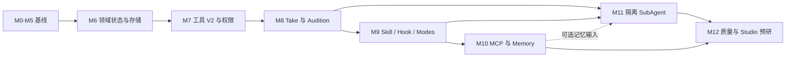

# Alda 音乐 Agent M6–M12 进阶实施路线

> 本文承接 [M0–M5 基础实施路线](implementation-roadmap.md) 与 [进阶架构设计](advanced-music-agent-architecture.md)。当前仓库尚无 `alda-agent/` 实现；本文中的类型、目录、命令和验收项均是**目标设计**，不是已完成代码。

## 目录

1. [如何阅读这份路线](#1-如何阅读这份路线)
2. [开工门槛与总览](#2-开工门槛与总览)
3. [依赖顺序与并行边界](#3-依赖顺序与并行边界)
4. [建议 Workspace 与文件布局](#4-建议-workspace-与文件布局)
5. [跨里程碑状态与证据规则](#5-跨里程碑状态与证据规则)
6. [Tool V1 到 V2 的安全迁移](#6-tool-v1-到-v2-的安全迁移)
7. [M6：作品状态与持久化地基](#7-m6作品状态与持久化地基)
8. [M7：工具协议、权限与资源安全](#8-m7工具协议权限与资源安全)
9. [M8：Take、语义修改与可追溯试听](#9-m8take语义修改与可追溯试听)
10. [M9：交互模式与本地扩展系统](#10-m9交互模式与本地扩展系统)
11. [M10：只读 MCP 与证据化记忆](#11-m10只读-mcp-与证据化记忆)
12. [M11：隔离 SubAgent 与盲评协作](#12-m11隔离-subagent-与盲评协作)
13. [M12：质量闭环、重放与 Studio 预研](#13-m12质量闭环重放与-studio-预研)
14. [总验收矩阵与工作量](#14-总验收矩阵与工作量)
15. [实施记录模板](#15-实施记录模板)

## 1. 如何阅读这份路线

### 1.1 状态标签

本文严格使用以下标签：

- **当前事实**：能从本仓库现有文档或固定参考源码中直接确认；
- **目标设计**：本项目选择的实现方向，只有代码和验收证据齐全后才能改称“已实现”；
- **探索项**：收益或可行性尚未证明，必须经过原型、消融实验或人类听审；
- **阻塞条件**：未满足就不能进入下一里程碑的硬门槛。

### 1.2 当前事实

- 当前仓库只有研究、设计、教程与上游参考源码，没有 `alda-agent/` 工程；
- M0–M5 已有按日拆解的基础路线，但“路线写完”不等于“代码完成”；
- 基础设计中的工具接口接收 `&mut Session`，并以 `current_score: String` 表示作品状态；
- 基础范围只有四个音乐工具、JSONL Session、压缩和 H0–H3 评测设计；
- 完整进阶目标已经在 [进阶架构设计](advanced-music-agent-architecture.md) 中定义，包括 Brief、Revision、Artifact、权限、Skill、Hook、MCP、Memory、Take、Audition 与 SubAgent。

### 1.3 本路线的完成定义

一个里程碑只有同时满足以下条件才算完成：

1. 目标代码已合入，且没有用文档或 mock 冒充关键路径；
2. 单元、属性、集成、故障注入和端到端测试中适用的部分已通过；
3. 新持久化数据能重放，旧数据有兼容或明确迁移路径；
4. 每个外部副作用都先经过 Effect 与 Permission 判断；
5. 验收记录包含命令、输入 fixture、输出 Artifact/hash、结果和已知缺口；
6. 文档把结果标成事实、设计或探索，不把“测试了一次”写成普遍结论。

## 2. 开工门槛与总览

### 2.1 M6 前阻塞检查

开始进阶路线前，先对真实实现执行一次基线审计。若 M0–M5 尚未实现，应先回到基础路线，不要直接从本文复制类型。

| 检查 | 最低要求 | 证据 |
|---|---|---|
| Agent Loop | 单 Provider 至少能完成工具调用闭环 | 录制的端到端运行日志 |
| 乐谱工具 | write、parse、analyze、play 四条路径行为明确 | 每个工具的成功/失败 fixture |
| Session | JSONL 可追加、恢复，损坏尾行可处理 | replay 测试 |
| 取消 | turn 与 Alda 子进程可被停止 | 超时/中断测试 |
| 基础评测 | H0–H3 至少有固定测试集 | 基线报告，不要求高分 |
| 工作区 | `cargo test --workspace`、fmt、clippy 可运行 | CI 或本地命令记录 |

如果代码仍为单 crate，可以进入 M6，但应先建立模块边界；不必为了“看起来专业”一次拆出全部 crate。

### 2.2 里程碑总览

| 里程碑 | 必须交付 | 暂不交付 |
|---|---|---|
| M6 | Brief、Constraint、不可变 Revision、Artifact Store、旧 Session 迁移 | 完整双向乐谱 IR |
| M7 | 两阶段 Tool Contract V2、Effect 权限、受限 Capability、Coordinator 提交、取消与资源锁 | 通用 Bash、完整 OS Sandbox |
| M8 | IR Lite、MusicPatch MVP、Take、Audition、Feedback、Audible Diff | 自动语义 merge |
| M9 | Plan/Compose/Review/Audition、Slash、MUSIC.md、Skill、声明式 Hook、本地 Plugin | 任意命令 Hook、Marketplace |
| M10 | 受隔离只读 MCP、Project/Preference Memory、可执行删除 | DAW/写入 MCP、自动全局偏好 |
| M11 | 两个候选 Agent、约束分析、盲评、Integrator、同预算消融 | 默认开启 Teams |
| M12 | H0–H7、Trace/Replay、隐私遥测、发布 Gate、故障演练 | 专业实时伴奏 |

### 2.3 Profile 到里程碑

| 标签/Profile | 里程碑 | 能力边界 |
|---|---:|---|
| `legacy-mvp`（兼容标签） | M0–M5 | 旧 Session、四工具、无 V2 Revision/通用权限，不算正式 minimal |
| `minimal` | M6–M8 | Revision、Tool V2、权限、Take、Gate、可追溯 Audition |
| `advanced` | M9–M10 | 声明式扩展、Memory、受隔离只读 MCP |
| `studio` | M11–M12+ | 可选 SubAgent、命令扩展宿主、外设/写入 MCP/DAW 预研 |

高 Profile 的工具 schema 不应出现在低 Profile 模型上下文中。旧 Session 必须先迁移为 V2 事件才能进入 `minimal`。

## 3. 依赖顺序与并行边界

### 3.1 主依赖图



### 3.2 为什么不能改顺序

- 没有 Revision 与 Artifact，反馈无法证明“听的是哪个版本”；
- 没有 Tool V2 与权限，MCP、Hook 和多 Agent 会扩大未受控副作用；
- 没有 Take 隔离，多 Agent 只会并发改同一字符串；
- 没有 Audition 绑定，Preference Memory 会把含糊反馈错误泛化；
- 没有单 Agent 基线，无法证明 Teams 的额外成本是否换来质量收益。

### 3.3 可以并行的工作

在每个接口冻结后，可并行推进以下工作，但合并仍经过同一验收门：

| 主线 | 可并行支线 | 前提 |
|---|---|---|
| M6 Domain | Artifact Store 故障测试 | hash 和事件 schema 已冻结 |
| M7 Coordinator | Permission policy fixtures | EffectClass 已冻结 |
| M8 Patch Engine | Audition UI 原型 | Revision/Audition ID 已冻结 |
| M9 Skill loader | MUSIC.md 合并器 | 指令优先级已写 ADR |
| M10 MCP | Memory 提取离线实验 | 两者不能互相写状态 |
| M11 Agent runtime | 盲听评测准备 | CandidateSet 契约已冻结 |

禁止并行修改同一个 canonical Revision；canonical 提交始终是串行 CAS。

## 4. 建议 Workspace 与文件布局

### 4.1 目标布局

以下是 M12 前的**目标布局**。若 M6 开始时仍为单 crate，应先按同名模块实现，等边界稳定后再拆 crate。

```text
alda-agent/
├── Cargo.toml
├── crates/
│   ├── alda-agent-domain/
│   │   └── src/
│   │       ├── brief.rs
│   │       ├── constraint.rs
│   │       ├── score.rs
│   │       ├── revision.rs
│   │       ├── patch.rs
│   │       ├── audition.rs
│   │       ├── memory.rs
│   │       ├── event.rs
│   │       └── lib.rs
│   ├── alda-agent-protocol/
│   │   └── src/
│   │       ├── tool.rs
│   │       ├── effect.rs
│   │       ├── artifact.rs
│   │       ├── evidence.rs
│   │       └── lib.rs
│   ├── alda-agent-state/
│   │   └── src/
│   │       ├── event_store.rs
│   │       ├── artifact_store.rs
│   │       ├── projection.rs
│   │       ├── checkpoint.rs
│   │       ├── migration.rs
│   │       └── lib.rs
│   ├── alda-agent-runtime/
│   │   └── src/
│   │       ├── coordinator.rs
│   │       ├── commit.rs
│   │       ├── permission.rs
│   │       ├── approval.rs
│   │       ├── cancellation.rs
│   │       ├── resource_lock.rs
│   │       ├── agent.rs
│   │       └── lib.rs
│   ├── alda-agent-tools/
│   │   └── src/
│   │       ├── score_read.rs
│   │       ├── score_patch.rs
│   │       ├── score_parse.rs
│   │       ├── score_analyze.rs
│   │       ├── take.rs
│   │       ├── audition.rs
│   │       ├── feedback.rs
│   │       └── lib.rs
│   ├── alda-agent-extensions/
│   │   └── src/
│   │       ├── instructions.rs
│   │       ├── skills.rs
│   │       ├── hooks.rs
│   │       ├── plugins.rs
│   │       ├── mcp.rs
│   │       └── lib.rs
│   ├── alda-agent-provider/       # 延续 M0-M5 Provider 抽象
│   └── alda-agent-eval/
│       └── src/
│           ├── gates.rs
│           ├── metamorphic.rs
│           ├── blind_ab.rs
│           ├── trace.rs
│           └── lib.rs
├── src/
│   ├── main.rs
│   ├── cli.rs
│   ├── repl.rs
│   └── commands/
├── tests/
│   ├── fixtures/
│   │   ├── sessions-v1/
│   │   ├── projects-v2/
│   │   ├── alda/
│   │   ├── mcp/
│   │   └── hooks/
│   ├── migration.rs
│   ├── permission.rs
│   ├── revision_race.rs
│   ├── audition_binding.rs
│   └── replay.rs
└── eval/
    ├── cases/
    ├── rubrics/
    └── reports/
```

### 4.2 依赖方向

```text
domain        ← protocol
   ↑              ↑
state        runtime        tools
   ↑              ↑          ↑
   └────────── CLI composition root ───── extensions/provider/eval
```

约束如下：

- `domain` 不依赖 Provider、CLI、MCP 或文件系统；
- `state` 只持久化领域事件和 Artifact 元数据，不调用模型；
- `runtime` 依赖抽象工具注册表，不依赖具体工具实现；
- `tools` 在 resolve 阶段读快照并返回 ActionPlan，在获权后通过 StagingCapabilities 执行并返回 ToolOutcome；
- binary 是 composition root，负责选择 Profile、注册具体工具和扩展；
- 禁止为了消除编译错误把所有 crate 相互依赖。若出现环，优先收窄协议而不是新增全局状态。

### 4.3 何时拆 crate

满足任一条件再拆：

- 需要用依赖方向阻止工具直接访问状态存储；
- 一个模块已经有独立测试、稳定公共类型和不同发布节奏；
- feature/Profile 需要在编译或注册阶段完全排除某类依赖。

纯粹因为文件多，不是拆 crate 的充分理由。

## 5. 跨里程碑状态与证据规则

本节是 M6–M12 的共同协议。任何里程碑都不能私自改变这些语义。

### 5.1 权威状态与派生状态

| 数据 | 权威来源 | 是否可由聊天总结恢复 |
|---|---|---|
| 乐谱内容 | content-addressed Artifact | 否 |
| Revision 关系 | append-only DomainEvent | 否 |
| 当前接受版本 | `RevisionAccepted` 事件投影 | 否 |
| Brief/Constraint | 版本化领域事件 | 否 |
| 对话历史 | Session Rollout | 是，但不是作品真相 |
| Checkpoint | 由权威事件生成的缓存 | 可重建 |
| 自然语言 handoff | compaction 结果 | 仅辅助，不可覆盖精确状态 |

`ScoreRevision` 的内容一经创建不可变，实体本身不含可变 `status`。生命周期与 `ReadyForAcceptance` readiness 分别由事件生成 `RevisionLifecycleProjection`；不得通过覆盖 Revision 文件来“修改状态”。

### 5.2 Revision 生命周期

```text
Draft ──H0 pass─────────> Candidate ──human accept──> Accepted
  │                           │                           │
  ├────────reject────────────> Rejected                  └─publish gate─> Published
  └────────cancel────────────> Aborted
```

规则：

1. `Draft` 表示已创建，不表示无效；
2. 进入 `Candidate` 前，source Artifact 必须存在且 hash 一致，H0 必须 Pass；
3. “可接受性”是由 Hard Constraint Gate 计算的 readiness，不等同于生命周期状态；
4. `Accepted` 只能由真实用户或被明确授权的人类角色触发；
5. `Published` 必须引用 `Accepted` Revision，并额外通过来源、许可、目标位置和每次审批；
6. `Rejected` 和 `Aborted` 不删除历史，仍可供对比和失败分析；
7. merge Revision 必须有两个及以上 parent，但 M12 前只允许显式冲突决议，不做自动语义合并。

### 5.3 Constraint Gate 四态

每条约束的校验结果必须是：

```text
Pass | Fail | Unknown | NotApplicable
```

- `Unknown` 不能按 `Pass` 处理；
- Hard Constraint 只有 `Pass` 或有效 `Waiver` 才允许 Accept；
- Waiver 必须包含 actor、reason、scope、时间和对应 Revision；
- Soft/Advisory 只展示证据和权重，不阻塞接受；
- 同一约束的证据冲突时，Evaluation Card 同时展示，不用平均分掩盖冲突。

### 5.4 Evidence 最小字段

```rust
pub struct EvidenceEnvelope {
    pub id: EvidenceId,
    pub subject_revision: RevisionId,
    pub subject_hash: ContentHash,
    pub scope: MusicalAddress,
    pub kind: EvidenceKind,
    pub outcome: EvidenceOutcome,
    pub producer: ProducerManifest,
    pub method: MethodManifest,
    pub artifact_refs: Vec<ArtifactRef>,
    pub created_at: Timestamp,
}
```

目标规则：

- source hash 改变后，旧证据默认 `Stale`，不能静默复用；
- MVP 每次 Patch 后重跑 H0 和所有 Hard Gate。局部证据复用属于后续优化；
- Parse 证据只说明语法/解析结果，不说明好听；
- Heuristic 必须写明风格范围、阈值和规则版本；
- AudioModel 记录模型版本、输入 Render hash 与不确定性，不能标成 Human；
- `ListeningHumanEvidence` 绑定实际开始的 Audition，可为 completed/partial/user-stopped，scope 不得超过 played range；读谱与真实试奏分别使用 `ScoreReviewHumanEvidence`、`PerformanceTestEvidence`；
- 未试听的“我觉得会更好听”是 Agent rationale，不是听审证据；
- Evidence append-only；更正通过新事件指向被替代证据。

### 5.5 提交规则

Coordinator 对每个动作执行两阶段协议：

```text
resolve 裸参数与只读 snapshot
→ ActionPlan（args hash / target / Effect / resource / data egress）
→ PermissionDecision
→ seal AuthorizedActionPlan
→ execute（只获得 StagingCapabilities）
→ 校验 StagedArtifact / Evidence / ProposedEvent
→ CAS 提交事件
→ 更新投影
→ 触发 Post Hook
```

`execute` 不接受裸参数，工具不能自行打开任意文件、网络或设备。动态路径/URL/设备在执行前变化会使授权失效。若 active head 已变化，返回 `CommitConflict { expected, actual }`；禁止 last-write-wins。失败 staging 可回收，工具失败不能留下“事件已提交但 Artifact 不存在”的半状态。

## 6. Tool V1 到 V2 的安全迁移

### 6.1 要消除的问题

基础接口形态如下：

```rust
async fn handle(
    &self,
    input: Value,
    session: &mut Session,
) -> Result<String, ToolError>;
```

它适合单线程教学闭环，但进阶后会产生三个结构性问题：

- 工具既执行业务又提交状态，权限和审计插不进唯一入口；
- 无法知道工具改了 Session 哪些字段；
- 直接并行只能退化成全局 `Arc<Mutex<Session>>`，容易造成锁跨 `await`、取消不完整和不可解释的提交顺序。

迁移目标是 `resolve(args, snapshot) -> ActionPlan` 与 `execute(AuthorizedActionPlan, StagingCapabilities) -> ToolOutcome`。不是把 `&mut Session` 换成 `Arc<Mutex<Session>>`，也不是仅在 `ToolContext` 放一个 permission 布尔值。

### 6.2 六步迁移

#### 步骤 A：冻结 V1 行为

为四个旧工具建立 characterization tests：正常输入、模型可修复错误、致命错误、取消、超时、输出上限。录制 Session 前后差异，作为迁移对照。

#### 步骤 B：收口 Session 写入口

- 将可变字段设为私有；
- 所有修改通过命名方法完成；
- 每个方法同步记录兼容 `DomainEvent`；
- 添加断言：一次工具调用后不允许出现未记录的作品状态变化。

此时仍是 V1 串行路径，不宣称支持并发。

#### 步骤 C：引入 Coordinator 与 Legacy Adapter

```rust
pub struct LegacyToolAdapter<T> {
    inner: T,
}

// 伪代码：adapter 仍走受控串行区，捕获兼容事件。
// 新工具不能使用这个 adapter。
```

Adapter 的目的只是过渡：它先解析旧参数形成完整 ActionPlan，获得授权后才在唯一串行执行器和受限 capability 内调用旧工具，捕获 StagedArtifact/Evidence/Event，并交给 Coordinator 提交。无法证明审批前无副作用的旧工具不得接入 Adapter。Adapter 必须打 warning 和迁移计数，避免永久遗留。

#### 步骤 D：双投影影子校验

同一 V1 事件同时更新：

1. 旧 Session 投影；
2. 新 Project/Revision 投影。

每次 turn 后比较 active score hash、消息数量、工具结果状态和恢复结果。影子投影只读，不影响用户主路径。至少用旧 Session fixtures、长对话和损坏尾行覆盖。

#### 步骤 E：按风险迁移工具

顺序必须是：

1. `alda_parse` / `score_analyze`：只读、确定性较强；
2. `write_score` → `score_patch`：产生 Revision，不再覆盖 current score；
3. `play_for_human`：先迁成 V2 `AudibleOutput` 工具，先审批再获取设备锁；M8 再将其替换为完整 `audition` 并记录 Render/Audition；
4. 后续导入、导出、MCP 只能直接实现 V2。

每迁移一个工具就删除对应 Adapter 注册，并跑 V1/V2 fixture 对照。

#### 步骤 F：切断旧接口

满足以下条件后才移除 V1：

- 注册表里没有 Legacy Adapter；
- `rg '&mut Session'` 不再命中工具 trait 或实现；
- 所有副作用工具都有“未授权时 execute 不可达”的测试，裸 args 无法绕过 sealed plan；
- 所有写工具只返回 ProposedEvent；
- 并发冲突测试稳定返回 `CommitConflict`；
- M0–M5 端到端场景通过兼容 CLI 再跑一次；
- 数据迁移有备份、dry-run 和回滚说明。

### 6.3 回滚与失败策略

- 迁移器永不原地覆盖 V1 JSONL；先生成 V2 目录，校验后原子切换指针；
- V2 写入开始后，V1 只读，不做双写回退；双写会产生两个事实源；
- 若切换失败，恢复 V1 只读快照并保留失败的 V2 目录供诊断；
- 任何无法映射的旧行保存为 `LegacyOpaqueEvent`，带原始 hash 和 warning，不静默丢弃；
- 并行开关在步骤 F 完成前保持关闭。

## 7. M6：作品状态与持久化地基

**目标设计**：建立 `CreativeBrief → ConstraintSet → ScoreRevision → Artifact` 的最小权威状态链，并能无损承接 V1 Session。

**预计工作量**：8–12 个专注开发日；首次做事件投影者预留 3–5 天学习与返工。

**依赖与主要落点**：依赖 M0–M5 基线审计；主要修改 `alda-agent-domain/{brief,constraint,revision,event}.rs`、`alda-agent-state/{artifact_store,event_store,projection,migration}.rs`，并新增 `tests/migration.rs`。若仍是单 crate，先使用 `src/domain/`、`src/state/` 同名模块。

### 7.1 任务包

#### M6.1 领域 ID 与不变量

- 用 newtype 定义 Project、BriefRevision、Score、Revision、Branch、Artifact、Evidence ID；
- 实现 `CreativeBrief`、`ConstraintSet`、`ScoreRevision`、`DomainEvent`；
- 字段私有，构造函数验证 parent、hash、scope 与状态转换；
- Revision 内容不可变，接受/拒绝/发布由事件表达；
- 为 schema 加显式 `schema_version`。

#### M6.2 Artifact Store

- 以内容 hash 寻址，metadata 与 blob 分开；
- 写入流程采用临时文件、fsync 策略说明、hash 校验和原子 rename；
- 大乐谱、MIDI、音频只保存引用，不进入 JSONL；
- 提供 `put/get/verify/pin`，GC 只设计接口，M12 再实现完整可达性回收。

#### M6.3 Event Store 与投影

- 定义 append-only 白名单事件；
- 实现 ProjectSnapshot、Revision DAG、active branch、accepted revision 投影；
- checkpoint 带 event offset 和 projection schema version；
- 从头重放与 checkpoint + tail 重放必须得到相同 hash；
- JSONL 最后一行损坏可报告并截断读取，禁止跳过中间损坏后继续伪装完整。

#### M6.4 V1 迁移器

- `migrate --dry-run <session>` 输出将创建的 Project、根 Revision、Artifact 和 warning；
- 旧 `current_score`/`score_state` 转为根或后续 Revision；
- 原始 V1 文件保持不变，并记录 source file hash；
- 无法识别的数据进入 opaque 兼容事件；
- 迁移后自动执行 parse，但 parse 失败仍保留原始作品并标成 Fail，不篡改输入。

#### M6.5 最小 CLI

目标命令：

```text
alda-agent project init
alda-agent project status
alda-agent project migrate --dry-run <session.jsonl>
alda-agent revision list
alda-agent artifact verify
```

数据输出走 stdout，warning/error 走 stderr；失败使用非零退出码。

### 7.2 测试

- 单元：所有 ID、构造器、状态转换和 Hard Constraint 四态；
- 属性：随机 DAG 拒绝环、自身 parent 和不存在 parent；
- 存储：同内容去重、hash 不符拒绝、临时文件中断不生成有效 Artifact；
- 重放：full replay 与 checkpoint replay 的投影 hash 一致；
- 迁移：至少 5 类 V1 fixture，包括空 Session、多次 compact、损坏尾行、无 score、parse 失败；
- 兼容：M0–M5 的基础端到端输入仍能得到相同最终 score source hash。

### 7.3 验收门

- [ ] 旧 Session 迁移前后原始 score 字节或规范化 hash 可对照；
- [ ] Revision DAG 和 Artifact 引用都能从事件重建；
- [ ] 删除 checkpoint 后仍可完整恢复；
- [ ] 聊天 compaction 不改变 Brief、Constraint 或 Revision；
- [ ] 文档和 CLI 均明确该版本还未支持并行写；
- [ ] 迁移报告列出所有 warning，没有静默丢行。

### 7.4 主要风险

| 风险 | 缓解 |
|---|---|
| 把事件溯源做成无限框架 | 只实现白名单事件、单机 JSONL 和确定性投影 |
| Revision 不可变但 status 被覆盖 | lifecycle 使用独立事件，读取时投影 |
| Artifact 写一半 | 临时文件 + hash + 原子 rename；故障注入验证 |
| V1 数据语义不完整 | opaque event + warning，绝不猜测成高置信事实 |

## 8. M7：工具协议、权限与资源安全

**目标设计**：完成 V1→V2 切换，让工具只能提出 Artifact、Evidence 与 DomainEvent，由 Coordinator 在权限与并发控制后提交。

**预计工作量**：8–12 个专注开发日。

**依赖与主要落点**：阻塞依赖 M6 的 Revision、Artifact 与投影；主要修改 `alda-agent-protocol/{tool,effect,evidence}.rs`、`alda-agent-runtime/{coordinator,commit,permission,approval,cancellation,resource_lock}.rs` 和 `alda-agent-tools/` 四个旧工具，新增 `tests/{permission,revision_race}.rs`。

### 8.1 任务包

#### M7.1 Tool Contract V2

- 实现 `resolve`、`ActionPlan`、`AuthorizedActionPlan`、`StagingCapabilities`、`ToolOutcome`、`ToolDescriptor`；
- `AuthorizedActionPlan` 是 Permission Broker 才能构造的 sealed type，绑定 args/target/Effect/策略版本/expiry；
- capability 只开放计划声明的 staging sink、路径、设备、网络 endpoint 或 Provider 字段；
- 内建工具视为受信代码，但工具 crate 禁止绕过 capability 的直接 I/O 依赖并接受静态检查/审计；非托管扩展不能同进程执行；
- descriptor 包含 exposure、effect、parallelism、locks、determinism、cancel safety 和 latency；
- registry 在启动时校验工具名、schema、Effect 与 Profile；
- 模型只看到当前 Profile 和当前模式允许的 schema。

#### M7.2 Coordinator 与 CAS

- resolve 接收只读 ProjectSnapshot 和 base Revision；execute 只接收 sealed plan 与受限 capability；
- 校验 proposed event 的 actor、subject、base 和 Artifact；
- 写提交使用 branch head compare-and-swap；
- 冲突返回 expected/actual，不自动覆盖；
- read tools 可并行，commit reducer 单写。

#### M7.3 Permission 与 Approval

- 按 EffectClass 决策，不按工具名硬编码；
- 冻结统一枚举：`Observe`、`WorkspaceWrite`、`AudibleOutput`、`ExternalFileWrite`、`ExternalDeviceWrite`、`NetworkRead`、`NetworkWrite`、`ModelEgress`、`Publish`、`Destructive`；复合动作按最高风险或拆分审批；
- 实现 `Skip / NeedsApproval / Forbidden`；
- approval payload 展示音乐动作、路径/设备、范围、预计时长、音量与目标；
- 音频 Render 测试软件 gain/loudness 限制；MIDI 直出只承诺 velocity/gain 上限，并在首次试听提示无法控制物理功放音量；
- cache key 至少包含 effect、resource、scope、tool hash 和会话；
- `Publish`、`Destructive` 不缓存永久允许；
- Profile 默认策略与架构文档保持一致。

#### M7.4 文件、子进程与设备安全

- 使用 root-dir capability 与 no-follow/openat 类安全打开，或在提交前重验 inode；不能只做一次路径规范化；
- `.alda-agent/permissions`、凭据、Hook、Plugin、Skill、MUSIC.md 等控制面路径只能由专用宿主命令和更高审批修改；
- Alda 子进程有 timeout、输出上限、进程组 kill 和结构化退出原因；
- 音频设备使用 semaphore(1)，取消释放 permit；
- 不持有 Mutex/RwLock guard 跨 `await`；
- CPU 分析进入有界 worker pool，阻塞子进程不占 async executor 核心线程。

#### M7.5 完成 V1 迁移

按第 6 节完成 Adapter、影子投影、逐工具切换和旧接口删除。V1 JSONL 仍可导入，但运行时不再使用 `&mut Session` 工具。

### 8.2 测试

- 注册：重复工具名、非法 schema、Profile 越界、缺 Effect 全部拒绝；
- 权限：workspace 内/外写、首次播放、重复播放、网络、发布、destructive 的决策表；
- 授权：未批准计划无法构造/反序列化 execute 输入，args/target 变化使 sealed plan 失效；
- 攻击：`../`、符号链接逃逸、超长输出、伪造远端 Effect annotation；
- 并发：两个相同 base 写提交只允许一个成功，另一个返回 CommitConflict；
- 取消：模型、工具、Alda 子进程和等待设备锁时均可停止且不残留进程；
- 迁移：每个 V1/V2 工具 fixture 的输出分类与最终 score hash 对照。

### 8.3 验收门

- [ ] 工具实现中没有 `&mut Session`；
- [ ] 没有用全局 `Arc<Mutex<Session>>` 代替迁移；
- [ ] 所有写操作都能从 rollout 找到 Permission 决策、必要时的审批、工具结果和提交事件；
- [ ] Permission 在副作用发生前执行，Post Hook 不能补救绕过；
- [ ] 工具只通过 StagingCapabilities 访问本次路径/设备/网络，未授权 execute 不可达；
- [ ] 并发冲突不会丢写或覆盖 canonical；
- [ ] Ctrl+C 后设备锁、子进程和临时文件均被清理；
- [ ] M0–M5 基础场景继续通过。

### 8.4 主要风险

| 风险 | 缓解 |
|---|---|
| Adapter 永久化 | 启动 warning、迁移计数、M7 DoD 强制为零 |
| Approval 疲劳 | 结构化 cache，只缓存窄 scope，不提供“永远全部允许” |
| 锁粒度过大 | 快照 + 消息传递 + CAS；锁只保护短临界区 |
| Effect 标注被工具低报 | 内建本地策略覆盖声明；测试高风险工具的最小 Effect |

## 9. M8：Take、语义修改与可追溯试听

**目标设计**：让用户能从共同基线生成隔离 Take，查看语义变化，试听确切 Render，并把反馈绑定到版本与片段。

**预计工作量**：10–15 个专注开发日。

**依赖与主要落点**：阻塞依赖 M7 完成 Tool V2 和写入 CAS；主要修改 `alda-agent-domain/{score,patch,audition}.rs`、`alda-agent-tools/{score_patch,take,audition,feedback}.rs`、`alda-agent-state/artifact_store.rs`，新增 `tests/audition_binding.rs` 与 IR/Patch fixtures。

### 9.1 任务包

#### M8.1 IR Lite

- 从 Alda source + parse snapshot 建立 stable Part、Section、Beat/Marker 地址；
- alias 优先映射 PartId；无 alias 时返回 `NeedsIdentityMapping`；
- Section/Beat 只接受显式 marker、用户确认的 MeterMap/SectionMap 或带来源项目元数据；否则返回 `NeedsSectionMapping` / `UnknownMeter`；
- 未映射时只允许 WholeScore、可靠 Part 或 MarkerRange，Section/Beat Patch 必须拒绝或请求澄清；
- 保存 source span 与 Alda 临时 ID 映射，但不承诺跨任意改写自动正确；
- MeterMap、BeatGrid 不把源码 `|` 当执行语义；
- 每个 IR Lite 绑定 source hash。

#### M8.2 MusicPatch MVP

实现并测试：

- ReplaceSection；
- ReplacePartSection；
- Transpose；
- ChangeInstrumentation；
- AdjustTempo；
- AdjustDynamics；
- 受警告保护的 ReplaceWholeScore escape hatch。

Patch 应先解析地址、验证 base hash、生成候选 Artifact、重跑 H0/Hard Gate，再提出 RevisionCreated 事件。

#### M8.3 Take 与 CandidateSet

- `/fork` 从不可变 Revision 创建 branch/take；
- `/take list|switch|reject|promote` 操作关系，不复制覆盖 canonical；
- CandidateSet 记录 common base、BriefRevision 和 DiversityIntent；
- promote 创建接受候选，不删除其他 Take；
- 首期语义 merge 只报告 address overlap、constraint conflict 和 source conflict。

#### M8.4 Render、Audition 与 Feedback

- MVP 先实现 Alda 原生 `MidiRenderArtifact`，记录 Revision、source hash、Alda 版本、MIDI hash、SoundFont/现场设备声明；现场播放不承诺声音 blob 可重建；
- 可重复 `AudioRenderArtifact` 必须选择离线 synth/录音适配器，并记录二进制版本、SoundFont hash、采样率、声道、gain、处理链与音频 hash；未选后端时不得伪造 WAV；
- Audition 记录 range、播放顺序、设备 profile、开始/完成/用户停止/取消、played range/until；
- ListeningHumanEvidence 可来自完成或部分试听，但 scope 不得超出实际播放；读谱/试奏意见使用独立 Evidence kind；
- `/audition A B --blind` 随机并平衡顺序，UI 隐藏模型/Agent；
- feedback 保留用户原话、目标、维度、偏好和抽取置信度，可由用户纠正。

#### M8.5 Import / Export Adapter

- Alda 2.4.3 原生只导出 MIDI；MIDI/MusicXML import、音频 export 是 Agent 新适配器；
- `score_import` 保存原文件、格式、许可、适配器版本与转换损失报告；
- `score_export` 根据目标动态产生 WorkspaceWrite/ExternalFileWrite/Publish plan；
- 不能 round-trip 的表达写入 `ConversionWarning/Unknown`，不宣称无损。

#### M8.6 Audible Diff

- 生成相同 range 的 before/after；
- 做响度归一化或清楚标注未归一化；
- 同时展示语义 Patch、结构指标和非目标范围 regression；
- 若无法渲染，仍输出符号 diff，但不能伪装成已试听。

### 9.2 测试

- IR：插入新声部后有 alias 的 PartId 稳定；无 alias 时不虚构高置信映射；
- 地址：无 marker/meter 时保持 NeedsSectionMapping/UnknownMeter，不虚构 Section/Beat；
- Patch 属性：转调保持音程关系，tempo scale 保持拍结构，重命名不改变播放事件；
- 非目标区域：局部 Patch 后其他 Section 的规范化 hash 不变；
- DAG：fork/promote/reject 后 parent 和 branch head 正确；
- Audition：取消、用户中途停止、设备忙、Render hash 不符、范围无效、played range 正确；
- Feedback：未开始播放无法写 ListeningHumanEvidence，部分反馈不得越过已听范围；
- Import/export：Alda MIDI 导出、适配器 provenance、转换损失、工作区外目标审批；
- 回归：ReplaceWholeScore 必须重跑全 Gate 并显示大范围警告。

### 9.3 验收场景

```text
1. 从同一 Revision fork Take A / B；
2. A 只改副歌配器，B 只改副歌和声；
3. 两者独立通过 parse 和 Hard Gate；
4. 生成相同片段的盲式 A/B；
5. 用户听完选择 B，并说“和声更有张力，但结尾太挤”；
6. 系统把原话绑定到 B 的 Revision/Render/Range；
7. 从 B fork refine Take，只改结尾；
8. A、B 和 refine 的 parent、Artifact 和证据仍可重放。
```

### 9.4 验收门

- [ ] 两个 Take 永不互相覆盖；
- [ ] 每条 ListeningHumanEvidence 都能追到实际开始的 Audition 与未越界 played range；读谱/试奏证据类型正确；
- [ ] Audible Diff 的 before/after 使用同一比较范围和明确渲染参数；
- [ ] Patch 失败不生成有效 Revision；
- [ ] 无 alias 映射的不确定性对用户可见；
- [ ] 系统没有宣称 parse、指标或 Audio Critic 等价于“好听”。

### 9.5 主要风险

| 风险 | 缓解 |
|---|---|
| IR Lite 演变成完整编译器 | 只做稳定地址、source map 与派生证据 |
| A/B 响度造成偏差 | 归一化并记录参数；允许用户关闭 |
| 文本 Patch 误伤范围外内容 | base hash、source span、非目标 hash 回归 |
| 用户反馈串版本 | Feedback 必须引用 AuditionId，不接受裸 Revision 文本 |

## 10. M9：交互模式与本地扩展系统

**目标设计**：将确定性宿主命令、项目指导、可复用创作流程和受信任扩展分开，避免把所有能力塞进一个 System Prompt。

**预计工作量**：8–12 个专注开发日。

**依赖与主要落点**：阻塞依赖 M8 的 Take、Audition 和 Patch；主要修改 `src/{cli,repl,commands/}`、`alda-agent-extensions/{instructions,skills,hooks,plugins}.rs`，新增 `tests/fixtures/{hooks,skills,plugins}/`。Plugin 只打包这些已受控能力。

### 10.1 任务包

#### M9.1 工作模式与 Slash

- Plan：只改 Brief/Constraint/计划，不写 score；
- Compose：允许在 Take 上提出 Patch；
- Review：只读分析与证据；
- Audition：控制 Render、播放与反馈；
- Batch：非交互任务，遇到 NeedsApproval 立即阻塞，不弹隐式确认。

实现 `/plan /compose /review /take /fork /diff /audition /stop /constraints /status /permissions /skills /compact /resume`，带帮助、参数校验、补全和稳定退出码。

#### M9.2 MUSIC.md 层叠

- 合并用户级、项目根和近目录指导；
- 目录层叠只服务多文件工程；单文件 score 的段落/声部规则进入带 MusicalAddress 的 Constraint/Instruction；
- 近层覆盖远层，但安全策略和 Hard Constraint 不被文本指导覆盖；
- `/status` 显示每条有效规则及来源；
- 指令内容纳入 prompt hash 与 rollout；
- 文件变化后下一 turn 重载并记录版本。

#### M9.3 Music Skill

- manifest 声明版本、触发描述、风格范围、工具需求、Effect 上限、输入输出、许可和 eval cases；
- 默认只暴露 name/description，命中或显式 `$skill` 后加载正文；
- Skill 不能注册超过 manifest Effect 上限的调用；
- Skill 测试 fixture 固定 Brief、base Revision 和预期 Gate，不用单次演示代替回归。

#### M9.4 Hook

先实现：SessionStart、UserBriefSubmit、Pre/PostScorePatch、Pre/PostAudition、OnFeedbackRecorded、PreAccept、PrePublish、Pre/PostCompact、Stop。

- Advanced 只运行进程内声明式白名单 Hook；任意命令 Hook 保持禁用，直到 Studio Extension Host 提供文件/环境/网络/设备隔离；
- 顺序确定且可显示；
- timeout、输出上限、幂等 key、递归深度限制；
- 声明式非托管 Hook 以内容 hash 请求信任；hash 只确认版本，不替代执行隔离；
- `Block/Warn/AdditionalContext/ProposedPatch` 分开；
- ProposedPatch 仍走 Permission、Gate 和 Coordinator，Hook 无旁路写权限。

#### M9.5 本地 Plugin

- Plugin 只作为本地分发目录，组合 Skill、Hook、MCP 配置和资产；
- 安装前显示许可、Effect、Hook 与外部服务；
- 支持 validate/install/list/disable/uninstall；
- 安装/升级/卸载通过专用宿主命令与更高审批，普通 WorkspaceWrite 不能修改控制面；
- 本阶段不实现 Marketplace、远程自动更新或未签名代码自动执行。

### 10.2 测试

- 模式：Plan/Review 尝试写谱被拒；Batch 遇审批正确阻塞；
- Slash：无效参数、脚本模式 stdout/stderr、退出码、补全快照；
- MUSIC.md：多层覆盖、来源展示、循环 symlink、超大文件上限；
- Skill：渐进加载、显式优先、冲突版本、缺工具、Effect 越界；
- Hook：稳定顺序、超时、崩溃隔离、递归、内容变化重新确认、命令 Hook 在 Advanced 被拒；
- Plugin：恶意路径、缺许可、禁用后不再注册、卸载不删除项目 Artifact。

### 10.3 验收门

- [ ] `/status` 能解释当前模式、Profile、MUSIC.md、Skill、Hook 和权限来源；
- [ ] 低 Profile 不加载高风险 schema；
- [ ] Skill/Hook 无法绕过 Coordinator；
- [ ] Hook 故障默认不破坏已提交 Revision，Pre 安全 Hook 失败按 fail-closed 策略处理；
- [ ] 安装 Plugin 前用户看到其能力边界；
- [ ] 一个爵士编配 Skill 至少有 3 个固定 eval cases，而非只有宣传示例。

### 10.4 主要风险

| 风险 | 缓解 |
|---|---|
| 指令来源互相覆盖 | 显示合并链；安全和 Hard Constraint 不可被文本覆盖 |
| Hook 成为第二套工具系统 | Hook 只提案，复用相同 Permission/Commit 路径 |
| Skill prompt 膨胀 | 渐进披露、每层 token 上限、只加载命中的 Skill |
| Plugin 供应链风险 | 首期仅本地、显式信任、manifest/许可/Effect 检查 |

## 11. M10：只读 MCP 与证据化记忆

**目标设计**：接入最小只读外部工具，并建立可查看、可纠正、可删除、带试听证据和范围的记忆管线。

**预计工作量**：9–14 个专注开发日。

**依赖与主要落点**：MCP 阻塞依赖 M7 权限与 M9 扩展注册；Preference Memory 阻塞依赖 M8 Audition 证据与 M6 状态层。主要修改 `alda-agent-extensions/mcp.rs`、`alda-agent-domain/memory.rs`、`alda-agent-state/{projection,checkpoint}.rs`、`alda-agent-runtime/context_builder.rs`，新增 `tests/fixtures/mcp/` 与 memory 隐私 fixtures。

### 11.1 任务包

#### M10.1 Music MCP Gateway

- 固定一个 MCP 协议版本与 conformance fixtures，覆盖 initialize、版本/capability negotiation、JSON-RPC 错误、取消与关闭；
- 首发 transport 必须具有真实隔离：stdio server 运行在受限进程/容器，环境变量 allowlist、最小文件系统、默认无网络；HTTP 绑定 URL/身份/配置 hash/版本与域策略；无法隔离则保持关闭；
- 规范化 server/tool 命名，清洗 schema 并设置大小上限；
- 本地补充 Effect、determinism、latency、locks、cancel safety 和 license scope；
- 首批只读工具：`list_instruments`、`inspect_midi`、`read_project_metadata`；
- 远端 annotation 只作提示，本地 Effect 判定拥有最终权威；
- server allowlist 同时绑定 executable/URL identity、配置 hash 和版本；实现 timeout、取消、最大响应和审计；
- 只对明确幂等请求重试；非幂等请求断线后先确认远端状态。

#### M10.2 Memory 管线

分开两个开关：

- use memory：是否检索已有记忆；
- generate memory：是否从本次 Session 提取候选。

实现 `candidate → redact/filter → deduplicate/contradict → user confirm（适用时）→ commit`。Preference 至少保存 scope、evidence、confidence、context、last_confirmed 和 contradiction。

Rollout 事件只存 Memory ID、正文 hash、scope、状态与审计元数据；正文进入独立加密 blob。`forget` 删除索引并销毁正文密钥，备份按声明到期策略清除，只保留不含正文的 tombstone。

#### M10.3 Memory UX

```text
/memory list [--scope project|user]
/memory inspect <id>
/memory correct <id>
/memory forget <id>
/memory pause
```

- Project 决策优先来自权威事件，不复制成含糊自然语言事实；
- 一次局部反馈默认只能成为 Project/section scope candidate；
- 升级为用户级偏好需要多次独立证据或显式确认；
- 外部 MCP、网页、参考素材默认不参与记忆生成；
- secret、完整音频和未授权参考素材不得进入 Memory。

#### M10.4 Context Builder

按固定预算构建：Stable Instructions → MUSIC.md → Active Brief/Hard Constraint → Checkpoint → Skill → Relevant Memory → recent real user messages → current schemas。

- 每段显示 token 预算与截断原因；
- exact score 只通过 Artifact/checkpoint 引用恢复；
- compaction 前后 checkpoint projection hash 一致；
- 检索结果记录 memory IDs，便于解释和删除后重放。

### 11.2 测试

- MCP：版本/能力不兼容、未知 server、schema 注入、超大响应、超时、取消、谎报只读、工具重名、stdio 越界文件/环境/网络；
- Permission：远端声明 observe、本地判定 device/network 时以本地为准；
- Memory：一次“这里不要鼓”不升级全局；跨风格矛盾偏好并存而非覆盖；
- 删除：forget 后索引、正文密钥和可恢复正文不可用；测试备份到期与仅元数据 tombstone；
- 脱敏：API key、token、路径秘密和未授权内容 fixture 不落盘；
- 压缩：30 轮后 Brief、Hard Constraint、active Take、last Audition 和 unresolved question 保真；
- 注入：恶意 MCP 文本不能变成 System Instruction 或 Memory 指令。

### 11.3 验收门

- [ ] MCP 首发只有只读工具，没有隐藏 DAW 写入；
- [ ] MCP server 被 OS/容器 capability 约束，而非只相信 annotation/hash；
- [ ] 外部数据始终被标成不可信内容；
- [ ] 用户能查看每条偏好的证据、范围和置信度；
- [ ] pause/forget/correct 在下一 turn 生效；
- [ ] forget 不是 UI 隐藏：正文、索引与备份保留策略有可验证结果；
- [ ] 精确作品事实不依赖自然语言 Memory；
- [ ] 关闭 generate memory 后不会后台写候选；
- [ ] 关闭 use memory 后模型上下文不含记忆正文。

### 11.4 主要风险

| 风险 | 缓解 |
|---|---|
| MCP prompt/schema 注入 | 内容与指令分层、本地 schema 清洗和 Effect 判定 |
| 偏好误泛化 | scope + 多证据 + 显式升级 |
| 删除只是 UI 隐藏 | 定义正文删除、索引更新、备份/rollout 隐私策略 |
| Memory 与项目事实冲突 | 领域投影优先，Memory 只能提供建议上下文 |

## 12. M11：隔离 SubAgent 与盲评协作

**目标设计**：实现有界、可取消、可审议的候选协作，并以同总预算对照实验判断是否值得启用。

**预计工作量**：10–15 个专注开发日，另加至少 3–5 天人类盲听采样。

**依赖与主要落点**：阻塞依赖 M8 的隔离 Take 和 M9 的角色 Skill；M10 Memory 只是可选、受限输入，不应成为硬依赖。主要修改 `alda-agent-runtime/{agent,coordinator,cancellation}.rs`、`alda-agent-domain/score.rs`、`alda-agent-eval/blind_ab.rs`，新增多 Agent 隔离、预算和失败 fixtures。

### 12.1 先建立对照组

固定相同 Brief、模型族和任务集，分别做两类实验：等经济成本（计入输入/输出/cache token、Critic、工具和 Render CPU）与等墙钟延迟；试听顺序按任务/听者随机并平衡。比较：

1. 单 Agent 单候选；
2. 单 Agent 多候选；
3. 两个 Candidate SubAgent；
4. 两个 Candidate SubAgent + Blind Critic。

不能把“多 Agent 花了三倍预算”与单 Agent 直接比较后宣称提升，也不能同时强行固定成本与墙钟而掩盖并行的延迟价值；最终报告质量—成本—延迟 Pareto。

### 12.2 任务包

#### M11.1 Agent Thread

- 每个 Agent 有独立 rollout、CancellationToken、预算和只读 base；
- fork 上下文只包含同一 BriefRevision、Hard Constraint、base Revision、角色 Skill 和有限 Memory；
- 输出为角色化 tagged enum：`CandidateProposal`、`ConstraintReport`、`CritiqueReport`、`IntegrationProposal` 或 `FailureReport`；只有 Candidate/Integrator 可带 Patch；
- Agent 不能直接提交 canonical 或授予 Accept/Publish；
- 主线程可 wait、interrupt、steer，并接收结构化摘要。

候选默认通过 Revision/Artifact namespace 隔离。仅当任务还会修改 Plugin 代码、MUSIC.md 或多文件工程时，增加可选 Git Worktree backend；测试其 Branch/Revision 映射、越界写阻断和取消清理。Worktree 不负责设备隔离，也不能作为语义 merge 的完成证据。

#### M11.2 MVP 编排

按架构限定：Candidate A、Candidate B、Constraint Analyst、Blind Critic、Human A/B、Integrator。最大并发 3，最大审议 2 轮。

- Candidate 从同一 base fork；
- Critic 只看 Brief、Artifact 和匿名 Evaluation Card，不看作者理由；
- Integrator 是唯一能提出 canonical commit 的 Agent 角色；
- Human 最终接受；
- 一个 Agent 失败时保留其他结果并报告缺失，不级联伪造成功。

M11 的 Agent 都是任务级 SubAgent，不实现长期常驻 Team。长期角色队列、跨项目角色记忆、成员恢复和 Team 级权限属于 Studio 后续实验，只有 SubAgent 对照实验先证明价值才立项。

Future Studio 立项文档至少定义 TeamId、成员生命周期、任务 DAG/mailbox、任务 lease/idempotency、Team/成员预算、权限继承上限、checkpoint/recovery 和 stop cleanup；缺少这些不能把“多个角色 Prompt”称为 Agent Teams。

#### M11.3 预算、取消与资源

- Session → Turn → Agent → Tool → Subprocess/MCP 形成取消树；
- token、候选数、修订数、试听数和墙钟预算分别计数；
- 到预算返回 `BudgetExhausted` 和当前候选，不写“任务成功”；
- 播放仍串行；CPU 分析有界；canonical CAS 单写；
- 清理超时后强制 kill，并记录 Aborted。

#### M11.4 冲突与重复劳动

- 在分发前声明 MusicalAddress 和任务目标；
- 检测两个 Agent 修改相同 Part/Section、重复生成和依赖未满足；
- M11 只报告冲突并让 Integrator/人类选择；
- motif/音频相似度只作重复候选信号，不作版权结论。

### 12.3 测试

- 隔离：A 无法读取 B 的私有 rollout 或未提交 Artifact；
- Workspace：启用 Git Worktree backend 时，映射、路径边界和取消清理可验证；未启用时不要求 Git；
- 提交：Candidate/Critic 直接写 canonical 被拒；
- 并发：最大并发、设备 semaphore、CAS 和资源锁生效；
- 取消：取消父 turn 后所有子 Agent/工具/子进程最终结束；
- 故障：一个 Agent timeout、一个输出非法 Patch、Critic 失败时仍返回可用候选与缺失项；
- 角色协议：Critic/Analyst 不需要伪造 MusicPatch，Candidate 不能输出 canonical commit；
- 盲评：隐藏作者、模型、生成顺序，播放顺序随机且平衡；
- 预算：四个对照组的总 token/时间/试听次数可核对。

### 12.4 产品验收与研究结论

工程验收：

- [ ] 每个 Agent 的输入、输出、预算、取消与来源可追踪；
- [ ] 生成者不能批准自己，Critic 不能覆盖 Take；
- [ ] Agent 失败不会导致 canonical 半提交；
- [ ] 同一实验可从 Artifact 重建，不要求 LLM 逐 token 复现；
- [ ] Multi-Agent 配置默认关闭。

探索验收：分别报告等成本与等延迟实验的人类盲选率、无偏好率、首次可听时间、完整经济成本、修改轮数和失败率，并给出样本量与不确定性。只有多个代表性任务上稳定优于相应基线，才讨论默认开启；否则保留为专家选项。

### 12.5 主要风险

| 风险 | 缓解 |
|---|---|
| 模式坍缩 | DiversityIntent、匿名候选、距离下限只作筛选信号 |
| Critic 附和 | 隐藏作者理由，先独立打卡再汇总 |
| 成本失控 | 层级预算和硬轮次上限 |
| 并发状态污染 | 只读 base、隔离 Take、Integrator 单写 |

## 13. M12：质量闭环、重放与 Studio 预研

**目标设计**：把前述能力变成可审计、可回归、可故障恢复的 Advanced Release；对 Studio 写入能力只做受控预研，不把原型写成正式承诺。

**预计工作量**：10–16 个专注开发日；外部 DAW/设备原型另计。

**依赖与主要落点**：Advanced Release 阻塞依赖 M6–M10；M11 可以保持关闭但其开启路径必须安全。主要修改 `alda-agent-eval/{gates,metamorphic,blind_ab,trace}.rs`、`alda-agent-state/{event_store,artifact_store,migration}.rs`、`alda-agent-runtime/permission.rs` 与 `eval/{cases,rubrics,reports}/`；Studio 原型放独立 feature/测试目录，不进入默认注册表。

### 13.1 必做：H0–H7 评测

冻结 `eval_schema = "alda-eval/v2"`。legacy M0–M5 的 H2=LLM Judge、H3=人工验收，迁移为 V2 H4/H5；所有报告、fixture 与基线记录 schema version，禁止静默同名换义。

扩展 M4 基线：

| 层 | M12 必测内容 | 结果性质 |
|---|---|---|
| H0 | hash、Artifact、parse、重放完整性 | 确定性事实 |
| H1 | Hard Constraint、音域、时长、节拍、编制 | 事实或规则化结果 |
| H2 | 转调、tempo、rename 等 metamorphic tests | 变形性质 |
| H3 | Brief adherence、结构、动机 | 启发式/结构证据 |
| H4 | 匿名 LLM Judge | 模型信号 |
| H5 | 人类 A/B，含无偏好 | 人类证据 |
| H6 | 多样性、来源、motif lineage、相似风险 | 风险/来源证据 |
| H7 | TTFT、首次可听时间、成本、失败率、取消清理 | 工程指标 |

Evaluation Card 分栏显示，不合成一个“音乐质量总分”。

### 13.2 Trace、Replay 与故障演练

- rollout 保存白名单事实事件；
- trace reducer 确定性生成 Brief→Take→Gate→Render→Audition→Feedback 图；
- 在声明的 `replay_horizon` 内恢复 Project、Revision、Artifact、审批和决策来源；窗口外恢复元数据并显式标记 ArtifactMissing/Tombstoned；
- replay 默认跳过播放、DAW、网络写和发布；
- 不承诺重新调用模型得到同一输出；
- 故障演练覆盖：磁盘满、尾行损坏、Artifact 丢失、MCP 断连、Hook timeout、设备占用、取消风暴和并发冲突。

### 13.3 隐私、可观测性与发布 Gate

- 遥测默认关闭；
- 常规 span 只记录 ID、hash、安全摘要、时延、状态和大小；
- Prompt、完整乐谱、音频、Memory、参考素材需要独立 opt-in；
- Provider 模型调用单列 `ModelEgress`：披露 endpoint、接收字段、用途、保留/训练政策与地域，按项目同意；Audio Critic 独立 opt-in；
- `PrePublish` 检查 Accepted Revision、来源链、license scope、目标、导出 hash 和每次审批；
- 发布清单区分模型、Skill、素材、人工修改和未知来源；
- 相似度检测只给风险提示，不能输出法律安全结论。

### 13.4 Artifact GC、备份与升级

- 定义 strong/weak reference、`replay_horizon`、rollout/blob retention 与 tombstone；Accepted/Published、pin、窗口内 active rollout 才是 strong；
- GC 先 dry-run，输出将删除的 hash/size/reason；
- Published Artifact 默认 pin；
- schema 升级先备份、可 dry-run、保留 migration manifest；
- 旧版本 binary 读到新 schema 时 fail clearly，不尝试猜测降级写入。

### 13.5 探索项：Studio Profile

以下不阻塞 Advanced Release：

- 只在测试 DAW/虚拟 MIDI 设备上原型化 ExternalDeviceWrite；
- 比较通用 MCP、专用 Adapter、两层组合的可观测性与取消能力；
- 验证 transport stop、幂等写、undo/backup、设备 allowlist；
- 评估独立进程、容器或 OS Sandbox，而不是假定路径检查足够；
- 定时批量评测只使用最小权限，遇到审批立即阻塞；
- 专业实时伴奏另立研究项目，不纳入 M12 DoD。

### 13.6 测试与验收门

- [ ] H0–H7 报告能追到 fixture、配置、模型/工具版本和 Artifact；
- [ ] legacy 报告迁移后保留原 schema，H2/H3 不被误读为 V2 含义；
- [ ] Trace reducer 同输入产生同结构 hash；
- [ ] Replay 不触发扬声器、网络写、DAW 或发布；
- [ ] 遥测关闭时无外发，开启时秘密和正文仍不进入常规 span；
- [ ] 关闭遥测不被误写成“无数据外发”；Provider/Audio ModelEgress 同意可检查和撤销；
- [ ] 发布缺任一来源/审批项时 fail closed；
- [ ] GC dry-run 与实际删除集合一致，pin 不被删除；
- [ ] replay horizon 外的缺失 blob 显式报告，不伪装完整 Replay；
- [ ] 至少完成一次备份恢复和一次取消/进程残留检查；
- [ ] Studio 原型结果标为探索，不计入 Advanced“已实现”清单。

### 13.7 主要风险

| 风险 | 缓解 |
|---|---|
| 用单一总分掩盖质量冲突 | Evaluation Card + Pareto 展示 |
| Replay 被误解成确定生成 | 明确只重建状态/证据，不重新执行副作用 |
| 遥测泄露作品 | 默认关闭、正文独立 opt-in、脱敏 fixture |
| Studio 原型越权 | 虚拟设备、专用 workspace、每次审批、stop cleanup |

## 14. 总验收矩阵与工作量

### 14.1 能力到证据

| 能力 | 最少可接受证据 | 不足以证明 |
|---|---|---|
| Revision 不可变 | 覆盖尝试失败 + DAG/replay 测试 | 代码注释写着 immutable |
| Permission | 副作用前审批 trace + 越界测试 | UI 弹过一次确认 |
| 取消安全 | 子进程/设备残留检查 | 主界面显示 Cancelled |
| MusicPatch | metamorphic + 非目标 hash 回归 | parse 通过 |
| ListeningHumanEvidence | Audition→played range→Feedback 完整链 | 模型说用户会喜欢 |
| Memory | scope/证据/纠正/删除测试 | resume 能找回聊天 |
| MCP 安全 | 本地 Effect 覆盖恶意 annotation | server 自称只读 |
| Multi-Agent 收益 | 同预算、盲评、样本与成本报告 | 候选数量更多 |
| Replay | 状态/Artifact/决策来源可恢复 | 再调模型碰巧生成相似结果 |
| 发布可信 | Accepted + provenance + approval + export hash | 相似度分数较低 |

### 14.2 工作量预估

以下只是低置信度排期基线，以一名熟悉 Rust/async、每天 5–6 小时专注开发的工程师估算；在没有真实 M0–M5 代码与跨平台 spike 前，应按 **0.5×–2×** 做情景规划，不把区间当承诺：

| 里程碑 | 计划开发日 | 累计 | 最大不确定性 |
|---|---:|---:|---|
| M6 | 8–12 | 8–12 | V1 数据质量与事件投影 |
| M7 | 8–12 | 16–24 | Tool 迁移与取消清理 |
| M8 | 10–15 | 26–39 | IR Lite 地址和可重复 Render |
| M9 | 8–12 | 34–51 | Hook/Skill 信任与 UX |
| M10 | 9–14 | 43–65 | MCP 兼容与偏好边界 |
| M11 | 10–15 | 53–80 | 多 Agent 消融与人类盲听 |
| M12 | 10–16 | 63–96 | 故障演练与 Studio 外设差异 |

这是核心开发计划区间，不是总项目承诺。若 M0–M5 尚未实现，不能把其工作量隐含进 M6。安全评审、人类听审研究、跨平台音频/离线 synth、外部 DAW、OS Sandbox、文档维护和发布运维必须单列日程，可能超过核心编码本身。

### 14.3 每个里程碑统一 CI

目标工程建立后，每个 PR 至少运行：

```bash
cargo fmt --all -- --check
cargo clippy --workspace --all-targets --all-features -- -D warnings
cargo test --workspace
```

涉及 Artifact、子进程、音频或 MCP 的测试应使用临时 workspace、fixture server 或虚拟设备；默认 CI 不播放真实扬声器、不访问公网、不写真实 DAW。

### 14.4 最终 Go / No-Go

满足以下条件，才可把 `advanced` 标为可用：

- M6–M10 的验收门全部通过；
- M11 即使未证明收益，也能保持关闭且不影响单 Agent；
- M12 的 replay、隐私、发布 Gate 和故障恢复通过；
- 没有未标注的 Legacy Adapter、隐藏副作用或无法追踪的 Artifact；
- 用户能查看当前 Profile、权限、Brief、Constraint、Revision、Audition 和 Memory 来源；
- 已知限制明确列出：Audio Critic 非人耳、相似度非法律结论、非实时伴奏、非完整乐谱 IR。

## 15. 实施记录模板

每完成一个任务包，复制以下模板到 issue、ADR 或开发日志：

```markdown
# Mx.y 实施记录

## 状态
- 当前事实：
- 本次目标设计：
- 仍属探索：

## 变更
- 代码路径：
- schema / event 版本：
- 兼容影响：

## 验证
- 命令：
- fixture / ProjectId：
- 输入 Revision / Artifact hash：
- 输出 Revision / Artifact hash：
- 测试结果：
- 人类听审记录（若适用）：

## 风险与回滚
- 已知缺口：
- 回滚步骤：
- 是否影响 Profile 默认权限：

## 结论
- [ ] 已实现并有证据
- [ ] 只完成设计
- [ ] 探索失败，保留数据
```

这份记录的目的不是增加流程负担，而是防止把“类型已经写出”“模型跑过一次”或“多人觉得不错”误写成可靠、通用、可发布的工程能力。
