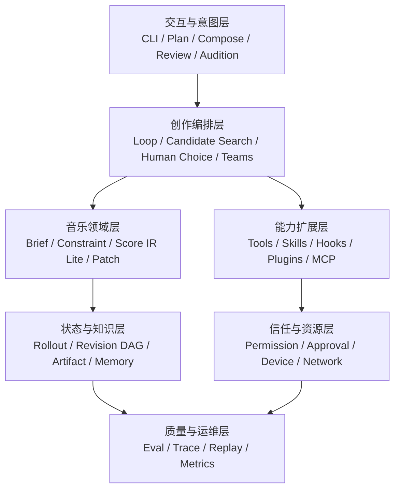
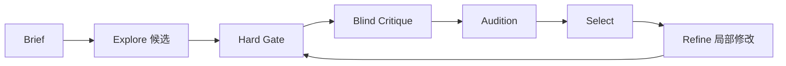
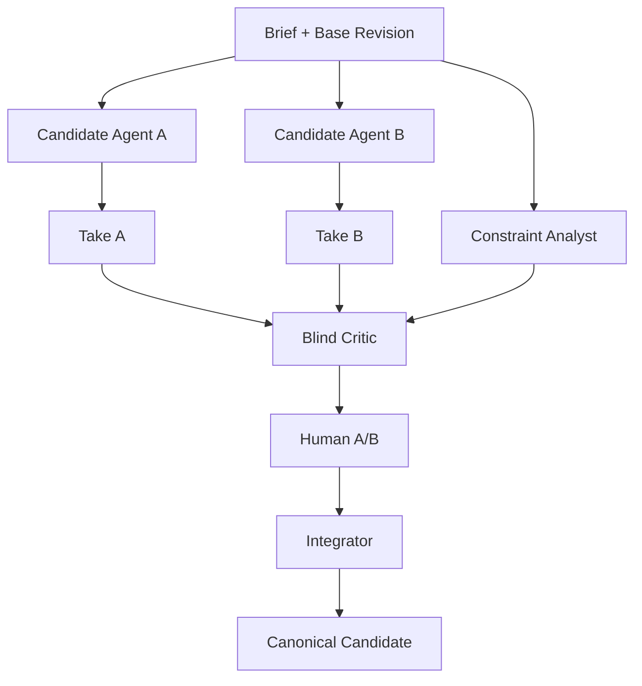

# Alda 进阶音乐 Agent 架构设计

> 本文是 M0–M5 基础 Harness 之后的 V2 设计。它定义目标协议、领域模型和验收标准，不表示仓库已经实现这些能力。

## 目录

1. [目标、Profile 与非目标](#1-目标profile-与非目标)
2. [七层架构](#2-七层架构)
3. [音乐领域模型](#3-音乐领域模型)
4. [创作循环](#4-创作循环)
5. [工具与语义 Patch](#5-工具与语义-patch)
6. [权限、审批与资源安全](#6-权限审批与资源安全)
7. [命令、模式、Skill、Plugin、Hook 与 MCP](#7-命令模式skillpluginhook-与-mcp)
8. [上下文、Rollout、Checkpoint 与 Memory](#8-上下文rolloutcheckpoint-与-memory)
9. [Take、Audible Diff 与 Artifact Store](#9-takeaudible-diff-与-artifact-store)
10. [SubAgent 与 Agent Teams](#10-subagent-与-agent-teams)
11. [并发、取消与资源锁](#11-并发取消与资源锁)
12. [评测、可观测性与 Replay](#12-评测可观测性与-replay)
13. [配置和目录布局](#13-配置和目录布局)
14. [威胁模型](#14-威胁模型)
15. [迁移方案](#15-迁移方案)
16. [ADR 与开放问题](#16-adr-与开放问题)

## 1. 目标、Profile 与非目标

### 1.1 目标

进阶系统应能完成以下闭环：

```text
用户意图
  → 结构化 Brief 与约束
  → 一个或多个隔离 Take
  → 确定性语法/结构门禁
  → 可演奏性与启发式分析
  → 可追溯 Render 和 A/B 试听
  → 结构化人类反馈
  → 选择、语义修改或合并
  → 接受并保存来源证据
```

### 1.2 三个 Profile

`legacy-mvp` 是 M0–M5 数据与行为的兼容标签，不是正式 Profile。它没有 V2 Revision、通用权限或可追溯 Audition；打开旧 Session 时必须迁移，不能声称已经满足 `minimal`。

| Profile | 最早里程碑 | 使用场景 | 能力 |
|---|---:|---|---|
| `minimal` | M8 | 教学与本地短作品 | Brief、Revision、Tool V2、权限、Take、符号 Gate、可追溯试听 |
| `advanced` | M10 | 长项目与可扩展创作 | `minimal` + 模式、MUSIC.md、Skill、声明式 Hook、本地 Plugin、证据化 Memory、受隔离只读 MCP |
| `studio` | M11+ | DAW/外设/协作制作 | `advanced` + 可选 SubAgent、受限命令扩展、远程/写入 MCP、DAW、批处理与完整审计 |

Profile 是能力上限，不是三个独立代码库。低 Profile 不注册高风险工具，也不加载相关 schema。

### 1.3 非目标

- 不承诺专业实时伴奏或演出级低延迟；
- 不宣称任何自动指标等价于“好听”；
- 不让 Audio Critic 替代用户审美；
- 不在首期实现完整 MusicXML/Alda 双向编译器；
- 不默认开放 Bash、网络、DAW 写入或发布；
- 不保证 LLM replay 逐 token 确定；
- 不把相似度提示描述为法律结论。

## 2. 七层架构



### 2.1 层间规则

- UI 只能发出命令或用户意图，不直接改乐谱文件；
- 编排层决定工作流，但不能绕过领域不变量；
- 工具返回 Artifact、Evidence 与 ProposedEvent，不直接持有全局可变 Session；
- 状态层只接受带基线 Revision 的提交；
- 信任层在副作用发生前判断；
- 质量层观察所有层，但默认不记录秘密、完整 Prompt 或用户音频。

## 3. 音乐领域模型

### 3.1 聚合边界

```text
CompositionProject
├── Active BriefRevision
├── Score identity
├── Active Branch / Accepted Revision
└── Lifecycle

Score
├── Stable Parts
└── Revision DAG

Audition
├── Revision
├── Render
├── Playback Range
└── ListeningFeedback
```

`CompositionProject` 不内嵌所有事件、音频和历史；大对象进入 Artifact Store，以 hash 引用。

### 3.2 CreativeBrief

```rust
pub struct CreativeBrief {
    pub id: BriefRevisionId,
    pub raw_user_intent: String,
    pub goal: MusicalGoal,
    pub intended_use: IntendedUse,
    pub duration: OptionalRange<MusicalDuration>,
    pub instrumentation: InstrumentationSpec,
    pub form: Option<FormSpec>,
    pub meter_map: MeterMap,
    pub tempo_curve: TempoCurve,
    pub affect_curve: Vec<AffectPoint>,
    pub style_profile: StyleProfile,
    pub references: Vec<ReferenceAsset>,
    pub open_questions: Vec<BriefQuestion>,
}
```

原则：

- 模糊词原文保留；“忧伤”不能静默变成“小调 + 60 BPM”；
- 影响硬约束的未知项先澄清；
- Brief 可版本化，Take 必须记录生成时使用的 BriefRevision；
- reference 记录来源、许可和是否可进入长期存储。

### 3.3 ConstraintSet

```rust
pub enum ConstraintSeverity {
    Hard,
    Soft { weight: f32 },
    Advisory,
}

pub struct Constraint {
    pub id: ConstraintId,
    pub source: ConstraintSource,
    pub severity: ConstraintSeverity,
    pub scope: MusicalAddress,
    pub predicate: ConstraintPredicate,
    pub verification: VerificationMethod,
    pub status: ConstraintStatus,
}
```

不变量：

- Hard 未通过时不能进入 `Acceptable`，除非有显式 Waiver；
- 主观约束可以是 `NeedsHumanReview`，不能把 Unknown 当 Pass；
- 冲突约束必须形成 `ConstraintConflict`；
- Soft 结果展示证据，不提供跨风格统一最优值。

### 3.4 Score IR Lite

首期 IR 不承担完整乐谱格式转换，只提供稳定地址和派生证据：

```rust
pub struct ScoreIrLite {
    pub score_id: ScoreId,
    pub source_hash: ContentHash,
    pub parts: Vec<StablePart>,
    pub sections: Vec<Section>,
    pub beat_grid: BeatGrid,
    pub markers: Vec<MarkerBinding>,
    pub events_ref: ArtifactRef,
    pub source_map: Vec<SourceBinding>,
    pub mapping_state: MappingState,
}

pub enum MappingState {
    Ready,
    NeedsIdentityMapping,
    NeedsSectionMapping,
    UnknownMeter,
}

pub enum MusicalAddress {
    WholeScore,
    Section(SectionId),
    Part(PartId),
    PartSection { part: PartId, section: SectionId },
    BeatRange { start: BeatPosition, end: BeatPosition },
    MarkerRange { from: MarkerName, to: MarkerName },
    Motif(MotifId),
}
```

稳定 Part 优先使用 Alda alias；Section/Beat 优先来自显式 marker、用户确认的 MeterMap/SectionMap 或带来源的项目元数据。无 alias 的导入文件进入 `NeedsIdentityMapping`；无 marker 或拍号依据时进入 `NeedsSectionMapping` / `UnknownMeter`。未完成映射只能使用 `WholeScore`、可靠 alias 或 `MarkerRange`，不能虚构 Section/Beat 地址。

### 3.5 ScoreRevision

```rust
pub struct ScoreRevision {
    pub id: RevisionId,
    pub score_id: ScoreId,
    pub parents: Vec<RevisionId>,
    pub brief_revision: BriefRevisionId,
    pub source: ArtifactRef,
    pub ir: Option<ArtifactRef>,
    pub patch: Option<MusicPatch>,
    pub generated_by: ActorRef,
    pub generation: GenerationManifest,
    pub evidence: Vec<EvidenceRef>,
}
```

生命周期不写回不可变 Revision，而由事件生成读取投影：

```rust
pub struct RevisionLifecycleProjection {
    pub revision: RevisionId,
    pub state: RevisionLifecycleState,
    pub readiness: AcceptanceReadiness,
    pub decided_by: Option<ActorRef>,
}
```

`ReadyForAcceptance` 是 Gate 派生的 readiness，不是 `Accepted` 生命周期状态。

不变量：

- Revision 创建后不可覆盖；
- parent 图必须无环；
- Evidence 必须匹配 source hash；
- Accepted/Published 只能引用不可变 Revision；
- 自动生成者不能自行授予 Published；
- merge Revision 必须有多个 parent 和冲突决议记录。

### 3.6 Evidence

```rust
pub enum Evidence {
    Syntax(SyntaxEvidence),
    Structural(StructuralEvidence),
    Heuristic(HeuristicEvidence),
    Playability(PlayabilityEvidence),
    Render(RenderEvidence),
    AudioModel(AudioModelEvidence),
    ListeningHuman(ListeningHumanEvidence),
    ScoreReviewHuman(ScoreReviewHumanEvidence),
    PerformanceTest(PerformanceTestEvidence),
}
```

证据等级不互相替代。AudioModel 不是 Human；Heuristic 不是 Structural；Parse 不是审美判断。

### 3.7 Audition 与 Feedback

```rust
pub struct Audition {
    pub id: AuditionId,
    pub revision: RevisionId,
    pub render: RenderId,
    pub range: MusicalAddress,
    pub order: u32,
    pub device_profile: Option<DeviceProfileId>,
    pub status: AuditionStatus,
    pub played_range: Option<MusicalAddress>,
    pub played_until: Option<BeatPosition>,
}

pub struct ListeningFeedback {
    pub audition: AuditionId,
    pub raw_text: String,
    pub targets: Vec<FeedbackTarget>,
    pub dimensions: Vec<PerceptualAssessment>,
    pub preference: Option<CandidatePreference>,
    pub interpretation_confidence: Option<f32>,
}
```

`ListeningHumanEvidence` 必须绑定实际开始的 Audition，但可来自完整播放、用户主动停止或部分播放；反馈 scope 不得超过 `played_range/played_until`。读谱意见使用 `ScoreReviewHumanEvidence`，真实试奏意见使用 `PerformanceTestEvidence`，不能伪装成已听 Render。结构化抽取必须保留用户原话并允许纠正。

## 4. 创作循环

### 4.1 双循环



Explore 负责差异，Refine 负责局部收敛。Critic 只提出证据与假设，不能覆盖 Take。

### 4.2 Creative Budget

```rust
pub struct CreativeBudget {
    pub max_model_tokens: u64,
    pub max_input_tokens: u64,
    pub max_output_tokens: u64,
    pub max_cost: Option<Money>,
    pub max_candidates: usize,
    pub max_refinements_per_candidate: usize,
    pub max_auditions: usize,
    pub max_wall_time: Duration,
    pub max_render_cpu: Duration,
    pub max_artifact_bytes: u64,
    pub subagent_reservations: Vec<BudgetReservation>,
    pub min_diversity: Option<DiversityThreshold>,
}
```

达到预算不是成功，只是 `BudgetExhausted`。系统返回当前最佳候选和未满足约束。

### 4.3 停止条件

必须同时区分：

- `HardConstraintsSatisfied`；
- `UserAccepted`；
- `NoUsefulChange`；
- `BudgetExhausted`；
- `Cancelled`；
- `BlockedByPermission`；
- `NeedsClarification`。

## 5. 工具与语义 Patch

### 5.1 Tool Contract V2

```rust
#[async_trait]
pub trait MusicTool: Send + Sync {
    fn descriptor(&self) -> ToolDescriptor;

    fn resolve(
        &self,
        args: ToolArgs,
        ctx: ResolveContext,
    ) -> Result<ActionPlan, ToolError>;

    async fn execute(
        &self,
        plan: AuthorizedActionPlan,
        caps: StagingCapabilities,
    ) -> Result<ToolOutcome, ToolError>;
}

pub struct ResolveContext {
    pub project: ProjectSnapshot,
    pub base_revision: RevisionId,
    pub branch: BranchId,
    pub cancellation: CancellationToken,
}

pub struct ActionPlan {
    pub args_digest: ContentHash,
    pub base_revision: RevisionId,
    pub effects: Vec<EffectClass>,
    pub resources: Vec<ResourceClaim>,
    pub data_egress: Vec<DataEgressClaim>,
    pub approval: ApprovalPayload,
}

pub struct ToolOutcome {
    pub staged_artifacts: Vec<StagedArtifact>,
    pub evidence: Vec<Evidence>,
    pub proposed_events: Vec<DomainEvent>,
    pub model_message: String,
}
```

执行顺序是强协议，不是实现建议：

```text
resolve(args, snapshot)
→ ActionPlan(effect/resource/data egress/approval payload)
→ PermissionDecision
→ seal AuthorizedActionPlan（绑定 plan hash、策略版本、scope、expiry）
→ execute(AuthorizedActionPlan, StagingCapabilities)
→ StagedArtifact + Evidence + ProposedEvent
→ verify + CAS commit
```

工具不接收 `&mut Session`，也拿不到任意文件系统、网络或设备句柄。`StagingCapabilities` 只暴露本次授权的临时 Artifact sink、设备/网络 capability 和取消句柄；未授权计划无法构造。动态目标路径、URL、设备和数据外发必须在 `resolve` 后进入 plan，执行时若参数或资源身份变化则计划失效。Coordinator 使用 `base_revision` 乐观提交；冲突返回 `CommitConflict`，禁止 last-write-wins。Artifact 可先进入隔离 staging，只有验证与 CAS 成功后才进入可达索引；失败 staging 可安全清理。

Capability API 只能约束遵守宿主边界的受信内建代码：工具 crate 禁止直接 I/O 依赖并接受静态检查/代码审计。非托管 Hook、Plugin 或 MCP 不能放在同一进程里假装被 Rust 类型保护，必须进入第 7 节的受限 Extension Host / OS Sandbox。

### 5.2 ToolDescriptor

除 JSON Schema 外，工具声明：

```text
exposure: direct | deferred | hidden
effect: observe | workspace_write | audible_output | external_file_write |
        external_device_write | network_read | network_write | model_egress |
        publish | destructive
parallelism: parallel | score_serial | resource_locked
resource_locks: [audio_device, daw_project]
determinism: deterministic | seeded | nondeterministic
cancel_safety: safe | teardown_required | unsafe
latency: interactive | batch
```

### 5.3 核心工具

| 工具 | 作用 | Effect |
|---|---|---|
| `score_read` | 读源码、IR、结构或指定片段 | Observe |
| `score_patch` | 应用可验证 MusicPatch | WorkspaceWrite |
| `score_parse` | 调 Alda parse | Observe |
| `score_analyze` | 结构、乐理和可演奏性证据 | Observe |
| `take_fork` | 从 Revision 建隔离 Take | WorkspaceWrite |
| `take_compare` | 语义与指标差异 | Observe |
| `audition` | 播放指定 Take/Range | AudibleOutput |
| `audition_stop` | 停止播放 | AudibleOutput |
| `feedback_record` | 绑定试听反馈 | WorkspaceWrite |
| `score_import` | MusicXML/MIDI/Alda 导入 | WorkspaceWrite |
| `score_export` | MIDI/音频/乐谱导出 | WorkspaceWrite / ExternalFileWrite（按目标动态取高者） |
| `ask_human` | 请求澄清、选择或审批 | Observe |

### 5.4 MusicPatch MVP

```rust
pub enum MusicPatch {
    ReplaceSection { section: SectionId, source: String },
    ReplacePartSection { part: PartId, section: SectionId, source: String },
    Transpose { scope: MusicalAddress, semitones: i8 },
    ChangeInstrumentation { part: PartId, instrument: InstrumentSpec },
    AdjustTempo { scope: MusicalAddress, target: TempoSpec },
    AdjustDynamics { scope: MusicalAddress, curve: DynamicCurve },
}
```

首期保留 `ReplaceWholeScore` escape hatch，但必须产生新 Revision、显示大范围变更警告并重跑全部 Gate。

## 6. 权限、审批与资源安全

### 6.1 三态决策

```rust
pub enum PermissionRequirement {
    Skip { constrained_by: CapabilitySet },
    NeedsApproval { action: ApprovalAction, reason: String },
    Forbidden { reason: String },
}
```

### 6.2 EffectClass 默认策略

| Effect | Minimal | Advanced | Studio |
|---|---|---|---|
| Observe | 自动 | 自动 | 自动 |
| WorkspaceWrite | 当前项目自动 | 当前项目自动 | 当前项目自动 |
| AudibleOutput | 首次询问，可会话允许 | 首次询问 | 设备策略 |
| ExternalFileWrite | 禁止 | 每次询问 | 目标目录 allowlist + 询问 |
| ExternalDeviceWrite | 禁止 | 询问 | 设备 allowlist |
| NetworkRead | 禁止 | server allowlist | 域 allowlist |
| NetworkWrite | 禁止 | 每次询问 | 每次询问 |
| ModelEgress | 首次披露 Provider/字段 | 按项目与 Provider 同意 | 按 Provider/Audio Critic/字段策略 |
| Publish | 禁止 | 每次询问 | 每次询问 |
| Destructive | 禁止 | 每次询问 | 每次询问 + backup |

审批 payload 显示音乐动作，不只显示命令字符串，例如播放设备、预计时长、音量、Take、范围和导出目标。

音量控制只承诺软件可控范围：音频 Render 可限制增益并测量 loudness，MIDI 直出只能限制 velocity/软件 gain；系统无法判断或控制外置功放、耳机旋钮的物理音量，首次试听必须明确提示这一边界。

### 6.3 最小安全基座

- 规范化路径并确认位于 workspace；
- 写前 snapshot，原子 rename 提交；
- 子进程 timeout、进程组 kill 和输出上限；
- 播放设备 semaphore；
- MCP/外部内容视为不可信数据；
- 外部 annotation 不能替代本地 EffectClass；
- approval cache 使用结构化 key，不缓存“全部允许”；
- `AuthorizedActionPlan` 绑定 args/target/Effect/策略版本和有效期，execute 不接受裸参数；
- `.alda-agent/permissions`、凭据、Hook、Plugin、Skill、MUSIC.md 等控制面路径不属于普通 `WorkspaceWrite`；
- 文件访问使用 root-dir capability、no-follow/openat 类安全打开或提交前 inode 重验，不能只做一次字符串规范化；
- Post Hook 不能替代 Pre Permission。

## 7. 命令、模式、Skill、Plugin、Hook 与 MCP

### 7.1 Slash Commands

宿主命令处理确定性状态变化：

```text
/plan /compose /review /take /fork /diff /audition /stop
/constraints /memory /skills /mcp /compact /resume /status
/eval /permissions /agents
```

`/reharmonize` 等可复用创作流程应做 Skill，不做隐藏 Prompt 宏。

### 7.2 MUSIC.md

项目根 `MUSIC.md` 保存全局创作约定；多文件工程的乐章目录可有近层 `MUSIC.md` 覆盖远层。单个 `score.alda` 内的声部/段落没有目录祖先，局部规则必须进入带 `MusicalAddress` 的 Constraint/Instruction，不能机械套用目录层叠。系统保存来源链并在 `/status` 展示最终合并结果。强制团队规则仍应放入版本控制文档，不只放 Memory。

### 7.3 Music Skill

```text
skills/jazz-arrangement/
├── SKILL.md
├── manifest.toml
├── references/
├── rubrics/
├── transforms/
├── tests/
└── assets/
```

Manifest 至少声明：版本、触发描述、适用风格、工具需求、Effect 上限、输入输出 Artifact、规则文化范围、示例许可和 eval cases。

Skill 先只暴露 name/description，触发后加载完整内容；显式 `$skill` 优先于自动匹配。

### 7.4 Plugin

Plugin 是分发单元，可打包 Skill、Hook、MCP 配置、UI、预设和资产。首期只支持本地目录安装，不做 Marketplace；安装时检查 manifest、许可、Hook 信任和 MCP Effect。安装/升级/卸载只能通过专用宿主命令与更高审批修改控制面，普通 Agent 工具不得自改 Plugin。

### 7.5 Hook

```text
SessionStart / UserBriefSubmit
PreScorePatch / PostScorePatch / PostParse
PreAnalyze / PostAnalyze
PreAudition / PostAudition / OnFeedbackRecorded
PreExport / PreAccept / PrePublish
PreCompact / PostCompact
SubagentStop / Stop / SessionEnd
```

Advanced 首发只允许运行进程内、声明式、白名单 Hook（例如 schema 校验、调用已注册只读分析器），不直接执行任意命令。命令 Hook 等同于运行用户代码，只有进入 Studio 的受限 Extension Host 后才能启用；宿主必须提供文件、环境变量、网络与设备 capability，而不是只依赖内容 hash。

Hook 输出分 `Continue`、`Block`、`Warn`、`AdditionalContext` 和 `ProposedPatch`。`ProposedPatch` 必须重新进入标准 Permission、Gate 与 Coordinator 路径，Hook 没有旁路写权限。Hook 有稳定顺序、timeout、内容哈希信任、幂等键和递归深度限制。

### 7.6 Music MCP Gateway

支持标准 MCP 传输和命名空间，但宿主增加本地元数据：Effect、determinism、latency、resource locks、cancel safety、license scope。

首个 MCP 只做只读：`list_instruments`、`inspect_midi`、`read_project_metadata`。固定并测试协议版本、初始化/capability negotiation、JSON-RPC 错误、取消、断线与幂等重试；非幂等请求断线后必须先确认远端状态。

“只读”是本地 ActionPlan 的产品语义，不是 server 自证的安全边界。stdio server 必须运行在独立受限进程/容器，使用环境变量 allowlist、最小文件系统、默认无网络和输出上限；HTTP server 绑定 URL/身份/配置 hash/版本与域策略。凭据不继承给未声明 server。无法提供此隔离时，MCP 保持关闭。DAW 写入、远程/写入 MCP 和发布在 Studio Profile 后实现。

## 8. 上下文、Rollout、Checkpoint 与 Memory

### 8.1 模型上下文分层

```text
Stable Instructions
MUSIC.md hierarchy
Active Brief + Hard Constraints
Current Revision checkpoint
Selected Skill instructions
Relevant Memory snippets
Recent real user messages
Current tool schemas
```

所有层有 token 上限。稳定前缀尽量不变，动态状态用结构化 checkpoint 引用。

### 8.2 Rollout

JSONL 保存白名单事件：

```text
project_created / brief_revised / constraint_changed
revision_created / artifact_created / evidence_recorded
audition_started / audition_completed / feedback_recorded
memory_candidate / memory_committed / approval_decided
agent_spawned / agent_completed / agent_cancelled
checkpoint / compacted
```

大乐谱、MIDI 和音频不写进 JSONL，存 content-addressed blob；事件只引用 hash、mime、size 和 provenance。

Memory 事件也只保存 ID、正文 hash、scope、状态和审计元数据，不写偏好正文。正文进入独立加密 blob；`forget` 删除检索索引并销毁正文密钥，备份按声明的到期策略清除。审计可保留“发生过删除”的非敏感 tombstone，但不能借 append-only 名义继续保留可恢复正文。

### 8.3 MusicalCheckpoint

```rust
pub struct MusicalCheckpoint {
    pub accepted_revision: Option<RevisionId>,
    pub active_take: RevisionId,
    pub brief_revision: BriefRevisionId,
    pub hard_constraints: Vec<ConstraintId>,
    pub unresolved_questions: Vec<BriefQuestionId>,
    pub focus: Option<MusicalAddress>,
    pub last_parse: Option<EvidenceRef>,
    pub last_audition: Option<AuditionId>,
    pub artifact_refs: Vec<ArtifactRef>,
}
```

压缩后的上下文由最近真实用户消息、Checkpoint 和自然语言 handoff 组成。精确音符只从 Artifact 恢复。

### 8.4 Memory 类型

| 类型 | 内容 | 生命周期 |
|---|---|---|
| Working | 当前计划与未决问题 | Turn/Session |
| Project | Brief、接受版本、关键决策 | Project |
| Preference | 有证据的用户偏好 | 可衰减、可删除 |
| Episodic | 历次试听和选择 | Project/User |
| Semantic | Alda、乐理、乐器知识 | 版本化知识库 |
| Procedural | Skill、工作流、rubric | 版本化 |
| Provenance | 素材与生成来源 | 与 Artifact 同寿命 |

Preference 必须保存 evidence、scope、confidence、context、last_confirmed 和 contradiction。默认 opt-in；外部 MCP/搜索内容可配置为不参与记忆提取。

## 9. Take、Audible Diff 与 Artifact Store

### 9.1 Take

Take 是用户可理解的候选版本：

```rust
pub struct CandidateSet {
    pub id: CandidateSetId,
    pub common_base: RevisionId,
    pub brief_revision: BriefRevisionId,
    pub candidates: Vec<RevisionId>,
    pub diversity_intent: DiversityIntent,
}
```

A/B 候选必须共享 Brief 和基线，或明确标记不可直接比较。盲听阶段隐藏模型、Agent 和生成顺序。

### 9.2 Audible Diff

每个 Patch 生成：

- before/after 指定片段；
- 可选的 loudness-normalized A/B（保留原 Render，记录算法/目标/增益；若响度本身是比较目标则关闭）；
- 语义变化摘要；
- 可选 piano-roll、和声/密度/音域图；
- 非目标范围 regression 报告。

Render 分两级，避免把 Alda 原生能力写错：

- `MidiRenderArtifact`：Alda 2.4.3 原生导出 MIDI，记录 Alda 版本、MIDI hash、播放参数和 SoundFont/设备声明；现场播放不承诺可重建相同声音。
- `AudioRenderArtifact`：由另选的离线 synth/录音适配器产生，必须记录二进制版本、SoundFont hash、采样率、声道、gain、处理链与输出 hash。未选择并验证后端前，Audible Diff 只能用现场 A/B 或 MIDI/符号差异，不能声称已有可重复 WAV。

MIDI import、MusicXML import 与音频 export 都是 Alda Agent 新适配器，不是 Alda 2.4.3 原生导入/导出能力。

### 9.3 Artifact Store

```text
.alda-agent/artifacts/sha256/ab/cd...  # blob
.alda-agent/artifacts/index.jsonl      # metadata events
```

Metadata 包含 hash、mime、size、producer、source revision、tool/skill/model version、license scope 和 created_at。垃圾回收按显式引用强度、保留窗口和 pin 做可达性分析。

引用分为 strong/weak。Accepted/Published、pin 与保留窗口内的 active rollout 是 strong；过期 rollout、已删除 Memory 和缓存索引是 weak。系统声明 `replay_horizon` 与 blob retention：窗口内承诺恢复状态和 blob；窗口外只保证事件元数据与显式 `ArtifactMissing/Tombstoned`，不声称完整重放。Published 默认 pin，删除需单独治理流程。

## 10. SubAgent 与 Agent Teams

### 10.1 角色

- Conductor/Producer：拆任务、预算、冲突协调；
- Composer：主题、旋律、和声骨架；
- Arranger：织体和段落发展；
- Orchestrator：乐器与音域；
- Rhythm Agent：律动与节奏层；
- Playability Reviewer：演奏可行性；
- Blind Critic：不知道作者身份的独立评价；
- Render Engineer：MIDI、音频与设备；
- Provenance Reviewer：来源与发布 Gate；
- Integrator：唯一能提交 canonical 的角色。

### 10.2 协作契约

每个 Agent 接收同一 BriefRevision、只读 base Revision、有限 Memory 和预算。输出使用角色化 tagged enum：

```rust
pub enum AgentResult {
    CandidateProposal { patch: MusicPatch, evidence: Vec<EvidenceRef>, rationale: String },
    ConstraintReport { evidence: Vec<EvidenceRef>, unresolved: Vec<ConstraintId> },
    CritiqueReport { findings: Vec<CritiqueFinding>, audition_plan: Option<AuditionPlan> },
    IntegrationProposal { patches: Vec<MusicPatch>, conflicts: Vec<SemanticConflict> },
    FailureReport { status: AgentFailureStatus, partial_artifacts: Vec<ArtifactRef> },
}
```

只有 Candidate/Integrator 可以携带 Patch，只有 Integrator 可以提出 canonical commit。Critic 看 Brief 和 Artifact，不看作者理由。生成者不能同时最终批准自己的候选。

SubAgent 与 Agent Team 不是同一个生命周期：SubAgent 是一次候选、分析或审议任务，完成后返回结构化结果；Agent Team 是 Studio Profile 下可复用的角色集合、任务队列和预算域。MVP 只实现有界 SubAgent。只有跨曲目协作确有收益、角色记忆边界和停机策略经过验证后，才启用长期 Team；“给多个 Prompt 起角色名”不等于团队机制。

### 10.3 Take Workspace 与 Git Worktree

用户看到的是 Take/Variation，不是 checkout 路径。默认隔离由不可变 Revision、独立 rollout、Artifact namespace 和只读 base 提供。若候选还会修改 Plugin 代码、MUSIC.md 或多个工程文件，可以选 Git Worktree 作为文件系统后端，但它：

- 不能替代 `ScoreRevision`、`CandidateSet` 和 MusicPatch 语义冲突检测；
- 不能隔离共享音频设备、DAW、MCP 服务或凭据；
- 必须记录 worktree → Branch/Revision 映射，并在取消后安全清理；
- 不应成为只生成一个 Alda Artifact 的默认开销。

### 10.4 Future Studio Team 契约

长期 Team 至少需要 `TeamId`、版本化成员角色、任务 DAG、成员 mailbox、Team/成员两级预算、权限上限、checkpoint、恢复与停机协议。成员只能继承 Team 权限上限，不能自行扩权；任务 lease 超时可回收，重复投递靠 idempotency key；停止 Team 必须取消成员、释放设备并保存未提交 Take。跨项目 Preference 默认不共享。该规格是 Future Studio 接口边界，不进入 M11 默认实现。

### 10.5 MVP 工作流



最大并发 3，最大审议轮次 2。Agent 失败不取消其他候选；主线程返回成功结果与缺失项。

## 11. 并发、取消与资源锁

### 11.1 并发矩阵

| 操作 | 策略 |
|---|---|
| 不同 Take parse/analyze | 并行 |
| 候选生成 | 隔离并行 |
| canonical 提交 | 串行 CAS |
| 同一 DAW 工程写 | 独占 |
| 音频设备播放 | 队列 / semaphore(1) |
| CPU 音频分析 | 有界 worker pool |
| MCP 只读 | 按本地 Effect 判断并行 |

### 11.2 取消树

```text
Session Cancellation
└── Turn Cancellation
    ├── Agent Cancellation
    │   └── Tool Cancellation
    │       └── Subprocess / MCP Request
    └── Audition Cancellation
```

取消必须释放设备、杀进程组、停止 DAW transport，并返回结构化 `Aborted`。不持有锁跨 `await`；优先消息传递和乐观提交，不使用全局 `Arc<Mutex<Session>>`。

## 12. 评测、可观测性与 Replay

### 12.1 H0–H7

以下编号属于 `eval_schema = "alda-eval/v2"`。M0–M5 的 legacy schema 中 H2=LLM Judge、H3=人工验收；迁移映射为 legacy H2 → V2 H4，legacy H3 → V2 H5。报告必须携带 schema/version，不允许只写“H2 通过”。

| 层 | 评测 |
|---|---|
| H0 | 文件、hash、Alda parse、Artifact 完整性 |
| H1 | 硬约束、音域、时长、节拍、编制 |
| H2 | 变形正确性与 metamorphic tests |
| H3 | 动机、段落、结构与 Brief adherence |
| H4 | 盲式 LLM Judge，仅作信号 |
| H5 | 人类 A/B，允许“不确定/无偏好” |
| H6 | 多样性、来源、相似风险、motif lineage |
| H7 | TTFT、首次可听时间、成本、失败率、取消清理 |

Metamorphic tests 示例：转调后音程关系保持；tempo scale 后拍结构保持；声部重命名不改变播放事件。

### 12.2 Evaluation Card

报告分别显示：事实通过/失败、启发式信号、模型判断、人类意见、不确定项、适用风格和证据链接。禁止用一个总分掩盖冲突目标；候选可用 Pareto front 展示。

### 12.3 Trace 与 Replay

Trace reducer 从 Rollout 生成执行图。Replay 不自动重放扬声器、DAW 或发布动作，也不承诺重新调用模型得到相同音乐；在 `replay_horizon` 内恢复状态、Artifact 与决策来源，窗口外恢复事件元数据并显式报告缺失/tombstone。

### 12.4 隐私

遥测默认关闭；Prompt、完整乐谱、用户音频、Memory 和参考素材默认不进入 OTel。常规 span 只记录 ID、hash、安全摘要、时延、状态和大小。

模型调用本身也是数据外发，不等同于遥测。Provider/Audio Critic 分别声明接收字段、用途、保留/训练政策、地域和 endpoint；项目首次使用前展示并取得 `ModelEgress` 同意。敏感 Brief、未发布乐谱、Memory 和参考素材按字段最小化/脱敏，可选择本地 Provider；Audio Critic 需要独立 opt-in，不能沿用文本模型同意。

## 13. 配置和目录布局

```text
project/
├── MUSIC.md
├── score.alda
├── movements/02-scherzo/MUSIC.md
└── .alda-agent/
    ├── config.toml
    ├── constraints.toml
    ├── permissions.toml
    ├── hooks.json
    ├── skills/
    ├── plugins/
    ├── memories/
    ├── sessions/
    ├── artifacts/
    ├── takes/
    ├── traces/
    └── eval/
```

配置优先级：CLI > 环境变量 > 项目配置 > 用户配置 > defaults。秘密只从环境或凭据存储读取，不写进项目配置、Rollout 或 Memory。

## 14. 威胁模型

| 资产 | 威胁 | 控制 |
|---|---|---|
| 乐谱与 Take | 覆盖、路径穿越、并发丢失 | workspace root、不可变 Revision、原子提交 |
| 音频设备 | 超长/高音量播放、设备占用 | 审批 payload、时长/软件增益上限、物理音量提示、资源锁 |
| DAW/MIDI | 非幂等写入、transport 失控 | Studio Profile、Pre Permission、stop cleanup |
| 外部素材 | 隐私、许可和来源丢失 | provenance、license scope、opt-in memory |
| MCP | schema/prompt 注入、越权、数据外发 | schema 净化、本地 Effect、域 allowlist、审批 |
| Memory | 偏好误泛化、秘密持久化 | evidence/scope、脱敏、查看/删除、默认关闭 |
| LLM Provider / Audio Critic | 未发布作品、偏好或素材外发与保留 | ModelEgress、字段最小化、Provider 政策披露、本地选项、Audio 独立 opt-in |
| 控制面 | Agent 自改权限、Hook、Plugin、Skill、MUSIC.md 或凭据 | 专用宿主命令、更高审批、root capability/no-follow、环境变量 allowlist |
| 多 Agent | 覆盖、无限循环、成本失控 | 隔离 Take、预算、轮次、Integrator 单写 |
| 发布 | 未授权发布或错误归属 | PrePublish Gate、每次审批、来源清单 |

## 15. 迁移方案

### 15.1 从 `current_score: String` 迁移

1. 首次打开旧 Session 时计算 source hash；
2. 创建 `CompositionProject`、根 `ScoreRevision` 和默认 Branch；
3. parse 生成 IR Lite 与 Evidence；
4. 旧 `score_state` 转为兼容事件并保留原始行；
5. 后续写谱只创建 Revision，不覆盖根版本。

### 15.2 Tool trait 迁移

先为旧工具写 Adapter，但 Adapter 也必须实现 `resolve → authorize → execute`；旧 handler 只能在获得 `AuthorizedActionPlan` 后于受限串行执行器中运行。M7 后移除 `&mut Session`。并行能力只在所有写工具迁移且没有审批前副作用后开启。

### 15.3 Profile 兼容

`legacy-mvp` Session 先迁移为 V2 Revision/Artifact，才进入 `minimal`。Minimal 不加载 Skill/MCP/Memory/Teams；Advanced 可加载受限只读 MCP；远程/写入 MCP、DAW 与 Teams 属于 Studio。所有 Profile 继续写兼容的 V2 Revision 和 Artifact 事件。

## 16. ADR 与开放问题

| ADR | 决策 | 理由 |
|---|---|---|
| A-01 | 作品状态独立于聊天历史 | 压缩不能改写精确音乐事实 |
| A-02 | Revision 不可变 | 支撑回退、A/B、来源和并行隔离 |
| A-03 | 首期采用 IR Lite | 保留稳定地址，避免重造完整乐谱编译器 |
| A-04 | 工具返回 ProposedEvent | 移除共享 `&mut Session` 并支持乐观提交 |
| A-05 | 权限按 Effect 分类 | 工具名不能准确表达副作用 |
| A-06 | Human 拥有最终 Accept/Publish | 审美和授权不能由生成者自证 |
| A-07 | Skill 与 Slash 分离 | Slash 控状态，Skill 表达可复用流程 |
| A-08 | Multi-Agent 默认关闭 | 收益需同预算消融证明 |
| A-09 | Trace 可重建但不承诺生成确定性 | LLM 与外部渲染可能非确定 |
| A-10 | Audio Critic 是可选证据 | 不能替代人耳和用户偏好 |
| A-11 | Tool 使用两阶段授权与受限 capability | 从接口上阻止审批前副作用 |
| A-12 | Eval 报告版本化 | legacy H0–H3 与 V2 H0–H7 不可静默同名换义 |
| A-13 | 扩展代码必须有执行隔离 | hash/allowlist 不能约束真实系统调用 |

开放问题：

1. 无 alias 的 Alda Part 如何半自动建立稳定身份？
2. MeterMap 如何与源码保持双向一致并处理变拍？
3. MVP MusicPatch 是否还应包含 reharmonize？
4. Preference 从 Project 升级到 Global 需要多少独立证据？
5. 哪些乐器优先进入可演奏性规则库？
6. 盲评 Critic 应看到多少创作意图，哪些作者信息必须隐藏？
7. DAW 集成首选通用 MCP、专用 Adapter 还是两层组合？
8. Artifact GC 的默认保留和 pin 策略如何设计？
9. 相似风险分析的阈值如何避免常见短动机误报？
10. Studio Extension Host 在各平台采用 OS Sandbox、容器还是受限进程 capability，如何给出等价测试？
