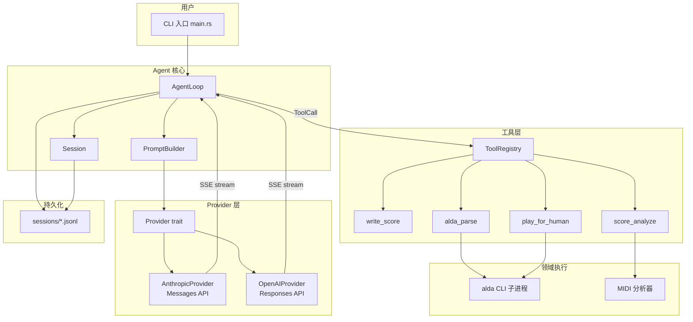

# Alda Agent Harness 设计文档

> 基于 docs/research/ 下 9 份调研报告的综合设计。所有设计决策均标注依据来源(调研文档:节号)。
>
> **版本边界**：本文是 M0–M5 的最小单 Agent 设计，不代表仓库中已有可运行实现，也不是最终产品架构。权限、不可变作品版本、试听证据、Skill/Hook/MCP、长期记忆和多 Agent 的 V2 设计见[进阶音乐 Agent 架构](advanced-music-agent-architecture.md)，实施顺序见[M6–M12 进阶路线](advanced-implementation-roadmap.md)。若两份文档冲突，以进阶架构中明确标记的迁移决策为准。

## 目录

1. [架构全景](#1-架构全景)
2. [核心类型与内部协议](#2-核心类型与内部协议)
3. [Agent 主循环设计](#3-agent-主循环设计)
4. [Provider 抽象层](#4-provider-抽象层)
5. [工具系统设计](#5-工具系统设计)
6. [流式输出与事件归一化](#6-流式输出与事件归一化)
7. [会话持久化与上下文管理](#7-会话持久化与上下文管理)
8. [配置系统](#8-配置系统)
9. [错误处理策略](#9-错误处理策略)
10. [Crate 划分与目录结构](#10-crate-划分与目录结构)
11. [里程碑实施计划](#11-里程碑实施计划)

---

## 1. 架构全景

### 1.1 设计哲学

> "Codex 大量复杂性来自多 client 并发、多 provider 抽象、安全 sandbox、长对话管理、Hook/Plugin 系统。Alda harness 是**单用户、单 session、短对话、固定白名单工具**的教学 MVP。暂缓上述扩展之后，核心可以先收敛为一个 `while loop` + tool dispatch。" —— 基于 codex-agent-loop.md §8.5 的 M0–M5 范围裁剪

这里的“暂缓”不是断言音乐工具没有风险。`alda parse` 接近纯分析，但 `play` 会占用音频/MIDI 设备并启动子进程，写谱会修改文件，未来的 MCP、联网、DAW 控制和发布还会引入更高副作用。MVP 依靠固定工具、固定参数、工作目录限制和超时降低风险；V2 再引入按 Effect 分类的权限与审批。

### 1.2 从 Codex 能力面裁剪到约 5000 行 MVP 的规划表

| codex 模块 | 代码量(估) | alda harness 取舍 | 理由 |
|------------|-----------|-------------------|------|
| `tui` | ~23 万行 | **砍掉** — CLI 命令行交互即可 | 参考 codex `exec/` crate 的 headless 模式 |
| `app-server` / `app-server-daemon` / JSON-RPC 传输层 | ~10 万行 | **砍掉** — 单进程内直接调用 | 不需要多 client 并发 (harness-engineering.md §末节) |
| `sandboxing` / `bwrap` / `linux-sandbox` / `windows-sandbox` | ~3 万行 | **砍掉** — alda 工具全部白名单化,无任意命令执行 | codex-tools.md §7.1 |
| `guardian` | ~5 万行 | **MVP 不引入独立 Guardian** — 以白名单、路径边界、参数校验和超时控制已知副作用 | V2 按 Effect 增加权限与审批，见进阶架构 §6 |
| `rollout` + `state` + `thread-store` + SQLite | ~3 万行 | **取其骨架** — 单文件 JSONL + 逆序扫描 resume,砍 SQLite/zstd/ordinal/Paginated | codex-session-state.md §6 |
| `plugin` / `ext` / `connectors` / `MCP` | ~10 万行 | **砍掉** — 工具 <10 个,不需要扩展体系 | codex-tools.md §7.1 |
| `code-mode` / `collaboration-mode` | ~5 万行 | **砍掉** — 单一交互模式 | |
| `multi_agents` / `agent-graph` | ~5 万行 | **M0–M5 不实现** — 先建立可重复的单 Agent 基线 | V2 仅在同预算对照与盲听证明收益后启用，见进阶架构 §10、§12 |
| `analytics` / `otel` / `feedback` / `telemetry` | ~3 万行 | **砍掉** — 学习项目不需要 | |
| `agent-identity` / `memories` / `skills` / `context-fragments` | ~5 万行 | **取其思想** — 系统提示词注入 alda 文档,但不需要框架 | harness-engineering.md §3.4 |
| `exec` (headless entry) | ~1 万行 | **取其结构** — `run_turn` 的 while loop 模式 | codex-agent-loop.md §3 |
| `tools` crate (通用抽象) | ~6.5k 行 | **取其 trait 骨架** — `Tool` trait + `ToolRegistry` | codex-tools.md §7.1 |
| `core` (核心 agent 逻辑) | ~28.7 万行 | **取其 500 行精华** — agent loop + stream 处理 + prompt 组装 | codex-agent-loop.md §8.4 |

**范围说明**：表中的代码量均为快照级估算，用于解释取舍，不是精确统计，也不能证明两套系统能力等价。M0–M5 的工程预算目标约为 5000 行 Rust；实际规模应在实现后由 `tokei`/`cloc` 和验收结果记录，不能把“代码更少”当作品质证据。

### 1.3 整体架构图



### 1.4 数据流(mermaid sequenceDiagram)

```mermaid
sequenceDiagram
    actor User
    participant CLI as main.rs
    participant Loop as AgentLoop
    participant Prompt as PromptBuilder
    participant Provider as Provider(Anthropic/OpenAI)
    participant Registry as ToolRegistry
    participant Alda as alda CLI

    User->>CLI: "写一首C大调圆舞曲"
    CLI->>Loop: user_message(content)
    Loop->>Prompt: build(system_prompt, history, tools)
    Prompt-->>Loop: ChatRequest

    loop 每轮 turn
        Loop->>Provider: stream(request)
        Provider-->>Loop: SSE events (text_delta, tool_call, done)

        alt TextDelta
            Loop->>CLI: print(text)
        else ToolCall
            Loop->>Registry: dispatch(name, args)
            Registry->>Alda: alda parse -o data
            Alda-->>Registry: score JSON / parse error
            Registry-->>Loop: ToolOutput
            Loop->>Prompt: append(tool_output)
            Note over Loop: 若有错误则继续循环<br/>让模型修正
        else Done
            Note over Loop: turn 结束
        end
    end

    Loop->>CLI: final_response + score summary
    CLI-->>User: 乐谱文本 + 可播放路径
```

---

## 2. 核心类型与内部协议

### 2.1 消息类型(provider 无关的内部表示)

依据 codex-model-client.md §6.5 的 OpenAI vs Anthropic 消息格式差异对照表,设计统一内部类型:

```rust
/// 一条对话消息,对两种 provider API 归一化
/// 所有变体统一使用 Vec<ContentBlock>,避免 adapter 对不同变体做分支判断
#[derive(Debug, Clone, Serialize, Deserialize)]
#[serde(tag = "role", rename_all = "lowercase")]
pub enum Message {
    User {
        content: Vec<ContentBlock>,
    },
    Assistant {
        content: Vec<ContentBlock>,
    },
    Tool {
        /// 工具执行结果,回注给模型(tool_use_id 建立与对应 tool_use 的关联)
        tool_call_id: String,
        content: Vec<ContentBlock>,
    },
    System {
        /// 仅用于 compact 后注入 developer message / steer
        content: Vec<ContentBlock>,
    },
}

#[derive(Debug, Clone, Serialize, Deserialize)]
#[serde(tag = "type", rename_all = "snake_case")]
pub enum ContentBlock {
    Text { text: String },
    ToolCall { id: String, name: String, arguments: String },
    /// 工具执行结果(对应 Anthropic tool_result, OpenAI function_call_output)
    ToolResult { tool_use_id: String, content: String },
    // 暂不支持 image/audio
}
```

**设计依据**:

- Anthropic Messages API 用 `"role": "user"/"assistant"` + `content` 数组,工具调用是 `content_block` 中的 `tool_use`/`tool_result` 类型(codex-model-client.md §6.5 表)
- OpenAI Responses API 用 `"type": "message"` + `"role": "..."` + `"content": [...]`,工具调用是独立 `ResponseItem::{FunctionCall, FunctionCallOutput}`(codex-model-client.md §1)
- 归一化后,两个 adapter 各自负责 `Message` ↔ 各家 API 格式的转换

### 2.2 ChatRequest(发给模型的请求)

借鉴 codex `Prompt` struct(`client_common.rs:17-48`,见 codex-agent-loop.md §8.2):

```rust
pub struct ChatRequest {
    /// 系统提示词(Anthropic: system 字段; OpenAI: instructions 字段)
    pub system_prompt: String,
    /// 对话历史(Vec<Message>,不含 system)
    pub messages: Vec<Message>,
    /// 工具定义(provider 无关的规格)
    pub tools: Vec<ToolSpec>,
    /// 模型名(必须是所选 provider 可用的模型 ID)
    pub model: String,
    /// 最大输出 token
    pub max_tokens: u32,
    /// 温度
    pub temperature: Option<f32>,
}

/// 工具规格(provider 无关)
/// Anthropic → 转成 input_schema; OpenAI → 转成 parameters
/// 参考 codex: ToolSpec 枚举(codex-tools.md §1.1),但简化为单一 Function 变体
pub struct ToolSpec {
    pub name: String,
    pub description: String,
    /// JSON Schema (properties + required)
    pub input_schema: serde_json::Value,
}
```

### 2.3 流式事件枚举(归一化所有 provider 的 SSE 事件)

借鉴 codex `ResponseEvent` 枚举(`codex-api/src/common.rs:76-123`,见 codex-model-client.md §6.4):

```rust
/// Provider 无关的流式事件
/// 各 adapter 把 SSE chunk 转成此枚举
pub enum StreamEvent {
    /// 文本增量
    TextDelta { text: String },
    /// 工具调用开始(content_block_start)
    ToolCallStart { id: String, name: String },
    /// 工具调用参数增量
    ToolCallDelta { id: String, arguments_delta: String },
    /// 工具调用完成(content_block_stop)
    ToolCallDone { id: String, name: String, arguments: String },
    /// 思考/推理文本增量(可选,展示用)
    ThinkingDelta { text: String },
    /// 输入 token 用量(可选,在 message_start 或 message_delta 中)
    UsageInput { input_tokens: u32, cached_input_tokens: u32 },
    /// 输出 token 用量
    UsageOutput { output_tokens: u32 },
    /// 请求完成
    Done { stop_reason: StopReason },
}

pub enum StopReason {
    EndTurn,       // 模型正常结束
    MaxTokens,     // 达到 max_tokens 上限
    ToolUse,       // 模型请求工具调用
    Error(String), // 错误
}
```

**映射规则**(依据 codex-model-client.md §6.4 流式事件对照表):

| 内部事件 | Anthropic SSE | OpenAI SSE |
|----------|--------------|------------|
| `TextDelta` | `content_block_delta`(delta.type=`text_delta`) | `response.output_text.delta` |
| `ToolCallStart` | `content_block_start`(type=`tool_use`) | `response.output_item.added`(type=`function_call`) |
| `ToolCallDelta` | `content_block_delta`(delta.type=`input_json_delta`) | `response.function_call_arguments.delta` |
| `ToolCallDone` | `content_block_stop` | `response.output_item.done` |
| `ThinkingDelta` | `content_block_delta`(delta.type=`thinking_delta`) | `response.reasoning_text.delta` |
| `Done(end_turn)` | `message_stop`(stop_reason=`end_turn`) | `response.completed` |
| `Done(tool_use)` | `message_stop`(stop_reason=`tool_use`) | `response.completed` |

---

## 3. Agent 主循环设计

### 3.1 双层循环结构

借鉴 codex `submission_loop` + `run_turn` 的双层结构(codex-agent-loop.md §3):

```rust
/// Agent 主循环
pub struct AgentLoop {
    session: Session,
    provider: Box<dyn Provider>,
    tools: ToolRegistry,
    config: AldaConfig,
}

impl AgentLoop {
    /// 外层循环:接收用户输入,管理 turn 生命周期
    pub async fn run(&mut self) -> Result<()> {
        loop {
            // 读取用户输入(CLI stdin / REPL / 文件)
            let user_input = self.read_user_input().await?;
            if user_input.is_empty() {
                break; // EOF → 退出
            }

            // 将用户消息追加到历史
            self.session.history.push(Message::User {
                content: vec![ContentBlock::Text { text: user_input }],
            });

            // 运行一个完整的 turn
            let result = self.run_turn().await;

            match result {
                Ok(_) => {
                    // 正常完成,显示最终结果
                    self.session.persist()?;
                }
                Err(AgentError::Interrupted) => {
                    eprintln!("[interrupted]");
                    continue; // 不退出,等下一个输入
                }
                Err(e) => {
                    eprintln!("[fatal] {e}");
                    break;
                }
            }
        }
        Ok(())
    }

    /// 内层循环:模型调用 → 工具执行 → 模型再思考,直到 turn 结束
    /// 对应 codex turn.rs:252 的 while follow_up 循环
    async fn run_turn(&mut self) -> Result<()> {
        let mut follow_up = true;
        let mut turn_iteration = 0;
        const MAX_TURN_ITERATIONS: u32 = 20; // 安全上限,防止无限循环

        while follow_up && turn_iteration < MAX_TURN_ITERATIONS {
            turn_iteration += 1;

            // 1. 组装请求
            let request = ChatRequest {
                system_prompt: self.build_system_prompt(),
                messages: self.session.active_messages(), // 含历史 + 本轮工具结果
                tools: self.tools.model_visible_specs(),
                model: self.config.model.clone(),
                max_tokens: self.config.max_tokens,
                temperature: self.config.temperature,
            };

            // 2. 流式调用模型
            let mut stream = self.provider.stream(request).await?;
            let mut pending_tool_calls: Vec<ToolCall> = vec![];
            let mut turn_assistant_content: Vec<ContentBlock> = vec![];

            // 3. 处理流式事件
            // 注意: provider adapter 保证 ToolCallDone 携带完整 arguments
            // ToolCallStart/ToolCallDelta 由 provider 内部消化,不暴露给此循环
            while let Some(event) = stream.next().await {
                match event? {
                    StreamEvent::TextDelta { text } => {
                        print!("{text}"); // 实时输出
                        turn_assistant_content.push(ContentBlock::Text { text });
                    }
                    StreamEvent::ToolCallDone { id, name, arguments } => {
                        // 同时记录到 pending(用于执行)和 assistant_content(用于历史回放)
                        // 缺失 ContentBlock::ToolCall 会导致 Anthropic API 抱怨 tool_result
                        // 找不到对应的 tool_use block
                        turn_assistant_content.push(ContentBlock::ToolCall {
                            id: id.clone(),
                            name: name.clone(),
                            arguments: arguments.clone(),
                        });
                        pending_tool_calls.push(ToolCall { id, name, arguments });
                    }
                    StreamEvent::ThinkingDelta { text } => {
                        // 可选:显示推理过程
                        if self.config.show_thinking {
                            eprint!("[think] {text}");
                        }
                    }
                    StreamEvent::UsageInput { .. } | StreamEvent::UsageOutput { .. } => {
                        // 更新 token 统计
                        self.session.update_token_usage(event);
                    }
                    StreamEvent::Done { stop_reason } => {
                        match stop_reason {
                            StopReason::EndTurn => {
                                follow_up = false;
                            }
                            StopReason::ToolUse => {
                                // 至少有一个工具调用,继续循环
                                follow_up = !pending_tool_calls.is_empty();
                            }
                            StopReason::MaxTokens | StopReason::Error(_) => {
                                follow_up = false;
                            }
                        }
                    }
                }
            }
            // 流异常退出(EOF without Done)——视为错误,防止空转死循环
            // 发生条件: 网络断开、超时、服务器异常关闭连接
            if follow_up && pending_tool_calls.is_empty() {
                tracing::warn!("stream ended unexpectedly without Done event, treating as fatal");
                return Err(AgentError::Provider(ProviderError::Fatal(
                    "stream closed without completion event".into()
                )));
            }

            // 4. 追加 assistant 消息到历史
            if !turn_assistant_content.is_empty() {
                self.session.history.push(Message::Assistant {
                    content: turn_assistant_content,
                });
            }

            // 5. 执行工具调用(顺序执行)
            for tc in &pending_tool_calls {
                let result = self.tools.dispatch(&tc.name, &tc.arguments, &mut self.session).await;
                // 参考 codex 的工具输出格式(codex-tools.md §4.2):
                // Exit code / Wall time / Output
                let output_text = match &result {
                    Ok(output) => output.model_visible_text(),
                    Err(e) => format!("Error: {e}"), // RespondToModel 语义
                };
                self.session.history.push(Message::Tool {
                    tool_call_id: tc.id.clone(),
                    content: output_text,
                });
                // 把 parse 成功/失败信息同步注入,帮助模型决策(参考 codex steer 模式)
                if result.is_err() {
                    // 工具失败 → follow_up = true,下轮模型会看到错误并修正
                    follow_up = true;
                }
            }

            pending_tool_calls.clear();
        }

        if turn_iteration >= MAX_TURN_ITERATIONS {
            eprintln!("[warn] turn iteration limit reached, stopping");
        }

        Ok(())
    }
}
```

### 3.2 系统提示词构建

借鉴 codex `BaseInstructions`(protocol/src/prompts/base_instructions/default.md,276 行)和 harness-engineering.md §5:

```rust
impl AgentLoop {
    fn build_system_prompt(&self) -> String {
        // 基础指令模板
        let mut prompt = String::new();
        prompt.push_str(include_str!("prompts/base_instructions.md"));
        // 注入当前乐谱状态(如果有)
        if let Some(score) = &self.session.current_score {
            prompt.push_str(&format!("\n\n## 当前乐谱\n```alda\n{score}\n```\n"));
        }
        // 注入 alda 语法速查(从 alda-language.md 提炼,约 200 行精简版)
        prompt.push_str(include_str!("prompts/alda_cheatsheet.md"));
        prompt
    }
}
```

`prompts/base_instructions.md` 的结构(参考 codex 的压缩指令四要点 + 音乐语境,codex-session-state.md §5.3):

```markdown
你是一个 Alda 音乐编程助手。你的任务是帮用户创作 alda 乐谱。

## 工作流程
1. 理解用户的音乐需求(风格、情绪、乐器、结构)
2. 用 write_score 工具写出乐谱
3. 用 alda_parse 校验语法和结构
4. 用 score_analyze 获得乐理度量反馈
5. 必要时用人耳播放工具,让用户听后给你反馈
6. 根据反馈迭代改进

## 核心约束
- 你**听不到音频**。你对音乐的"理解"只能来自 alda_parse 和 score_analyze 返回的符号信息。
- 所有乐谱必须通过 `alda parse` 无错误校验。
- 用户对播放效果的评价是你最重要的反馈信号——认真对待每一次用户反馈。

## 输出格式
- 最终乐谱用 write_score 工具输出,不要直接在对话中粘贴完整乐谱。
- 简短评价你的创作思路(1-3 句),不要长篇大论。
```

### 3.3 中断处理

借鉴 codex CancellationToken 模式(codex-agent-loop.md §6.1, §8.2):

```rust
use tokio_util::sync::CancellationToken;

impl AgentLoop {
    pub async fn run_with_interrupt(&mut self, cancel: CancellationToken) -> Result<()> {
        tokio::select! {
            result = self.run() => result,
            _ = cancel.cancelled() => {
                // 参考 codex: 取消后尝试优雅关闭 stream,然后发 TurnAborted
                eprintln!("[interrupted] shutting down...");
                self.session.persist()?; // 保存当前状态
                Ok(())
            }
        }
    }
}
```

---

## 4. Provider 抽象层

### 4.1 Provider trait

借鉴 codex `ModelProvider` trait(`model-provider/src/provider.rs:101-216`,见 codex-model-client.md §5):

```rust
/// 模型 Provider 抽象
#[async_trait]
pub trait Provider: Send + Sync {
    /// 流式对话(主要接口)
    async fn stream(&self, request: ChatRequest) -> Result<EventStream>;

    /// 非流式完整对话(compact 等场景使用)
    /// 默认实现: 调用 stream() 并收集所有 TextDelta
    async fn complete(&self, request: ChatRequest) -> Result<String> {
        let mut stream = self.stream(request).await?;
        let mut text = String::new();
        while let Some(event) = stream.next().await {
            if let StreamEvent::TextDelta { text: t } = event? {
                text.push_str(&t);
            }
        }
        Ok(text)
    }

    /// 获取 model 的 context window 大小(用于压缩阈值计算)
    fn context_window(&self) -> usize;

    /// 获取 provider 名称(日志/配置用)
    fn name(&self) -> &str;
}

/// 统一事件流
pub type EventStream = Pin<Box<dyn Stream<Item = Result<StreamEvent>> + Send>>;
```

### 4.2 Anthropic Provider 实现要点

依据 codex-model-client.md §6 的对照表:

```rust
pub struct AnthropicProvider {
    api_key: String,
    base_url: String,  // 默认 https://api.anthropic.com/v1
    client: reqwest::Client,
    model: String,
}

impl AnthropicProvider {
    /// 将 ChatRequest → Anthropic Messages API 请求体
    fn to_anthropic_request(&self, request: &ChatRequest) -> serde_json::Value {
        // system: String (单段,非数组)
        // messages: [{role, content: [{type, text/tool_use/tool_result}]}]
        // tools: [{name, description, input_schema}]
        // max_tokens, temperature, stream: true
        // anthropic-version: "2023-06-01"

        let system = request.system_prompt.clone();

        let messages: Vec<Value> = request.messages.iter().map(|msg| {
            match msg {
                Message::User { content } => json!({
                    "role": "user",
                    "content": content.iter().map(ContentBlock::to_anthropic).collect::<Vec<_>>()
                }),
                Message::Assistant { content } => json!({
                    "role": "assistant",
                    "content": content.iter().map(ContentBlock::to_anthropic).collect::<Vec<_>>()
                }),
                // Anthropic 的 tool_result 作为独立的 user-role 消息插入
                // 但实际 API 中 tool_result 是 content block,role 是 user
                Message::Tool { tool_call_id, content } => json!({
                    "role": "user",
                    "content": [{
                        "type": "tool_result",
                        "tool_use_id": tool_call_id,
                        "content": content
                    }]
                }),
                Message::System { .. } => panic!("System messages should be in system field, not messages"),
            }
        }).collect();

        let tools: Vec<Value> = request.tools.iter().map(|t| json!({
            "name": t.name,
            "description": t.description,
            "input_schema": t.input_schema,
        })).collect();

        json!({
            "model": request.model,
            "system": system,
            "messages": messages,
            "tools": tools,
            "max_tokens": request.max_tokens,
            "stream": true,
        })
    }

    /// 解析 Anthropic SSE 事件为统一 StreamEvent
    fn parse_sse_event(event_type: &str, data: &Value) -> Option<StreamEvent> {
        match event_type {
            "content_block_start" => {
                let block = &data["content_block"];
                if block["type"] == "tool_use" {
                    Some(StreamEvent::ToolCallStart {
                        id: block["id"].as_str()?.to_string(),
                        name: block["name"].as_str()?.to_string(),
                    })
                } else {
                    None // text block 的开始不需要单独事件,delta 里直接出文本
                }
            }
            "content_block_delta" => {
                let delta = &data["delta"];
                // 注意: Anthropic SSE content_block_delta 带的是 index(整数,内容块序号),
                // 而 content_block_start 带的是 id(tool_use 唯一标识如 "toolu_xxx")。
                // 需要维护 index→id 映射,确保累积器以 id 为 key。
                match delta["type"].as_str()? {
                    "text_delta" => Some(StreamEvent::TextDelta {
                        text: delta["text"].as_str()?.to_string(),
                    }),
                    "input_json_delta" => Some(StreamEvent::ToolCallDelta {
                        id: data["index"].to_string(),
                        arguments_delta: delta["partial_json"].as_str()?.to_string(),
                    }),
                    "thinking_delta" => Some(StreamEvent::ThinkingDelta {
                        text: delta["thinking"].as_str()?.to_string(),
                    }),
                    _ => None,
                }
            }
            "content_block_stop" => {
                // 在 Anthropic 中,content_block_stop 不携带完整参数
                // 需要在外部累积 ToolCallDelta 的 partial_json 拼接
                None // 由外层在收到 message_stop 时合成 ToolCallDone
            }
            "message_start" => {
                // 提取 input token 信息
                let usage = &data["message"]["usage"];
                Some(StreamEvent::UsageInput {
                    input_tokens: usage["input_tokens"].as_u64()? as u32,
                    cached_input_tokens: usage.get("cache_read_input_tokens")
                        .and_then(|v| v.as_u64()).unwrap_or(0) as u32,
                })
            }
            "message_delta" => {
                let delta = &data["delta"];
                // stop_reason 在 message_delta 中,不在 message_stop 中
                // 必须缓存它: AnthropicProvider 内部用字段存储，在 message_stop 时消费
                let mut events = vec![];
                if let Some(usage) = delta.get("stop_reason") {
                    // 缓存到 provider 内部状态,在 message_stop 时合成 Done
                    // (此逻辑在 AnthropicProvider::stream() 的循环中,此处只展示解析)
                }
                if let Some(usage) = data.get("usage") {
                    events.push(StreamEvent::UsageOutput {
                        output_tokens: usage["output_tokens"].as_u64().unwrap_or(0) as u32,
                    });
                }
                events
            }
            "message_stop" => {
                // message_stop 本身不含 stop_reason——
                // 由 provider 适配器用 message_delta 中缓存的值合成 Done
                None // 在 AnthropicProvider::stream() 循环中合成
            }
            "error" => Some(StreamEvent::Done {
                stop_reason: StopReason::Error(
                    data["error"]["message"].as_str().unwrap_or("unknown").to_string()
                ),
            }),
            "ping" => None,
            _ => None,
        }
    }
}
```

**关键差异处理**:

- Anthropic 的 `content_block_stop` 不携带 `arguments` 字段,需要在 stream 外部缓存 `ToolCallDelta` 累积拼接的 `partial_json`,在收到 `message_stop`(stop_reason=`tool_use`)时合成 `ToolCallDone`。
- **注意**: Anthropic 的 `stop_reason` 在 `message_delta` 事件的 `delta.stop_reason` 字段中,而非 `message_stop` 事件中。provider adapter 必须在收到 `message_delta` 时缓存 `stop_reason`,在后续 `message_stop` 到达时使用缓存值合成 `Done` 事件。
- Anthropic 的 `message_delta` + `message_stop` 是两个事件,OpenAI 只用 `response.completed` 一个——外层循环统一处理这两者的差异。

### 4.3 OpenAI Provider 实现要点

```rust
pub struct OpenAIProvider {
    api_key: String,
    base_url: String,  // 默认 https://api.openai.com/v1
    client: reqwest::Client,
    model: String,
}

impl OpenAIProvider {
    fn to_openai_request(&self, request: &ChatRequest) -> serde_json::Value {
        // instructions: String (顶层字段,对应 Anthropic 的 system)
        // input: [{type: "message", role, content: [{type: "input_text", text}]}]
        // tools: [{type: "function", name, description, parameters}]
        // max_output_tokens, temperature, stream: true

        let instructions = request.system_prompt.clone();

        let input: Vec<Value> = request.messages.iter().map(|msg| {
            match msg {
                Message::User { content } => json!({
                    "type": "message",
                    "role": "user",
                    "content": content.iter().map(ContentBlock::to_openai).collect::<Vec<_>>()
                }),
                Message::Assistant { content } => json!({
                    "type": "message",
                    "role": "assistant",
                    "content": content.iter().map(ContentBlock::to_openai).collect::<Vec<_>>()
                }),
                Message::Tool { tool_call_id, content } => json!({
                    "type": "function_call_output",
                    "call_id": tool_call_id,
                    "output": content,
                }),
                Message::System { content } => json!({
                    "type": "message",
                    "role": "developer",
                    "content": [{"type": "input_text", "text": content}],
                }),
            }
        }).collect();

        let tools: Vec<Value> = request.tools.iter().map(|t| json!({
            "type": "function",
            "name": t.name,
            "description": t.description,
            "parameters": t.input_schema,
        })).collect();

        json!({
            "model": request.model,
            "instructions": instructions,
            "input": input,
            "tools": tools,
            "max_output_tokens": request.max_tokens,
            "temperature": request.temperature,
            "stream": true,
        })
    }
}
```

### 4.4 重试策略

借鉴 codex `core/src/client.rs` 的重试逻辑(codex-model-client.md §4):

```rust
/// 可重试错误 vs 致命错误(copy codex 的设计,codex-model-client.md §4)
pub async fn stream_with_retry(
    provider: &dyn Provider,
    request: &ChatRequest,
    max_retries: u32,
) -> Result<EventStream> {
    let mut attempt = 0;
    let mut last_error = None;

    while attempt < max_retries {
        match provider.stream(request.clone()).await {
            Ok(stream) => return Ok(stream),
            Err(e) if is_retryable(&e) => {
                attempt += 1;
                let delay = std::time::Duration::from_millis(2u64.pow(attempt) * 100);
                tracing::warn!("stream attempt {attempt} failed: {e}, retrying in {delay:?}");
                tokio::time::sleep(delay).await;
                last_error = Some(e);
            }
            Err(e) => return Err(e), // 致命错误,不重试
        }
    }

    Err(last_error.unwrap())
}

fn is_retryable(e: &AgentError) -> bool {
    matches!(e,
        AgentError::Provider(ProviderError::RateLimited)
        | AgentError::Provider(ProviderError::ServerError(_))
        | AgentError::Provider(ProviderError::NetworkError(_))
    )
}
```

---

## 5. 工具系统设计

### 5.1 Tool trait

借鉴 codex `ToolExecutor` trait(`tools/src/tool_executor.rs:49-69`,codex-tools.md §2.1):

```rust
use crate::error::ToolError;

/// Alda agent 工具的最小 trait
/// 对应 codex: ToolExecutor<Invocation>,简化为 spec 与 handler 在同一 struct
#[async_trait]
pub trait Tool: Send + Sync {
    /// 工具名(模型调用时用)
    fn name(&self) -> &str;

    /// 工具的 JSON Schema 定义(模型可见)
    fn spec(&self) -> ToolSpec;

    /// 执行工具
    /// 参考 codex: handle(invocation) → ToolExecutorFuture
    async fn handle(&self, args: &str, session: &mut Session) -> Result<ToolOutput, ToolError>;

    /// 是否支持并行(默认 false,M1 不实现)
    fn supports_parallel(&self) -> bool { false }
}

/// 工具输出
pub struct ToolOutput {
    pub tool_call_id: String,
    /// 模型可见文本(纳入对话历史)
    pub text: String,
    /// 结构化数据(可选,程序消费)
    pub data: Option<serde_json::Value>,
    /// 工具执行是否成功
    pub success: bool,
}

impl ToolOutput {
    /// 生成模型可视化文本
    /// 参考 codex 的输出格式(codex-tools.md §7.1):
    /// Exit code: 0 | 1
    /// Wall time: X.XXXs
    /// Output:
    /// <content>
    pub fn model_visible_text(&self) -> String {
        let status = if self.success { "Exit code: 0" } else { "Exit code: 1" };
        let content = truncate_with_notice(&self.text, MAX_TOOL_OUTPUT_TOKENS);
        format!("{status}\n{content}")
    }
}

```

`ToolError` 统一定义在 `src/error.rs`（见 §9），工具模块只导入该类型，避免出现两个同名但不兼容的错误类型。

### 5.2 工具定义

```rust
// ===== write_score =====
// 对应 codex apply_patch: 覆写乐谱文件并自动跑 parse
// codex-tools.md §7.2

fn spec_write_score() -> ToolSpec {
    ToolSpec {
        name: "write_score".into(),
        description: "将 alda 乐谱写入文件。指定 path 和 content(完整 alda 源代码)。\
            写入后自动运行 alda parse 检查,检查结果会包含在输出中。\
            注意:你**听不到音频**,只能通过 alda_parse 和 score_analyze 判断乐谱质量。\
            写完请用 alda_parse 验证。".into(),
        input_schema: json!({
            "type": "object",
            "properties": {
                "path": {
                    "type": "string",
                    "description": "乐谱文件路径(如 score.alda)。路径限定在 workspace 内"
                },
                "content": {
                    "type": "string",
                    "description": "alda 源代码全文"
                }
            },
            "required": ["path", "content"]
        }),
    }
}

// ===== alda_parse =====
// LLM 可用的主要反馈信号

fn spec_alda_parse() -> ToolSpec {
    ToolSpec {
        name: "alda_parse".into(),
        description: "解析 alda 乐谱文件,返回 JSON 格式的 score 数据。\
            每个音符含 midi-note(音高编号)、offset(开始时间 ms)、duration(持续 ms)。\
            如果解析失败,返回带行列号的错误信息——请根据错误修正乐谱。\
            这个工具是你"看到"音乐的窗口,因为你听不到音频。".into(),
        input_schema: json!({
            "type": "object",
            "properties": {
                "path": {
                    "type": "string",
                    "description": "要解析的 alda 文件路径"
                },
                "output": {
                    "type": "string",
                    "enum": ["data", "events", "ast"],
                    "description": "输出格式。data=score JSON(默认,含 midi-note/offset/duration);\
                        events=事件列表;ast=语法树"
                }
            },
            "required": ["path"]
        }),
    }
}

// ===== score_analyze =====
// 乐理度量反馈,LLM 可用

fn spec_score_analyze() -> ToolSpec {
    ToolSpec {
        name: "score_analyze".into(),
        description: "分析 alda 乐谱的乐理特征,返回可计算度量摘要。包括:\
            - 调内音比例、音域、音高多样性\
            - 音符密度、节奏多样性、休止比\
            - 协和度、和弦类型分布\
            - 声部交叉检测、乐器音域合规\
            所有度量都从符号数据计算(midi-note/offset/duration/volume),\
            不涉及任何音频信号。适合你在听完前先做一轮客观检查。".into(),
        input_schema: json!({
            "type": "object",
            "properties": {
                "path": {
                    "type": "string",
                    "description": "要分析的 alda 文件路径"
                },
                "checks": {
                    "type": "array",
                    "items": {"type": "string"},
                    "description": "可选:要运行的特定检查项。默认全部运行"
                }
            },
            "required": ["path"]
        }),
    }
}

// ===== play_for_human =====
// 人耳专用通道

fn spec_play_for_human() -> ToolSpec {
    ToolSpec {
        name: "play_for_human".into(),
        description: "为用户播放 alda 乐谱。**你听不到音频!**\
            输出只含播放元信息(是否成功),不包含任何听感评价。\
            你必须请在用户听完后给你反馈,用户的口头评价是你理解\
            音乐效果的唯一途径。".into(),
        input_schema: json!({
            "type": "object",
            "properties": {
                "path": {
                    "type": "string",
                    "description": "要播放的 alda 文件路径"
                },
                "from": {
                    "type": "string",
                    "description": "可选:从指定标记处开始播放"
                },
                "to": {
                    "type": "string",
                    "description": "可选:播放到指定标记处结束"
                }
            },
            "required": ["path"]
        }),
    }
}
```

### 5.3 ToolRegistry

借鉴 codex `ToolRegistry`(HashMap\<ToolName, Arc\<dyn CoreToolRuntime\>\>,codex-tools.md §2.3):

```rust
pub struct ToolRegistry {
    tools: HashMap<String, Arc<dyn Tool>>,
}

impl ToolRegistry {
    pub fn new() -> Self {
        Self { tools: HashMap::new() }
    }

    pub fn register(&mut self, tool: Arc<dyn Tool>) {
        let name = tool.name().to_string();
        if self.tools.contains_key(&name) {
            panic!("duplicate tool name: {name}"); // 参考 codex error_or_panic
        }
        self.tools.insert(name, tool);
    }

    pub fn model_visible_specs(&self) -> Vec<ToolSpec> {
        self.tools.values().map(|t| t.spec()).collect()
    }

    /// 分发工具调用
    /// 参考 codex: registry.dispatch_any_with_terminal_outcome (codex-tools.md §3.3)
    pub async fn dispatch(&self, name: &str, args: &str, session: &mut Session) -> Result<ToolOutput, ToolError> {
        match self.tools.get(name) {
            Some(tool) => tool.handle(args, session).await,
            None => Err(ToolError::RespondToModel(format!(
                "unsupported tool: {name}. Available tools: {}",
                self.tools.keys().cloned().collect::<Vec<_>>().join(", ")
            ))),
        }
    }
}
```

---

## 6. 流式输出与事件归一化

### 6.1 SSE 解析器

```rust
/// 通用 SSE 解析器
/// 从 reqwest 的 Response 字节流解析 SSE 事件
/// 参考 codex: codex-api/src/sse/responses.rs (codex-model-client.md §3)
pub fn parse_sse_stream(
    response: reqwest::Response,
    provider: ProviderType,
) -> impl Stream<Item = Result<StreamEvent>> {
    // SSE 格式: "event: <type>\ndata: <json>\n\n"
    // 使用 tokio::io::BufReader 逐行读取
    // 累积 event + data 两行后解析为 StreamEvent

    // Anthropic: 每个 SSE 消息有 event: 行
    // OpenAI: SSE 中 event 为可选字段,通过 data 中的 type 字段区分

    // 累积 ToolCallDelta 的 partial_json,在收到 Done(tool_use) 时合成 ToolCallDone
    // (这是 Anthropic 的特化处理,见 §4.2)
}
```

### 6.2 关键设计:ToolCall 归一化由 Provider 适配器内部完成

> **设计决策**:每个 provider adapter 负责在自己的 `EventStream` 产生前内部累积 ToolCallDelta,
> 只向 AgentLoop 输出完整的 `ToolCallDone` 事件。AgentLoop 永远不会看到
> `ToolCallStart`/`ToolCallDelta`——它们是 provider 内部的中间态。

**Anthropic 特化处理**(`AnthropicProvider::stream()` 内部):
- `content_block_stop` 在 Anthropic 中**不携带完整 arguments**
- Anthropic adapter 必须在内部分配一个 `ToolCallAccumulator`,以 `index`(content_block 索引)为 key
- 累积所有 `content_block_delta(delta.type=input_json_delta)` 的 `partial_json`
- 在收到 `message_stop(stop_reason=tool_use)` 时调用 `finalize_all()`,合成完整的 `ToolCallDone` 事件,注入到输出流中
- **AgentLoop 拿到的 EventStream 中只有 `ToolCallDone` 变体**,没有 `ToolCallStart`/`ToolCallDelta`

**OpenAI 处理**(`OpenAIProvider::stream()` 内部):
- OpenAI 的 `response.output_item.done` 事件携带完整 `arguments`,可以直接转换为 `ToolCallDone`
- 不需要累积器

```rust
/// Anthropic provider 内部使用的累积器(不暴露给 AgentLoop)
/// 在 AnthropicProvider::stream() 内部持有
struct ToolCallAccumulator {
    pending: HashMap<String, ToolCallPending>,
}

struct ToolCallPending {
    name: String,
    id: String,
    arguments_buf: String,
}

impl ToolCallAccumulator {
    fn on_start(&mut self, id: String, name: String) {
        self.pending.insert(id.clone(), ToolCallPending {
            name, id, arguments_buf: String::new()
        });
    }

    fn on_delta(&mut self, id: &str, delta: &str) {
        if let Some(p) = self.pending.get_mut(id) {
            p.arguments_buf.push_str(delta);
        }
    }

    /// 在 Done(tool_use) 时调用,返回所有完成的 ToolCallDone 事件
    fn finalize_all(&mut self) -> Vec<StreamEvent> {
        self.pending.drain()
            .map(|(_, p)| StreamEvent::ToolCallDone {
                id: p.id,
                name: p.name,
                arguments: std::mem::take(&mut p.arguments_buf),
            })
            .collect()
    }
}
```

**`StreamEvent` 公开变体简化**:`ToolCallStart` 和 `ToolCallDelta` 不再作为公开的 `StreamEvent` 变体,
改为 provider 内部使用。AgentLoop 只匹配:

```rust
pub enum StreamEvent {
    TextDelta { text: String },
    ToolCallDone { id: String, name: String, arguments: String },
    ThinkingDelta { text: String },
    UsageInput { input_tokens: u32, cached_input_tokens: u32 },
    UsageOutput { output_tokens: u32 },
    Done { stop_reason: StopReason },
}
```

AgentLoop 的流事件处理简化为:

```rust
while let Some(event) = stream.next().await {
    match event? {
        StreamEvent::TextDelta { text } => {
            print!("{text}");
            turn_assistant_content.push(ContentBlock::Text { text });
        }
        StreamEvent::ToolCallDone { id, name, arguments } => {
            // 由 provider adapter 保证 arguments 是完整 JSON
            pending_tool_calls.push(ToolCall { id, name, arguments });
        }
        StreamEvent::ThinkingDelta { text } => { /* 可选展示 */ }
        StreamEvent::UsageInput { .. } | StreamEvent::UsageOutput { .. } => {
            self.session.update_token_usage(event);
        }
        StreamEvent::Done { stop_reason } => {
            match stop_reason {
                StopReason::EndTurn => follow_up = false,
                StopReason::ToolUse => follow_up = !pending_tool_calls.is_empty(),
                StopReason::MaxTokens | StopReason::Error(_) => follow_up = false,
            }
        }
    }
}
```

这消除了架构审查发现的 C1 问题:原设计 Anthropic path 永远不会产生 `ToolCallDone`,导致工具调用沉默。

---

## 7. 会话持久化与上下文管理

### 7.1 JSONL 会话日志

直接抄 codex 的骨架(codex-session-state.md §6.1),砍掉所有规模化机制:

```rust
/// 会话管理器:一个文件对应一次会话
pub struct Session {
    pub id: String,
    pub history: Vec<Message>,
    pub current_score: Option<String>,
    pub token_info: TokenUsageInfo,
    log_path: PathBuf,
}

impl Session {
    /// 创建新会话,写 session_meta 首行
    pub fn new(sessions_dir: &Path) -> Result<Self> {
        let id = uuid::Uuid::new_v4().to_string();
        let now = chrono::Utc::now().format("%Y-%m-%dT%H-%M-%S");
        let filename = format!("{now}-{id}.jsonl");
        // 对应 codex: precompute_log_file_info(recorder.rs:1549-1578)
        let log_path = sessions_dir.join(&filename);

        let mut session = Self {
            id,
            history: vec![],
            current_score: None,
            token_info: TokenUsageInfo::default(),
            log_path,
        };

        // 写首行 session_meta(codex 的做法)
        session.append_line(&json!({
            "ts": chrono::Utc::now().to_rfc3339(),
            "type": "session_meta",
            "payload": {
                "id": session.id,
                "created_at": chrono::Utc::now().to_rfc3339(),
                "cwd": std::env::current_dir().unwrap_or_default().to_string_lossy(),
            }
        }))?;

        Ok(session)
    }

    /// 从 JSONL 恢复会话(resume)
    /// 参考 codex: reconstruct_history_from_rollout (rollout_reconstruction.rs:113-440)
    pub fn resume(log_path: &Path) -> Result<Self> {
        let content = std::fs::read_to_string(log_path)?;
        let mut history = vec![];
        let mut id = String::new();
        let mut current_score = None;
        let mut replacement_history_idx: Option<usize> = None;

        // 第一遍:逆序找最新 compacted 检查点 + 元数据
        let lines: Vec<&str> = content.lines().collect();
        for (i, line) in lines.iter().enumerate().rev() {
            if let Ok(item) = serde_json::from_str::<Value>(line) {
                match item["type"].as_str() {
                    Some("session_meta") => {
                        id = item["payload"]["id"].as_str().unwrap_or("").to_string();
                    }
                    Some("compacted") => {
                        if item["payload"]["replacement_history"].is_array() {
                            replacement_history_idx = Some(i);
                            break; // 最新检查点找到,停
                        }
                    }
                    Some("score_state") => {
                        current_score = item["payload"]["alda_source"].as_str().map(String::from);
                    }
                    _ => {}
                }
            }
        }

        // 第二遍:正序重放检查点之后的 response_item
        let start = replacement_history_idx.unwrap_or(0);
        if let Some(idx) = replacement_history_idx {
            // 把 replacement_history 作为基线
            let line = &lines[idx];
            let item: Value = serde_json::from_str(line)?;
            if let Some(replacement) = item["payload"]["replacement_history"].as_array() {
                for msg_val in replacement {
                    if let Ok(msg) = serde_json::from_value::<Message>(msg_val.clone()) {
                        history.push(msg);
                    }
                }
            }
        }

        // 重放检查点之后的 response_item
        for line in &lines[(start + 1)..] {
            if let Ok(item) = serde_json::from_str::<Value>(line) {
                if item["type"] == "response_item" {
                    if let Ok(msg) = serde_json::from_value::<Message>(item["payload"].clone()) {
                        history.push(msg);
                    }
                }
            }
        }

        Ok(Self {
            id,
            history,
            current_score,
            token_info: TokenUsageInfo::default(),
            log_path: log_path.to_path_buf(),
        })
    }

    /// 追加一行 JSON
    fn append_line(&self, value: &Value) -> Result<()> {
        use std::io::Write;
        let mut file = std::fs::OpenOptions::new()
            .create(true)
            .append(true)
            .open(&self.log_path)?;

        // 参考 codex: ensure_rollout_is_newline_terminated(recorder.rs:1874-1887)
        let metadata = file.metadata()?;
        if metadata.len() > 0 {
            // 检查文件尾是否 \n(防崩溃半行)
            // 简化:追加前总是先写 \n 如果文件非空且不以 \n 结尾
        }

        writeln!(file, "{}", serde_json::to_string(value)?)?;
        file.flush()?;
        Ok(())
    }

    /// 持久化当前状态(在所有必要的 response_item 之后调用)
    pub fn persist(&self) -> Result<()> {
        // 写 score_state(如果有)
        if let Some(score) = &self.current_score {
            self.append_line(&json!({
                "ts": chrono::Utc::now().to_rfc3339(),
                "type": "score_state",
                "payload": { "alda_source": score }
            }))?;
        }
        Ok(())
    }

    /// 活动消息(发给模型的历史,含本轮工具结果)
    pub fn active_messages(&self) -> Vec<Message> {
        // 过滤掉 System 角色消息(system prompt 在 ChatRequest 中单独传递)
        self.history.iter()
            .filter(|m| !matches!(m, Message::System { .. }))
            .cloned()
            .collect()
    }
}
```

### 7.2 Token 统计

借鉴 codex-session-state.md §4:

```rust
#[derive(Debug, Clone, Default)]
pub struct TokenUsageInfo {
    /// 会话累计用量
    pub total_input: u32,
    pub total_output: u32,
    pub total_cached: u32,
    /// 最近一次请求的 input 用量(≈ 当前上下文大小,用于压缩判断)
    pub last_input: u32,
    pub last_output: u32,
    /// 模型 context window 大小
    pub context_window: u32,
}

impl TokenUsageInfo {
    /// 当前上下文占据窗口的比例
    /// 参考 codex: context_window.rs:23-91 的 token_limit_reached 判定
    /// 阈值取 0.8(codex 是 0.9,我们更保守,给压缩请求留余量)
    pub fn needs_compaction(&self) -> bool {
        if self.context_window == 0 {
            return false;
        }
        let used = self.last_input + self.last_output;
        used as f64 >= 0.8 * self.context_window as f64
    }
}
```

### 7.3 上下文压缩(alda 特化)

借鉴 codex local compaction 的两段式(codex-session-state.md §5.3, §6.4):

```rust
impl Session {
    /// 上下文压缩(alda 特化)
    /// 只在 pre-turn 触发(M1 甚至不需要,乐谱场景对话短)
    pub async fn compact(&mut self, provider: &dyn Provider) -> Result<()> {
        // 第一步:让模型写 handoff 摘要
        let compact_prompt = format!(
            "你正在进行上下文压缩。请写一份任务交接摘要给另一个 LLM:\n\
             - 当前的乐谱进展(调性、曲式、乐器)\n\
             - 用户的偏好反馈\n\
             - 还剩什么没完成\n\
             - 乐谱当前是否通过 parse 校验\n\
             不需要复述乐谱内容——乐谱会作为 score_state 注入。"
        );

        let compact_request = ChatRequest {
            system_prompt: compact_prompt,
            messages: self.active_messages(),
            tools: vec![], // 不需要工具
            model: provider.model().into(),
            max_tokens: 2048,
            temperature: Some(0.0),
        };

        let summary = provider.complete(compact_request).await?; // 非流式

        // 第二步:构造替换历史
        // 参考 codex COMPACT_USER_MESSAGE_MAX_TOKENS = 20_000(compact.rs:56)
        // alda 场景保留所有用户消息(含人耳反馈)——通常很短
        let user_messages: Vec<Message> = self.history.iter()
            .filter(|m| matches!(m, Message::User { .. }))
            .cloned()
            .collect();

        let summary_prefix = "之前的 LLM 写了此任务的交接摘要。使用摘要中的信息协助你继续工作。\
            摘要:\n";

        let mut replacement: Vec<Message> = Vec::new();
        replacement.extend(user_messages);

        // 注入当前乐谱作为 score_state
        // 注意: 这个 Message::System 只存在于 replacement history 中,
        // 用于 resume 后 build_system_prompt() 发现并设为 session.current_score,
        // 然后 active_messages() 过滤掉它。
        // 这样乐谱状态是"上下文背景"而非"对话内容", 语义干净。
        if let Some(score) = &self.current_score {
            replacement.push(Message::System {
                content: vec![ContentBlock::Text {
                    text: format!("## 当前乐谱状态\n```alda\n{score}\n```"),
                }],
            });
        }

        replacement.push(Message::User {
            content: vec![ContentBlock::Text {
                text: format!("{summary_prefix}\n{summary}"),
            }],
        });

        // 第三步:替换历史并落盘 compacted 检查点
        self.history = replacement;

        // 写 compacted 行——含 replacement_history 全文,resume 的基石
        self.append_line(&json!({
            "ts": chrono::Utc::now().to_rfc3339(),
            "type": "compacted",
            "payload": {
                "summary": summary,
                "replacement_history": self.history.iter()
                    .map(|m| serde_json::to_value(m).unwrap())
                    .collect::<Vec<_>>()
            }
        }))?;

        Ok(())
    }
}
```

---

## 8. 配置系统

```rust
use std::path::PathBuf;

/// Alda Agent 配置(最简,对比 codex 上千行 config)
#[derive(Debug)]
pub struct AldaConfig {
    /// 模型名
    pub model: String,
    /// Provider 类型
    pub provider: ProviderType,
    /// API key(或从环境变量读取)
    pub api_key: Option<String>,
    /// 最大输出 tokens
    pub max_tokens: u32,
    /// 温度
    pub temperature: Option<f32>,
    /// alda 子进程管理用
    pub alda_binary_path: PathBuf,
    /// alda 子进程超时(秒)
    pub alda_timeout_secs: u64,
    /// API 请求超时(秒)
    pub request_timeout_secs: u64,
    /// 会话存储目录
    pub sessions_dir: PathBuf,
    /// 工作区目录(乐谱文件存放处)
    pub workspace_dir: PathBuf,
    /// 是否显示思考过程
    pub show_thinking: bool,
}

#[derive(Debug, Clone, Copy)]
pub enum ProviderType {
    Anthropic,
    OpenAI,
}

impl AldaConfig {
    pub fn from_env() -> anyhow::Result<Self> {
        let provider = match std::env::var("ALDA_AGENT_PROVIDER")
            .unwrap_or_else(|_| "anthropic".into())
            .as_str()
        {
            "anthropic" => ProviderType::Anthropic,
            "openai" => ProviderType::OpenAI,
            other => anyhow::bail!("不支持的 provider: {other}"),
        };

        // M0 只打印配置，因此允许 key 暂缺；构造具体 provider 时再校验。
        let api_key = match provider {
            ProviderType::Anthropic => std::env::var("ANTHROPIC_API_KEY").ok(),
            ProviderType::OpenAI => std::env::var("OPENAI_API_KEY").ok(),
        };

        let default_model = match provider {
            ProviderType::Anthropic => "claude-sonnet-5-20251001",
            ProviderType::OpenAI => "gpt-5.6-sol",
        };

        Ok(Self {
            model: std::env::var("ALDA_AGENT_MODEL")
                .unwrap_or_else(|_| default_model.into()),
            provider,
            api_key,
            max_tokens: std::env::var("ALDA_AGENT_MAX_TOKENS")
                .unwrap_or_else(|_| "4096".into())
                .parse()
                .unwrap_or(4096),
            temperature: std::env::var("ALDA_AGENT_TEMPERATURE")
                .ok()
                .and_then(|v| v.parse().ok()),
            alda_binary_path: PathBuf::from(
                std::env::var("ALDA_BINARY").unwrap_or_else(|_| "alda".into())
            ),
            alda_timeout_secs: std::env::var("ALDA_TIMEOUT_SECS")
                .ok()
                .and_then(|v| v.parse().ok())
                .unwrap_or(120),
            request_timeout_secs: std::env::var("ALDA_AGENT_REQUEST_TIMEOUT_SECS")
                .ok()
                .and_then(|v| v.parse().ok())
                .unwrap_or(120),
            sessions_dir: dirs::data_dir()
                .unwrap_or_else(|| PathBuf::from("."))
                .join("alda-agent")
                .join("sessions"),
            workspace_dir: std::env::current_dir().unwrap_or_else(|_| PathBuf::from(".")),
            show_thinking: std::env::var("ALDA_AGENT_SHOW_THINKING")
                .map(|v| v == "1")
                .unwrap_or(false),
        })
    }
}
```

---

## 9. 错误处理策略

借鉴 codex `FunctionCallError::{RespondToModel, Fatal}` 两态设计(codex-tools.md §4.3):

```rust
#[derive(Debug, thiserror::Error)]
pub enum AgentError {
    /// Provider 相关错误
    #[error("provider error: {0}")]
    Provider(#[from] ProviderError),

    /// 工具执行错误
    #[error("tool error: {0}")]
    Tool(#[from] ToolError),

    /// IO 错误
    #[error("io error: {0}")]
    Io(#[from] std::io::Error),

    /// 用户中断
    #[error("interrupted")]
    Interrupted,

    /// 配置错误(启动时检查)
    #[error("config error: {0}")]
    Config(String),
}

#[derive(Debug, thiserror::Error)]
pub enum ProviderError {
    #[error("rate limited")]
    RateLimited,
    #[error("server error: {0}")]
    ServerError(String),
    #[error("network error: {0}")]
    NetworkError(String),
    #[error("auth error: {0}")]
    AuthError(String),
    #[error("fatal: {0}")]
    Fatal(String),
}

#[derive(Debug, thiserror::Error)]
pub enum ToolError {
    #[error("tool error recoverable by model: {0}")]
    RespondToModel(String),
    #[error("fatal tool error: {0}")]
    Fatal(String),
}

// AgentError ↔ ToolError 的转换
// 在 agent loop 中:
// - ToolError::RespondToModel(msg) → 不升级,直接作为 tool output 回给模型
// - ToolError::Fatal(msg) → 升级为 AgentError::Tool → 终止 turn
```

**两态的设计含义**(与 codex 一致):
- `RespondToModel`: alda parse 失败、参数格式错、用户乐谱语法错——**所有模型有能力自己修正的错误**。变成 tool output 的失败文本,让模型在下一轮自纠
- `Fatal`: alda CLI 找不到、文件系统权限不足、磁盘满——**模型帮不上忙的错误**。终止 turn,报告用户

---

## 10. Crate 划分与目录结构

### 10.1 M1-M2 单 crate

```text
alda-agent/
├── Cargo.toml
├── src/
│   ├── main.rs              # CLI 入口(约 100 行)
│   ├── types.rs             # 核心域类型: Message, ContentBlock, ChatRequest, ToolSpec, StreamEvent 等(约 100 行)
│   ├── config.rs            # AldaConfig(约 60 行)
│   ├── agent.rs             # AgentLoop(约 150 行,双层 while loop)
│   ├── session.rs           # Session + JSONL 读写(约 200 行)
│   ├── prompt.rs            # 系统提示词构建(约 50 行)
│   ├── provider/
│   │   ├── mod.rs           # Provider trait + EventStream(约 40 行)
│   │   ├── anthropic.rs     # AnthropicProvider + SSE 解析 + ToolCallAccumulator(约 200 行)
│   │   ├── openai.rs        # OpenAIProvider + SSE 解析(约 200 行)
│   ├── tools/
│   │   ├── mod.rs           # Tool trait + ToolRegistry(约 80 行)
│   │   ├── write_score.rs   # write_score handler(约 60 行)
│   │   ├── alda_parse.rs    # alda_parse handler(约 80 行)
│   │   ├── score_analyze.rs # score_analyze handler(约 200 行)
│   │   └── play_for_human.rs# play_for_human handler(约 60 行)
│   ├── metrics.rs           # 乐理度量计算(约 300 行,17 个函数)
│   └── prompts/
│       ├── base_instructions.md  # 系统提示词(约 100 行)
│       └── alda_cheatsheet.md    # alda 语法速查(约 200 行)
├── tests/
│   ├── fixtures/            # 测试用 alda 乐谱
│   └── integration.rs       # 集成测试
└── docs/
    ├── research/            # 调研文档(已有 9 份)
    ├── design/              # 本设计文档
    └── tutorials/           # 教程(M3)
```

### 10.2 M3+ Workspace 多 crate

当代码量增长到需要关注模块边界时,重构成 workspace:

```text
alda-agent/
├── Cargo.toml               # [workspace]
├── crates/
│   ├── alda-agent-core/     # AgentLoop + Session + Error
│   ├── alda-agent-provider/ # Provider trait + Anthropic/OpenAI 实现
│   ├── alda-agent-tools/    # Tool trait + all handlers
│   └── alda-agent-metrics/  # 乐理度量计算
├── src/                     # CLI binary crate(thin)
│   └── main.rs
└── ...
```

参考 codex 的 workspace 划分但只取其洁净的 crate 边界,不取其复杂度(不引入 app-server、plugin、MCP 等)。

---

## 11. 里程碑实施计划

### M0: 环境验证(1-2 天)

**目标**: 确认 alda 环境可用,搭好 Rust 脚手架。

**任务**:
1. `alda doctor` 检查环境(JVM + MIDI + SoundFont)
2. `alda play -c "piano: c d e f g a b > c"` 验证播放链
3. `alda parse -o data` 验证 JSON 输出格式
4. `cargo init alda-agent` + 添加依赖(tokio, reqwest, serde, serde_json, clap, uuid, chrono, tokio-util, async-trait, thiserror, dirs)
5. 写 `config.rs` + `main.rs`(最小 CLI)

**验收**: `cargo run -- "写一首C大调简单旋律"` 能打印配置和版本信息。

### M1: 最小 agent loop(3-5 天)

**目标**: 单 provider(Anthropic) + 两个工具(write_score, alda_parse)的完整闭环。

**任务**:
1. 实现 `provider/types.rs`(ChatRequest, Message, StreamEvent)
2. 实现 `provider/anthropic.rs`(Messages API adapter, SSE parser, ToolCallAccumulator)
3. 实现 `tools/mod.rs`(Tool trait, ToolRegistry)
4. 实现 `tools/write_score.rs` + `tools/alda_parse.rs`
5. 实现 `agent.rs`(双层 while loop)
6. 实现 `session.rs`(基础 JSONL 追加,不含 compact)
7. 实现 `prompt.rs` + `prompts/base_instructions.md`
8. 端到端测试:给模型一个简单需求,验证它能生成乐谱 → 纠错 → 通过 parse 的循环

**验收**: LLM 能完成"写一段 4 小节 C 大调旋律"→ parse 失败 → 自动修正 → 通过的全自动流程。人工抽查乐谱的语法正确性和可播放性。

**关键代码规模预估**: ~1200 行 Rust。

### M2: REPL 驱动 + 流式 + 第二个 provider(3-5 天)

**目标**: 完善交互体验,验证双 provider 抽象的可用性。

**任务**:
1. 实现 `provider/openai.rs`(Responses API adapter)
2. 完善流式输出(实时显示模型思考,带 spinner)
3. 实现 `tools/play_for_human.rs`(REPL `eval-and-play` 或 `alda play` 调用)
4. 交互式 REPL 模式(读用户输入 → 跑 turn → 等下一轮,支持 `:resume`, `:compact`, `:quit`)
5. 改善工具输出的格式化(颜色、截断提示)
6. 添加 `CancellationToken` 中断支持

**验收**: 能切换 provider,流式输出流畅,用户能输入需求 → 看模型迭代 → 说"太慢了,加快"→ 继续迭代 → 播放 → 听完说"难听,改和弦"→ 模型修正。

**关键代码规模预估**: ~2500 行 Rust(累计)。

### M3: 提示词工程 + 持久化(3-5 天)

**目标**: 系统提示词注入 alda 语言知识,会话可 pause/resume。

**任务**:
1. 从 `alda-language.md` 和 `music-theory.md` 提炼 `prompts/alda_cheatsheet.md`
2. 实现 `metrics.rs` 的 17 个度量函数(M1 的手写子集 → M3 全部实现)
3. 实现 `tools/score_analyze.rs`(调 alda parse 取 JSON → 算度量 → 格式化摘要)
4. 完善 `session.rs`(resume 算法, 逆序找 compacted 检查点 + 正序重放)
5. 实现 `session.rs` 的 compact 方法(pre-turn 压缩, alda 特化: 乐谱作为 score_state)
6. 添加 `:resume <session_file>` 和 `:sessions` REPL 命令

**验收**: agent 能回答复杂的 alda 语法问题(如"怎么在 alda 里用 cram 写三连音");会话中断后能无缝 resum;乐谱对话 >10 轮后触发压缩但乐谱信息不丢失。

**关键代码规模预估**: ~4000 行 Rust(累计)。

### M4: Evaluation harness(3-5 天)

**目标**: 可度量地评估 agent 的乐谱生成质量。

**任务**:
1. 建立测试集:从 `examples/` 29 首乐谱中选 10 首作为"期望输出"和金标准
2. 设计测试场景:
   - **转写任务**:给乐谱,要求 agent 生成近似版本 → 比较 score JSON 的结构相似度
   - **补全任务**:给前半段,要求 agent 写后半段 → LLM judge + 结构断言
   - **风格迁移任务**:"把这段改成小调"→ 检查调性变化 + LLM judge
3. 实现分层验证:
   - 本阶段报告标记 `eval_schema = "alda-eval/legacy-v1"`；进阶 V2 将 legacy H2/H3 映射为 V2 H4/H5，不能静默同名换义
   - **H0 客观校验**: `alda parse` 通过率, 语法错误率
   - **H1 结构断言**: note count 范围, 音域范围, 乐器数量, 时长范围
   - **H2 LLM judge**: 双盲对比原曲和 agent 生成, 从 5 个维度评分
   - **H3 人工验收**: 抽查 20% 样本播放验收
4. 输出 eval 报告模板

**验收**: 对 2-3 个模型/配置各跑一套 eval,产出一份对比报告。H0 通过率 >95%,H1 结构断言通过率 >80%。

**关键代码规模预估**: ~5000 行 Rust(累计),外加 eval 脚本。

### M5: 上下文压缩 + 工程收尾

**目标**: 验证长对话场景的完整性，冻结一个可用于后续对照实验的单 Agent 基线。

**任务**:
1. 测试并调优 pre-turn 压缩的实际效果
2. 添加手动 `:compact` 命令
3. 固化单 Agent 的成本、时延、H0–H3 质量指标，作为进阶阶段的基线
4. (可选)仅在代码规模达到重构阈值时从单 crate 重构成 workspace 多 crate

**验收**: 30 轮以上的长对话不丢失核心上下文；压缩后 agent 行为无明显退化；单 Agent 基线报告记录模型、提示词、工具版本、token、时延和评测集版本。

M5 之后不要直接把三个角色串起来就宣称“多 Agent 更好”。先按[进阶音乐 Agent 架构](advanced-music-agent-architecture.md)建立 `CreativeBrief`、`ScoreRevision`、`Audition` 和隔离候选，再依照[M6–M12 进阶路线](advanced-implementation-roadmap.md)做同预算单 Agent 对照与人类盲听。

---

## 附录 A: 关键依赖项

```toml
[dependencies]
tokio = { version = "1", features = ["full"] }
reqwest = { version = "0.12", features = ["json", "stream"] }
serde = { version = "1", features = ["derive"] }
serde_json = "1"
clap = { version = "4", features = ["derive"] }
uuid = { version = "1", features = ["v4"] }
chrono = "0.4"
tokio-util = "0.7"
async-trait = "0.1"
thiserror = "2"
dirs = "5"
tracing = "0.1"
tracing-subscriber = "0.3"
```

## 附录 B: 设计决策记录(ADR)

| ID | 决策 | 依据 | 替代方案与取舍 |
|----|------|------|---------------|
| ADR-1 | 用 `Vec<Message>` 而非 codex 的 `ResponseItem` 作为历史存储 | Anthropic 和 OpenAI 都可以映射到简单的 `{role, content}` 模式;不需要 codex 16 种 `ResponseItem` 变体的全部语义 | 如果用 `ResponseItem` 类似的富类型,tool call 回注模型更精确,但代价是双 provider adpater 复杂 2-3 倍 |
| ADR-2 | ToolSpec 用 `input_schema: Value` 而非手写 JsonSchema builder | 工具 <10 个,schema 手写 JSON 即可;codex 的 `JsonSchema` builder 是为"schema 描述文本即 prompt engineering"服务的复杂构造器 | codex 的做法更类型安全,但 alda 场景不需要那种粒度 |
| ADR-3 | 两态 ToolError(RespondToModel / Fatal) | 直接抄 codex,经实践验证的好的设计(codex-tools.md 事实核查 0 critical) | 可用 `Result<ToolOutput, ToolError>` 的 `Err` 自动全部回注模型,但失去"模型帮不上忙"的致命错误上升语义 |
| ADR-4 | Session 用单文件 JSONL,不用 SQLite | codex-session-state.md §6 明确建议砍掉 SQLite;恢复只需逆序扫描 ~60 行 Rust | SQLite 适合会话量上千的索引与搜索,学习项目不需要 |
| ADR-5 | M1 只实现 Anthropic,M2 加 OpenAI | 先验证 trait 抽象是否有漏水,再补第二个实现;避免"为抽象而抽象" | 一开始就双 provider 能更早暴露设计问题,但初期调试多一个变量 |
| ADR-6 | score_analyze 用 Rust 实现(进程内计算),不调外部脚本 | 17 个度量函数都是纯数学计算(midi-note/offset/duration),Rust 实现快且无依赖;比调 Python 脚本少一层 IPC | Python 实现更快原型,但 agent harness 本身就是 Rust,统一语言运维简单 |
| ADR-7 | Tool::handle 接收 `&mut Session` 引用,允许 handler 更新 session 状态 | 可行性审查 C5 发现 write_score 无法更新 current_score;不修复会导致 system_prompt 中的乐谱状态永远是 stale | 可选方案: agent loop 根据 ToolOutput.data 推断更新——但这样 agent loop 需要知道每个工具的内部语义,违反封装 |
| ADR-8 | `ToolCallAccumulator` 内置在 Provider adapter 内部,不暴露给 AgentLoop | 架构清晰度审查 C1 发现原设计 Anthropic 下 ToolCallDone 永远不会产生;内置于 adapter 后 AgentLoop 只看到完整事件 | 可选方案: 提升到 AgentLoop 层统一处理——但这样 AgentLoop 需要知道 provider 内部的 SSE 细节,违背抽象 |

## 附录 C: alda 子进程管理规格

本节是对可行性审查 C6 的直接回应——"alda 子进程管理完全未详细说明"。

### C.1 AldaCommand 封装

```rust
/// alda CLI 命令的统一封装
/// 所有 alda 调用走此类型,集中处理超时、输出截断、错误格式化、环境变量注入
struct AldaCommand<'a> {
    config: &'a AldaConfig,
}

impl<'a> AldaCommand<'a> {
    /// 执行 alda 子命令
    /// 使用 tokio::process::Command,不阻塞异步运行时
    async fn run(&self, args: &[&str],
                 timeout_secs: u64) -> Result<AldaOutput, AldaSubprocessError>
    {
        let mut cmd = tokio::process::Command::new(&self.config.alda_binary_path);
        cmd.args(args)
            .stdin(std::process::Stdio::null())
            .stdout(std::process::Stdio::piped())
            .stderr(std::process::Stdio::piped());
        // 禁止 alda 自动填充 player pool,与 CI 环境兼容
        cmd.env("ALDA_DISABLE_SPAWNING", "yes");

        let mut child = cmd.spawn()
            .map_err(|e| AldaSubprocessError::Spawn(e.to_string()))?;

        let result = tokio::time::timeout(
            std::time::Duration::from_secs(timeout_secs),
            child.wait_with_output()
        ).await;

        match result {
            Ok(Ok(output)) => {
                let stdout = String::from_utf8_lossy(&output.stdout).to_string();
                let stderr = String::from_utf8_lossy(&output.stderr).to_string();
                Ok(AldaOutput { stdout, stderr, success: output.status.success() })
            }
            Ok(Err(e)) => Err(AldaSubprocessError::Wait(e.to_string())),
            Err(_elapsed) => {
                let _ = child.kill().await;
                Err(AldaSubprocessError::Timeout(timeout_secs))
            }
        }
    }

    /// alda parse → JSON Value(成功) / 错误信息回注模型(失败)
    async fn parse_json(&self, path: &Path, output_type: &str) -> Result<Value, ToolError> {
        let result = self.run(
            &["parse", "-f", &path.to_string_lossy(), "-o", output_type], 30
        ).await?;
        if !result.success {
            return Err(ToolError::RespondToModel(format!(
                "alda parse 失败:\n{}", result.stderr
            )));
        }
        serde_json::from_str(&result.stdout)
            .map_err(|e| ToolError::RespondToModel(format!("parse JSON 格式错误: {e}")))
    }
}

struct AldaOutput { stdout: String, stderr: String, success: bool }

enum AldaSubprocessError {
    Spawn(String),  // alda 二进制不存在
    Wait(String),   // 进程崩溃
    Timeout(u64),   // 超时
}

// AldaSubprocessError → ToolError 转换
impl From<AldaSubprocessError> for ToolError {
    fn from(e: AldaSubprocessError) -> Self {
        match e {
            AldaSubprocessError::Spawn(m) | AldaSubprocessError::Wait(m) =>
                ToolError::Fatal(format!("alda 进程错误: {m}")),
            AldaSubprocessError::Timeout(s) =>
                ToolError::RespondToModel(format!("alda 命令超时({}s)", s)),
        }
    }
}
```

### C.2 关键决策

| 问题 | 决策 | 理由 |
|------|------|------|
| 子进程运行时 | `tokio::process::Command` | 不阻塞异步运行时;支持 timeout + kill |
| stdout 上限 | 无硬上限(依赖内存);M3 加 `take()` | alda JSON <10MB 典型;strings crate 做防御 |
| play 长进程 | 直接调 `alda play` 等待;M3 改 REPL server 交互式 | M1-M2 简单优先 |
| 环境变量 | 始终注入 `ALDA_DISABLE_SPAWNING=yes` | 防止 agent 无意启动 player pool |
| 路径安全 | handler 拒绝含 `..` 的路径;仅允许 workspace 内 | 防止模型幻觉路径导致文件写入越界 |
| 超时 | parse 30s, play 120s(可配置 `alda_timeout_secs`) | parse 毫秒级;play 取决于乐谱长度 |
| 用户中断 | CancellationToken → `child.kill()` | Ctrl+C 优雅结束播放 |
| play 输出 | 仅元信息: "已为用户播放, wall time Xs, 退出码 N" | LLM 听不到音频——反馈闭环核心边界 |
