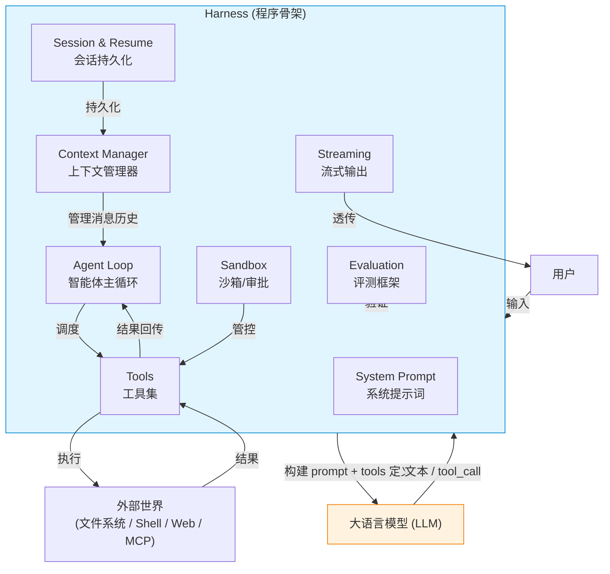
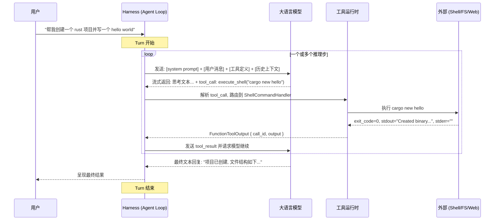

# Harness Engineering: Agent 工程综述

> 面向完全没接触过 Agent 开发的程序员。本综述从"什么是 harness"出发，逐一讲解 agent 的每块拼图，最后对照 Codex 120 万行代码的复杂度，讨论一个极简 Agent Harness 可以砍掉什么。

---

## 目录

1. [概念地图：什么是 Harness？](#1-概念地图什么是-harness)
2. [Agent Loop 与 Turn 生命周期](#2-agent-loop-与-turn-生命周期)
3. [Tool：定义、分发、结果回传](#3-tool定义分发结果回传)
4. [流式输出](#4-流式输出)
5. [系统提示词与领域知识注入](#5-系统提示词与领域知识注入)
6. [会话持久化与 Resume](#6-会话持久化与-resume)
7. [上下文压缩](#7-上下文压缩)
8. [审批与沙箱](#8-审批与沙箱)
9. [Evaluation Harness](#9-evaluation-harness)
10. [中英术语对照表](#10-中英术语对照表)
11. [Alda Agent Harness：简到极致是什么样](#11-alda-agent-harness简到极致是什么样)

---

## 1. 概念地图：什么是 Harness？

### 一句话定义

> **Agent = 模型 (Model) + Harness (程序骨架)**

如果你不是模型，那你就是 harness。── LangChain《The Anatomy of an Agent Harness》

Harness 是包裹在大语言模型外面的全部工程基础设施：系统提示词、工具定义与执行、上下文管理、会话持久化、审批流程、环境沙箱、流式输出、评测框架。模型只负责"接收文本、输出文本"，而 harness 决定了这个智能体能做什么、怎么被调用、如何被测试。

### 核心概念关系图



### 为什么需要 Harness？

模型的原生能力只有：接收文本/图片/音频，输出文本。它**不能**：

- 记住上一次对话的内容（无状态）
- 执行代码、读写文件
- 知道今天几月几号
- 自行搜索互联网
- 在多个子任务间协调

Harness 把这些"缺失的能力"一层一层补上。这个概念来自 LangChain 博客和 Anthropic 的《Building Effective Agents》── 它们共同指出：**在够用之前，不要加复杂度；先试单次模型调用，不行再加 agent 循环。**

---

## 2. Agent Loop 与 Turn 生命周期

### 什么是 Agent Loop？

Agent Loop 是整个 harness 的心跳：它定义了"用户请求进来 → 调用模型 → 模型可能要求执行工具 → 执行工具 → 把结果喂回模型 → 模型最终给出文本回复"这个循环。一个完整的循环叫一个 **Turn**（轮次）。



### Turn 的 5 个阶段

| 阶段 | 描述 | 在 codex-rs 中的对应 |
|------|------|---------------------|
| **1. 构建请求** | 收集 system prompt、历史消息、工具定义、领域知识片段，拼接为一次模型 API 请求 | `context/mod.rs` 中的各个 Fragment (30+ 种), `prompts/` |
| **2. 发送推理请求** | 调用模型 API（HTTP SSE 或 WebSocket），携带 tool definitions | `client.rs` 中的 `ModelClient`, `ResponsesWebsocketClient` |
| **3. 解析响应流** | 逐 token 解析模型输出，区分"文本增量"和"tool_call 指令" | `client_common.rs` 中的 `ResponseStream`, SSE 事件解析 |
| **4. 工具执行** | 如果是 tool_call，路由到对应 handler（shell、apply_patch、MCP 等），在受控环境中执行 | `tools/handlers/mod.rs` → 各 handler 实现 |
| **5. 模型再推理** | 将工具输出作为新的 message 追加到上下文，发起下一次推理请求。重复直到模型不再产生 tool_call | Loop 回到阶段 2 |

### 设计要点

- **有界循环**：必须在循环中设置最大迭代次数（如 50 步），防止模型陷入 tool_call 死循环。codex-rs 有 `rollout_budget` 上下文片段专门做这个。
- **拦截信号**：用户随时可以中断 turn，需要 `CancellationToken` 机制（codex 的 `step_context` 中携带 token）。
- **状态机语义**：每个 turn 结束后要么 `Completed`、要么 `Interrupted`、要么 `Errored`，上层可以据此决定是否重试、续接。

---

## 3. Tool：定义、分发、结果回传

### 什么是 Tool？

Tool 是模型与外部世界交互的"手"。模型不能执行代码，但它可以输出一个结构化的 `tool_call` JSON，harness 负责解析、执行、把结果打包回传给模型。

**本质就是：Schema → Handler → Output → Next Model Request。**

### Tool 的定义（Schema）

每个 tool 向模型暴露一个 JSON Schema 描述其接口。以 `execute_shell` 为例（简化自 codex 的 ShellCommandHandler）：

```json
{
  "type": "function",
  "name": "execute_shell",
  "description": "在项目的目目录中执行一个 shell 命令",
  "parameters": {
    "type": "object",
    "properties": {
      "command": {
        "type": "string",
        "description": "要执行的 shell 命令"
      },
      "workdir": {
        "type": "string",
        "description": "工作目录，默认项目根目录"
      }
    },
    "required": ["command"]
  }
}
```

Schema 不只是数据契约 ── **它是 prompt engineering 的一部分**。Anthropic 在《Building Effective Agents》附录 2 中强调：工具的 description、参数名、example 必须花和系统提示词同样的精力打磨。因为模型就是读这些文本来决定何时调用工具的。

codex-rs 的 tool schema 统一通过 `codex_tools::ResponsesApiTool` 这个数据结构管理，`create_tools_json_for_responses_api()` 负责序列化为 API 需要的格式。

### Tool 的分发（Dispatch）

当模型返回一个 tool_call 时，harness 需要：

1. **解析** tool_call payload（`call_id` + `name` + `arguments` JSON 字符串）
2. **路由** 到对应的 handler 实现
3. **校验** arguments 是否符合 schema（强类型反序列化）

在 codex-rs 中，`tools/handlers/mod.rs` 定义了所有 handler 的注册表：

| Handler | 功能 | 典型场景 |
|---------|------|---------|
| `ShellCommandHandler` | 执行 shell 命令 | 运行 cargo build、git status |
| `ApplyPatchHandler` | 应用代码补丁 | 模型生成的代码修改 |
| `WriteStdinHandler` | 向进程输入写入 | 交互式 CLI |
| `ViewImageHandler` | 读取图片 | 截图对比 |
| `McpHandler` | 调用 MCP 工具 | 外部服务集成 |
| `PlanHandler` | 制定计划 | 多步任务分解 |
| `CurrentTimeHandler` | 获取当前时间 | 模型需要时间上下文 |
| `RequestUserInputHandler` | 向用户请求输入 | 澄清意图 |

### 结果回传

工具执行完毕后，结果被包装为 `FunctionToolOutput`：

```
call_id: "call_abc123"
output: "{"exit_code": 0, "stdout": "...", "stderr": ""}"
```

然后以 `function_call_output` 消息回传给模型。模型看到这个输出后，可能继续调用其他工具，也可能产生最终文本响应。

而 tool_search 和 tool_discovery 机制支持渐进式工具暴露 ── 不把所有工具一次性给模型，而是让模型先用 search 找到需要的工具。这是"渐进披露"的一个实践，也是 Anthropic 推荐的做法。

---

## 4. 流式输出

### 为什么流式输出对用户体验至关重要

LLM 推理的延迟以秒计（从第一个 token 到完整响应可能需要 10-60 秒）。如果显示整个响应走完了才渲染，用户会以为程序卡死了。**流式输出让用户从第 0.5 秒就能看到模型在"想"**，这决定了产品是"可以用"还是"不可忍受"。

### 两种主流协议

| 协议 | 传输方式 | 优点 | 缺点 |
|------|---------|------|------|
| **SSE** (Server-Sent Events) | HTTP + `text/event-stream` | 简单，纯文本，易于调试和模拟 | 单向（只能服务端推，不能客户端推），连接重建有开销 |
| **WebSocket** | 双向长连接 | 双向通信，适合长时间会话和实时模式 | 较复杂，断线重连需要自己实现 |

codex-rs 同时支持两种方式：`responses_retry.rs` 中有 WebSocket 优先、HTTP SSE 降级的逻辑。`client.rs` 中对 WebSocket 做了"预热"──在真实请求之前发一个 `generate=false` 的空请求，复用连接以减少首 token 延迟。

同时, `client_common.rs` 的事件解析会区分不同种类的 streaming event: 文本增量(`response.output_text.delta`) 和工具调用(`response.output_item.added` 表示新工具调用开始,`response.function_call_arguments.delta` 表示工具调用参数增量)。

这个"区分并分发"的过程需要严谨的状态机，因为 API 返回的不是完整 JSON，而是**增量 patch**──你需要一个累积缓冲区，把 `delta` 拼回完整的 JSON 再反序列化。

---

## 5. 系统提示词与领域知识注入

### System Prompt 是什么？

System Prompt 是模型在**所有用户消息之前**收到的一段"角色设定"文本。它通常包含：

- **你是谁**："你是一个专业的 Rust 开发助手..."
- **你能做什么**："你可以执行 shell 命令、读写文件、搜索代码..."
- **你不能做什么**："不要输出超过 2000 行的文件..."
- **工作方式**："遇到不确定性时，先检查代码再回答..."
- **输出格式**："代码块使用带语言标识的 markdown..."

System prompt 嵌入模型的注意力窗口，影响它整个对话的行为倾向。它不保证约束（模型仍可能"违反"），但显著提升了输出质量和一致性。

### 领域知识注入

模型有知识截止日期，也不知道你的具体项目。因此需要注入**领域知识片段**：

- **AGENTS.md / CLAUDE.md** ── 项目级的编码规范、架构约定。codex-rs 在对话开始时自动加载
- **技能 (Skills)** ── 可复用的指令模板，如 `sc:test`、`sc:build`
- **当前时间** ── `CurrentTimeReminder` 上下文片段
- **环境信息** ── OS 类型、shell 类型、工作目录、git 分支
- **token 预算提示** ── `TokenBudgetContext` 告诉模型还剩下多少上下文空间
- **权限说明** ── `PermissionsInstructions` 告诉模型哪些目录可以访问

codex-rs 中这些片段都放在 `core/src/context/` 目录下面，约有 **40+ 个**不同的片段，每个都实现了 `ContextualUserFragment` trait，统一控制注入时机和 token 预算。

### 设计要点

- **片段必须有 token 上限**：不能再让模型反复追加引用，否则每次注入都会蚕食有限上下文。codex-rs 的 AGENTS.md 明确约束："Everything injected in the model context must have a bounded size and a hard cap. No items larger than 10K tokens."
- **不应频繁变动上下文结构**：频繁变化会导致 prompt cache 失效，增加推理成本。

---

## 6. 会话持久化与 Resume

### 为什么需要持久化

Agent 的一次对话可能持续数分钟、数小时。如果程序崩溃、用户关闭终端、网络断开──所有中间成果丢失。持久化是 harness 的基础能力。

### 两种粒度

| 粒度 | 存储内容 | 支持的能力 |
|------|---------|-----------|
| **Turn 级** | 每个 turn 的完整输入/输出（user message + assistant response + tool_calls + tool_results） | Resume：还原到任意历史 turn |
| **Rollout 级** | 所有 turns 的完整记录 + 元信息（session_id、thread_id、created_at） | 会话恢复、跨进程重启、多端同步 |

codex-rs 的 rollout 持久化包含几层：

- **SQLite state DB** (`state_db`) ── 索引 session、thread、turn 的元数据和快速查询
- **JSONL rollout 文件** ── 每个事件（user message、assistant output、tool invocation、tool result、error）以一行 JSON 追加写入，完整记录执行过程
- **压缩** ── rollout 文件可通过 gzip 压缩后仍然支持读
- **滚动恢复** ── `reverse_jsonl_scanner` 可以从最新事件反向扫描，快速恢复到最后状态

通过 `thread_store_from_config()` 和 `local_agent_graph_store_from_state_db()` 恢复状态，加载历史消息，让 agent 可以从中断点继续。

### 应用场景

- **程序重启**：用户关掉终端后 `codex resume` 继续
- **异步任务**：用户发起、后台执行、通知结果
- **协作**：多个用户/agent 共享同一个 thread 的上下文

---

## 7. 上下文压缩

### 为什么不压缩 Agent 会"失忆"

每个模型都有**上下文窗口**──它一次能处理的 token 上限。比如 200K tokens。这看起来很大，但对于代码 agent：

- 一次 shell 命令输出可能几千行（`cargo build` 报错时尤其夸张）
- 一次 diff review 可能上百 KB
- 模型每次"思考"产生的推理 token 也算

如果不压缩，**上下文窗口会被旧输出填满，模型开始忘记最早说过的话**。这就是"上下文腐烂"(Context Rot)。

### 三种压缩策略

| 策略 | 做法 | 适用场景 |
|------|------|---------|
| **Compaction（摘要压缩）** | 调用一个便宜的小模型，把 N 轮旧对话浓缩成一段摘要，替换掉原始长文本 | codex-rs 默认自动触发：上下文窗口快满时自动执行 |
| **尾部截断** | 大块 tool output 只保留头部 N token + 尾部 N token | codex `context_manager` 的标准操作 |
| **显式 truncation** | 直接将输出裁剪到固定 token 预算，丢弃中间部分 | `truncate_assistant_output_text_to_token_budget` |

codex-rs 的 compaction 实现非常成熟：

- `compact_remote.rs` ── 调用远程 API 做摘要，支持内部 API 的 Responses API compact 端点
- `compact_token_budget.rs` ── 计算当前用了多少 token、还剩多少
- `compact_model_fallback.rs` ── 如果摘要调用失败（网络错误等），先用当前模型重试
- 触发条件：上下文中逼近窗口容量时自动触发
- 支持 `pre_compact_hooks` / `post_compact_hooks` 让系统在压缩前后做清理

### 还有一个隐蔽问题：Prompt Cache 失效

如果每次请求对上下文做哪怕微小改动，模型服务端的 prompt cache 都可能命中失败──这就意味着每次推理都要重新编码全部上下文，速度从 **几百毫秒** 变成 **数秒**。

codex-rs 的代码审查规则明确指出："Avoid frequent changes to context that cause cache misses."

---

## 8. 审批与沙箱

### 为什么 Codex 需要复杂的审批与沙箱

Codex 是一个**编码 agent**，它的核心工具是写文件和执行 shell 命令。如果没有沙箱和审批机制：

- 模型可能 `rm -rf /` 删除用户数据
- 模型可能 `git push --force` 覆盖远程分支
- 模型可能拨打外部 API 泄露密钥
- 安装依赖时可能引入恶意包

这些风险是真实的，所以 codex-rs 的 sandbox 非常重：

| 组件 | 技术 | 作用 |
|------|------|------|
| **Linux 沙箱** | Bubblewrap (`bwrap`) + Landlock | 限制文件系统和网络访问 |
| **macOS 沙箱** | Seatbelt (`sandbox-exec`) | Apple 原生沙箱框架 |
| **Windows 沙箱** | Windows Sandbox + Restricted Token | Windows 原生隔离 |
| **权限模型** | `PermissionProfile` + `FileSystemPermissions` | 细粒度定义可访问的路径和操作 |
| **审批流程** | `RequestPermissions` + `AskForApproval` | 模型在操作前请求用户审批 |

`codex_sandboxing` crate 包含 `SandboxManager`、`SandboxTransformRequest` 等核心抽象，负责将"模拟可能执行的命令"转换为"在沙箱中安全的命令"。

### 为什么我们的音乐 Harness 可以大幅简化

Alda 的音乐 harness 与 Codex 有本质区别：

| 维度 | Codex (编码 agent) | Alda (音乐 agent) |
|------|-------------------|-------------------|
| **核心工具** | shell 命令、文件写入、git 操作 | 生成 Alda 代码文本 |
| **外部副作用** | 文件系统修改、网络调用 | **无**（纯文本输出） |
| **安全风险** | 高（代码执行、数据损坏） | **极低**（输出就是乐谱） |
| **审批需求** | 经常需要用户确认高危操作 | **不需要**（输出可人工预览） |
| **沙箱需求** | OS 级隔离 | **进程级就够了**（最多限制写入目录） |

结论：**音乐 harness 不需要 Bubblewrap/Seatbelt/Landlock 三层 OS 沙箱**。最坏情况是模型生成无效的 Alda 代码，adla player 无法解析。针对这个,harness 只需要校验语法和播放结果──成本远低于通用编码 agent。

---

## 9. Evaluation Harness

### 定义

Evaluation Harness 不负责"让 agent 运行"，而是"验证 agent 做得对不对"。它有四个层次，从最机械到最接近人类判断：

```
客观校验 → 结构断言 → LLM Judge → 人工评审
  (机械)                          (主观)
```

### 第 1 层：客观校验

**做法**：运行确定性检查。输入已知，输出必须有特定内容。

**例子**（来自 arXiv 论文的 Harness Ladder H3 层）：
- 空密码登录 → 响应必须包含子串 `"Password is required."`
- 正确密码登录 → 响应 JSON 必须 `ok: true`
- 错误密码登录 → 响应必须包含 `"Invalid credentials."`

**适用**：任何可以通过一个命令或 API 调用确定性地判对错的任务。**这一层应该是所有 evaluaion 的主力**。

**代码要点**：
```
fn probe_empty_password() -> bool {
    let output = run("node -e 'require(\"./login\").login(\"\", \"user\")'");
    output.contains("Password is required.")
}
```

### 第 2 层：结构断言

**做法**：检查输出格式、类型、结构是否符合预期。

**例子**：
- Alda 代码能否被 alda parser 解析通过？
- 输出 JSON 的 schema 是否合规？
- 生成的文件数量是否正确（比如应该创建 3 个文件，确实只创建了 3 个）？

**适用**：任何有正式结构约束的输出，你的程序本身就定义了"什么是对的"。

### 第 3 层：LLM Judge

**做法**：用一个"评审模型"来评判 agent 的表现（另一个 LLM，可能是更强的模型）。

**注意**：Anthropic《Building Effective Agents》和 arXiv harness engineering 论文中都没有推荐 LLM judge 作为首选的评估手段。论文中所有验证用的都是确定性检查，而非模型判断。LLM Judge 应该作为**补充**，仅用于"客观校验和结构断言都覆盖不到"的开放维度：

- 生成旋律的"音乐性"好坏
- 代码注释的"可读性"评价
- 回复是否"有帮助、不冒犯"

**适用**：非确定性、主观的评价维度。需要做好：
- 将 Judge 结果视为信号而非真理
- 多轮评分取平均以减少随机性
- 检查 Judge 是否与人工评审一致

### 第 4 层：人工评审

**做法**：人直接听/看 agent 的输出并给评价。

**适用**：最终质量验证、回归测试无法覆盖的边界、评估 Judge 本身的准确性。

### Harness Ladder：分层切实验证能力

arXiv 论文定义了 H0-H3 四个层级，这是一个很好的设计框架：

| 层级 | 提供给 Agent 的运行时支持 | 评测能测出什么 |
|------|--------------------------|---------------|
| **H0** | 任务描述 + 代码仓库 | 模型纯编码能力基线 |
| **H1** | + 工具注册表 + 测试命令注册 | 工具使用能力 |
| **H2** | + 项目记忆 (架构文档、测试约定、已知缺陷) | 上下文利用能力 |
| **H3** | + 验证流程 (确定性检查注册表、bug 复现协议、验证报告模板) | 自验证闭环能力 |

每一层给 agent 更多武器，但每一层也引入了更多可能的失败模式（工具调用失败、上下文理解错误、验证逻辑出错等）。分层测试让你能精确定位。

### 设计要点

- **用客观校验做主菜**：可自动化的检查越多，评测成本越低，可以跑得越频繁
- **结构断言做辅助**：它检查"输出形态"而非"输出内容"
- **LLM Judge 做收尾**：只覆盖真正主观的维度，不做重复的事
- **记录而不是评判**：失败归因比通过/失败标签更有价值。每轮保存完整 trace
- **Harness 和 Eval 分离**：agent 运行时和评测框架是两个东西，不要耦合

---

## 10. 中英术语对照表

| 英文 | 中文 | 一句话解释 |
|------|------|-----------|
| **Agent** | 智能体 | 模型 + 工具 + 记忆的复合系统，能自主完成多步任务 |
| **Harness** | 骨架 / 程序骨骼 | 包裹在模型外的全部工程基础设施 |
| **Turn** | 轮次 | 一次"用户请求 → 模型可能多次调用工具 → 最终回复"的完整过程 |
| **Agent Loop** | 智能体主循环 | 驱动 Turn 内多次模型调用的编程循环 |
| **Tool** | 工具 | 模型调用外部能力（shell、API、文件系统）的接口 |
| **Tool Call** | 工具调用 | 模型输出的一段结构化 JSON，请求 harness 执行某个工具 |
| **Handler** | 处理器 | 实现特定工具执行逻辑的代码模块 |
| **Schema** | 模式定义 | 工具的参数 JSON Schema，定义了工具的接口契约 |
| **Streaming** | 流式输出 | 模型逐 token 推送响应，不等完整结果 |
| **SSE** | 服务端推送事件 | 一种 HTTP 流式传输协议 (Server-Sent Events) |
| **Prompt** | 提示词 | 发送给模型的输入文本 |
| **System Prompt** | 系统提示词 | 在所有用户消息之前注入的角色设定文本 |
| **Context** | 上下文 | 模型当前能看到的所有 token（system prompt + 历史消息 + 工具结果） |
| **Context Window** | 上下文窗口 | 模型一次能处理的最大 token 数量 |
| **Token** | 令牌 | 模型的最小输入/输出单位，约 0.75 个英文单词 |
| **Compaction** | 上下文压缩 | 在上下文窗口快满时将旧历史替换为摘要 |
| **Compression** | 压缩 | 同 Compaction，有时特指 rollout 文件本身的压缩 |
| **Context Rot** | 上下文腐烂 | 上下文填满后模型推理质量下降的现象 |
| **Checkpoint** | 检查点 | 保存 agent 完整状态的时间点 |
| **Resume** | 续接 | 从检查点恢复继续执行 |
| **Rollout** | 执行记录 | agent 完整执行过程的持久化日志 |
| **Session** | 会话 | 用户的一次对话（可以包含多个 Turn） |
| **Thread** | 线程 / 对话线 | 在 codex-rs 中相当于一个独立对话 |
| **Handoff** | 交接 | 一个 agent 把任务和上下文转交给另一个 agent |
| **Subagent** | 子智能体 | 被父 agent 派生出来处理子任务的独立 agent 实例 |
| **Sandbox** | 沙箱 | 隔离执行环境，限制 agent 的工具操作范围 |
| **Approval** | 审批 | 用户对 agent 的危险操作（如执行 shell 命令）给予许可 |
| **Evaluation** | 评测 | 验证 agent 表现的质量和正确性 |
| **Harness Ladder** | 骨架阶梯 | H0-H3 四层渐进式运行时支持能力模型，用于分层评测 |
| **LLM Judge** | LLM 评审 | 用另一个模型评判 agent 输出质量的评估方法 |
| **ACI** | 智能体-计算机界面 | Agent-Computer Interface，工具的接口定义和文档 |
| **Skill** | 技能 | 可复用的指令/工具模板包 |
| **MCP** | 模型上下文协议 | 一种标准化的外部工具集成协议 (Model Context Protocol) |
| **RAG** | 检索增强生成 | 在外挂知识库中检索相关信息注入上下文 |
| **Progressive Disclosure** | 渐进披露 | 不到需要时不暴露工具/技能/上下文，保护上下文预算 |

---

## 11. Alda Agent Harness：简到极致是什么样

### 对照 Codex 的 120 万行 Rust 代码

codex-rs 包含约 120+ crate、~120 万行 Rust 代码，覆盖了从 CLI、TUI、app-server、sandbox 到 MCP、agent-graph、rollout、exec、multi-agent 的完整体系。

对于 Alda 音乐 harness，其中大量功能**不需要**：

```mermaid
graph LR
    subgraph Codex["Codex (120 万行 Rust)"]
        direction TB
        A1["CLI / TUI (~4 万行)"]
        A2["app-server + transport<br/>+ daemon (~3 万行)"]
        A3["sandboxing<br/>(Linux/Mac/Win, ~1.5 万行)"]
        A4["exec-server / process-hardening<br/>(~1.5 万行)"]
        A5["multi-agent / subagent<br/>(~1.5 万行)"]
        A6["MCP / plugin / extension<br/>(~3 万行)"]
        A7["file-search / file-watcher<br/>(~1 万行)"]
        A8["approval / request-permissions<br/>(~0.5 万行)"]
        A9["core (agent loop + context +<br/>tools + session , ~20 万行)"]
        A10["rollout / rollout-trace<br/>(~1 万行)"]
        A11["protocol / models<br/>(~2 万行)"]
        A12["其他杂项<br/>(cli login, analytics,<br/>memory, skills , ~4 万行)"]
    end

    style A1 fill:#ffcdd2
    style A2 fill:#ffcdd2
    style A3 fill:#ffcdd2
    style A4 fill:#ffcdd2
    style A5 fill:#ffcdd2
    style A6 fill:#ffcdd2
    style A7 fill:#ffcdd2
    style A8 fill:#ffcdd2
    style A9 fill:#c8e6c9
    style A10 fill:#c8e6c9
    style A11 fill:#c8e6c9
    style A12 fill:#fff9c4
```



| 模块 | Codex 复杂度 | Alda 需要吗？ | 理由 |
|------|-----------|------------|------|
| **GUI/TUI** | ~4 万行 (ratatui 全功能终端界面) | **砍掉** | CLI 输入 alda 指令即可 |
| **app-server + transport** | ~3 万行 (JSON-RPC、daemon 进程、远程连接) | **砍掉** | 单进程足够，没跨进程通信需求 |
| **sandboxing (OS 级)** | ~1.5 万行 (Bubblewrap/Seatbelt/Landlock/Windows Sandbox) | **大幅简化** | 没有文件系统和网络风险，限制 alda player 输出目录即可 |
| **exec-server + process hardening** | ~1.5 万行 (进程隔离与加固) | **砍掉** | 不执行任意代码 |
| **multi-agent / subagent** | ~1.5 万行 (多 agent 派生、交接、通信) | **砍掉** | 一个 agent + 一个 tool loop 足够 |
| **MCP / plugin / extension** | ~3 万行 (外部工具协议集成、插件注册) | **砍掉 / 自建 mini 版** | 不需要 MCP 标准生态，最多 2-3 个内建 tool |
| **file-search / file-watcher** | ~1 万行 (语义搜索、文件监控) | **砍掉** | 不需要在代码库中导航 |
| **approval / request-permissions** | ~0.5 万行 (分级审批流程) | **砍掉** | 没有危险操作，输出就是 alda 代码文本 |
| **agent loop + context + tools** | ~20 万行 (核心 loop、30+ 上下文片段、20+ tool handler) | **保留核心 (~1-2 万行)** | 这是 harness 的核心骨架：prompt 构造、loop 循环、tool 定义/路由、session 管理 |
| **rollout / persistence** | ~1 万行 (SQLite + JSONL + 压缩) | **保留简化版 (~500 行)** | 保存历史对话到文件，支持 resume |
| **protocol / models** | ~2 万行 (所有 API 契约、数据模型) | **极度简化 (~200 行)** | 只需要 turn、message、tool_call、tool_result 等基础结构 |
| **DevOps 相关** | login, analytics, config, skills, hooks, secrets, git-utils... | **全部砍掉** | 没有产品化需求 |

### 极简 Alda Harness 结构

```
alda-harness/
  src/
    main.rs           # CLI 入口：接收用户输入，启动 agent loop
    agent.rs          # agent loop 核心 (≤500 行)
    client.rs         # 模型 API 调用 (≤500 行)
    tools.rs          # tool 定义 + 路由 + 执行 (≤500 行)
    session.rs        # 会话管理 + resume (≤300 行)
    context.rs        # system prompt + 上下文构造 (≤200 行)
  tests/
    eval/             # evaluaion harness
      probes.rs       # 客观校验 (语法检查、alda 编译)
      asserts.rs      # 结构断言 (输出格式、结构)
      judge.rs        # LLM jury (旋律质量评估)
```

**核心循环描述**：
1. 用户输入 alda 音乐需求
2. Harness 构建 prompt（system prompt 定义音乐 agent 角色 + 用户消息 + 可用工具定义）
3. 调用模型 → 模型可能产生 alda 代码，也可能调用 `play` 或 `validate` 工具
4. `validate` 工具内部调用 alda parser，`play` 工具调用 alda player
5. 工具结果（解析成功/失败、播放成功/失败）回传给模型
6. 模型继续调整直到满意 → 输出最终 alda 代码
7. 保存 rollout 到文件

**不需要的东西**：没有 TUI、没有 sandbox、没有 MCP、没有 subagent、没有 approval ── 只在进程内限制 alda player 的副作用（限制输出文件路径）即可。

---

## 参考资料

- Anthropic, *Building Effective Agents*, 2024.12 — [原文](https://www.anthropic.com/engineering/building-effective-agents)
- LangChain, *The Anatomy of an Agent Harness*, 2026.03 — [原文](https://www.langchain.com/blog/the-anatomy-of-an-agent-harness)
- arXiv:2605.13357, *AI Harness Engineering: A Runtime Substrate for Foundation-Model Software Agents* — [原文](https://arxiv.org/html/2605.13357v1)
- OpenAI, Codex CLI — [GitHub](https://github.com/openai/codex)
- codex-rs 源码 (`ref/codex/codex-rs/`) — 约 120 万行 Rust, 120+ crate
