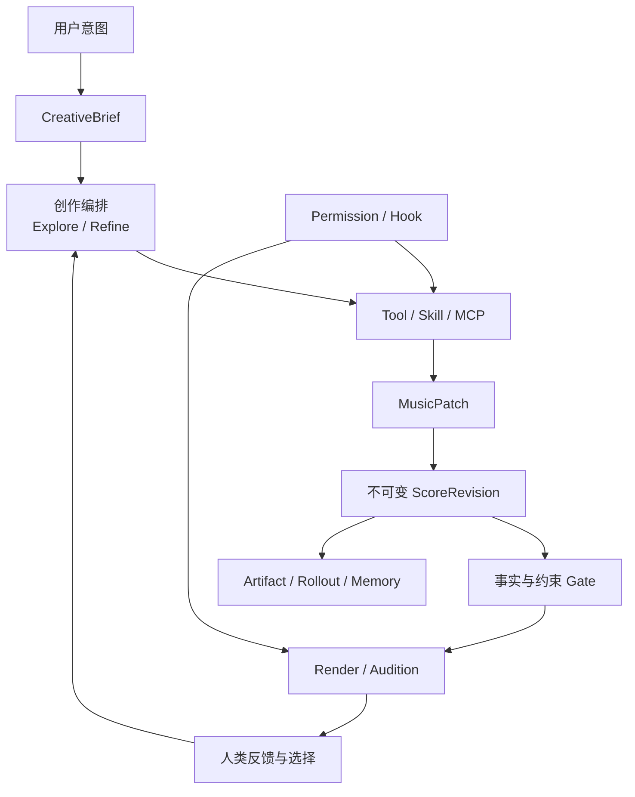
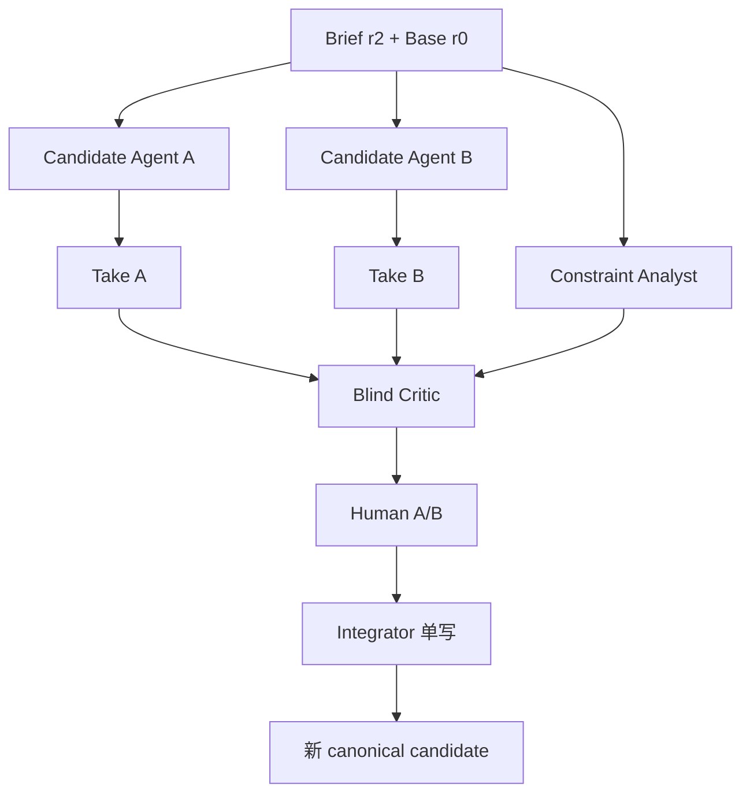

# 从 Alda 作曲助手到进阶音乐 Agent：一条可落地的学习路径

> 适合读者：已经理解基本 Agent Loop、工具调用和 Alda 语法，准备把单 Agent Demo 升级为可追溯、可试听、可扩展的音乐创作系统的开发者。  
> 前置阅读：[Harness Engineering 零基础教程](./harness-engineering-tutorial.md)、[程序员学乐理 × Alda](./music-theory-alda-tutorial.md)。  
> 架构依据：[Alda 进阶音乐 Agent 架构设计](../design/advanced-music-agent-architecture.md)。

## 开始之前：先认清仓库状态

当前仓库只有调研和设计文档，**没有 `alda-agent/` 可执行实现**。本文中的 Rust、TOML、JSON、命令行输出和目录结构都是用于指导实现的**设计示例**，不能直接当成已经存在的 API 或运行结果。

全文使用三种标签：

- **【事实】**：来自当前仓库已校验的调研、Alda 接口或 Codex 官方设计；
- **【设计】**：本项目建议采用的目标协议与实现顺序；
- **【探索】**：需要实验验证的音乐智能假设，不能先写成产品承诺。

尤其要守住两条边界：

1. Audio Critic、乐理启发式和 LLM Judge 都不能证明作品“好听”；
2. 多 Agent 可能增加差异，也可能只增加成本和协调失败，默认不启用，必须用同预算对照实验验证。

---

## 目录

1. [先看全貌：概念地图与学习路线](#1-先看全貌概念地图与学习路线)
2. [贯穿案例：为“雨后夜行”写一段室内乐](#2-贯穿案例为雨后夜行写一段室内乐)
3. [Brief 与 Constraint：把模糊愿望编译成可讨论的任务](#3-brief-与-constraint把模糊愿望编译成可讨论的任务)
4. [Revision 与 IR Lite：让每次创作都有稳定身份](#4-revision-与-ir-lite让每次创作都有稳定身份)
5. [MusicPatch 与工具协议：改音乐，不只是改文本](#5-musicpatch-与工具协议改音乐不只是改文本)
6. [Take、Audition 与 Audible Diff：让选择建立在确切试听上](#6-takeaudition-与-audible-diff让选择建立在确切试听上)
7. [Skill 与 MUSIC.md：沉淀可复用的创作方法](#7-skill-与-musicmd沉淀可复用的创作方法)
8. [Hook：在创作生命周期插入自动化](#8-hook在创作生命周期插入自动化)
9. [权限与审批：按副作用保护作品、设备和发布渠道](#9-权限与审批按副作用保护作品设备和发布渠道)
10. [Context、Checkpoint 与 Memory：既记得住，又不乱记](#10-contextcheckpoint-与-memory既记得住又不乱记)
11. [MCP：Advanced 只读与 Studio 写入边界](#11-mcpadvanced-只读与-studio-写入边界)
12. [SubAgent 与音乐团队：隔离候选，盲评后再集成](#12-subagent-与音乐团队隔离候选盲评后再集成)
13. [证据、评测与 Replay：证明系统可靠，而不是证明音乐好听](#13-证据评测与-replay证明系统可靠而不是证明音乐好听)
14. [Capstone：交付一个可审计的 A/B 创作闭环](#14-capstone交付一个可审计的-ab-创作闭环)

---

## 1. 先看全貌：概念地图与学习路线

### 本章目标

- 区分模型、创作编排、作品状态和人类听审的职责；
- 理解 `minimal`、`advanced`、`studio` 是逐级能力上限，而非三个代码库；
- 知道遇到新需求时应把它放在哪一层。

### 心智模型：作曲 Agent 不是“会吐乐谱的聊天框”

把系统想成一间小型制作室：模型可以提出创作动作，Harness 负责执行、保存和验证，人类负责审美与授权。精确的作品状态不寄存在聊天记忆里。



最容易混淆的关系如下：

| 概念 | 回答的问题 | 不应该承担什么 |
|---|---|---|
| Brief | 我们要创作什么？ | 不保存具体音符 |
| Constraint | 什么必须满足、什么只是偏好？ | 不把审美偏好伪装成真理 |
| Revision | 作品现在是哪一个不可变版本？ | 不等于聊天轮次 |
| IR Lite | 如何稳定定位声部、段落和拍位？ | 不做完整乐谱编译器 |
| Patch | 这次音乐意义上改了什么？ | 不直接覆盖 canonical 文件 |
| Take | 供人比较的候选是什么？ | 不自动成为最终版本 |
| Audition | 用户确切听了什么？ | 不凭“准备播放”生成反馈证据 |
| Memory | 哪些偏好或决策值得跨轮次复用？ | 不复制整段聊天或秘密 |

### 三条学习路径

```text
legacy-mvp（M0–M5 兼容标签，不是正式 Profile）
  单 Agent → 写谱 → parse → 符号分析 → 人工播放
       │
       ▼
minimal（M6–M8）
  Brief/Revision → 两阶段 Tool/权限 → Patch/Take → 可追溯 A/B
       │
       ▼
advanced（M9–M10）
  Skill/声明式 Hook/Memory → 受隔离只读 MCP
       │
       ▼
studio（M11+）
  受限命令扩展/写入 MCP/DAW/外设 → 可选多 Agent → 完整审计
```

推荐顺序：

1. **Legacy MVP**：完成基础闭环后迁移数据，不能直接自称 `minimal`；
2. **Minimal**：先做不可变 Revision 与审批前授权，再做 Take/Audition；
3. **Advanced**：之后才接声明式扩展、Memory 与受隔离只读 MCP；
4. **Studio**：只有当外部设备、网络或团队协作成为真实需求时才启用。

### 示例：给需求找正确归属

用户说“把副歌大提琴再收一点，但保留 A 版本”：

```text
“副歌”                → MusicalAddress::Section
“大提琴”              → stable PartId
“收一点”              → 需澄清或形成 Soft Constraint
“保留 A 版本”         → 从 Revision A fork 新 Take
实际修改              → AdjustDynamics 或 ReplacePartSection Patch
比较修改前后          → Audible Diff + Audition
最终采用              → 人类 Accept，不由生成 Agent 自批
```

### 动手练习

把以下需求分别归入 Brief、Constraint、Patch、Permission 或 Human Feedback：

> “写 45 秒的双人舞配乐；只用钢琴和大提琴；结尾不要完全解决；先播放前 8 小节给我听。”

建议答案：用途和整体目标进入 Brief；时长、编制进入 Constraint；“不完全解决”先保留为软偏好；具体作曲动作由 Patch 表达；播放进入 Permission；听后评价才是 Human Feedback。

### 常见失败

- 用一段 Prompt 同时承担需求、状态、规则、历史和权限；
- 把 parse 成功当作创作完成；
- 一开始就做完整 IR、DAW 写入和十个 Agent；
- 把 Profile 做成相互不兼容的三套存储格式。

### 验收清单

- [ ] 能指出每个核心概念的单一职责；
- [ ] Minimal 产生的 Revision/Artifact 能被 Advanced 继续读取；
- [ ] 明确最终 Accept/Publish 属于人类；
- [ ] 明确“自动指标通过”和“用户喜欢”是两件事。

---

## 2. 贯穿案例：为“雨后夜行”写一段室内乐

### 本章目标

- 固定一个从需求到交付的案例，后续每章都在它上面增加能力；
- 建立可观察的初始基线，而不是从抽象类图开始；
- 看见 Minimal 到 Advanced 的具体差距。

### 心智模型：先做可工作的窄闭环

我们的用户需求是：

> 为独立游戏过场写一段约 45 秒的“雨后夜行”。钢琴与大提琴，安静但不能昏睡；前半克制，后半出现一点希望。不要突然变得宏大。先做两个差异明显的候选让我盲听。

Minimal 版本只做：

```text
用户文本 → 模型生成 score.alda → alda parse → 符号分析 → 人工播放
```

Advanced 版本补上缺失的业务事实：

```text
Brief r1 → 根 Revision r0 → Take A/B → Gate → Render → 随机顺序试听
→ 反馈绑定 Audition → 选择 B → 局部 Patch → Revision r3 → 人类接受
```

### 示例：Minimal 的基线乐谱

下面只用于解释案例，不保证复制后就是完整成品：

```alda
(tempo! 78)

piano "rain-piano":
  o4 (vol 55) c8 e g > c < g e c4

cello "night-cello":
  o2 (vol 45) c2 g
```

此时系统最多知道：源码、parse 输出、分析结果和一段聊天。它还不知道：

- “希望”出现在哪个段落；
- 当前乐谱是候选 A 还是最终版本；
- 用户听的是哪一次 Render 的哪一段；
- “不要宏大”是项目约束还是全局偏好；
- 修改后怎样只检查被影响的段落。

### 动手练习

为 Minimal 版本建立一份基线记录，至少写下：

```yaml
source_hash: "<score.alda 的内容哈希>"
parse_status: pass | fail
duration_ms: "<由 parse 结果计算>"
parts: [rain-piano, night-cello]
human_listened: false
accepted: false
```

这里的 `human_listened` 初始必须是 `false`。成功生成音频不等于用户已经听过。

### 常见失败

- 还没有可靠 parse，就先实现候选搜索；
- 每次修改直接覆盖 `score.alda`，导致无法回退；
- 把模型声称的“45 秒”当成实测时长；
- 播放工具返回成功后自动写入“用户觉得不错”。

### 验收清单

- [ ] 同一输入能保存源码 hash、parse 结果和分析证据；
- [ ] 语法错误能回到 Agent Loop 修复，而不是进入试听；
- [ ] 试听与接受状态初始均为 false；
- [ ] 能列出从 Minimal 升级所缺失的领域对象。

---

## 3. Brief 与 Constraint：把模糊愿望编译成可讨论的任务

### 本章目标

- 将用户原话拆成目标、硬约束、软偏好和未知项；
- 让 Brief 和 Constraint 可版本化、可纠正；
- 防止系统把“安静”“希望”等词静默翻译成固定乐理公式。

### 心智模型：Brief Compiler 像需求编译器，不像灵感翻译器

自然语言不是可执行规范。编译过程应保留原文，并给出“我理解成了什么”。

```text
原始意图
├── Goal：过场配乐，雨后夜行
├── Hard：约 45 秒、钢琴 + 大提琴
├── Soft：安静但不昏睡、后半有希望、不宏大
└── Unknown：45 秒容差？是否循环？演奏者水平？
```

**【设计】** Hard 约束未满足时不能进入 `Acceptable`，除非用户显式 Waive。主观条件不能自动标为 Pass，只能进入 `NeedsHumanReview`。

### 示例：案例的 Brief r1

```json
{
  "id": "brief-r1",
  "raw_user_intent": "为独立游戏过场写一段约45秒的雨后夜行……",
  "goal": "game_cutscene_underscore",
  "duration": { "target_seconds": 45, "tolerance_seconds": 5 },
  "instrumentation": ["piano", "cello"],
  "affect_curve": [
    { "at": 0.0, "label": "restrained" },
    { "at": 0.6, "label": "subtle_hope" }
  ],
  "open_questions": ["是否需要无缝循环？"]
}
```

与它配套的约束：

```json
[
  {
    "id": "c-duration",
    "severity": "hard",
    "scope": "whole_score",
    "predicate": "duration_seconds in [40, 50]",
    "verification": "parsed_timeline"
  },
  {
    "id": "c-no-grand-finale",
    "severity": { "soft": { "weight": 0.8 } },
    "scope": "ending",
    "predicate": "avoid_sudden_grand_expansion",
    "verification": "human_review"
  }
]
```

第一条可由时间线证明；第二条没有跨风格可靠的机器真值，必须明确由人听审。

### 实现提示

先实现一个保守的 `compile_brief`：

1. 保存原文；
2. 抽取高置信字段；
3. 为每个字段记录来源 span 或用户消息 ID；
4. 把影响 Hard 的缺失项放入 `open_questions`；
5. 展示草案，用户确认后创建 `BriefRevision`。

不要让模型直接写数据库；模型只返回 `BriefDraft`，宿主校验 schema 后提交。

### 动手练习

用户补充：“可以 42 秒，不循环，大提琴要适合中级演奏者。”

请创建 `brief-r2`，并回答：

- 哪些字段变化？
- 哪个新条件需要 PerformerProfile 才能严格验证？
- 旧 Take 是否仍可直接与新 Take 公平比较？

建议：时长和循环条件已明确；可演奏性需要演奏者模型或人工复核；使用不同 Brief 生成的候选必须标注“非同条件”，不能伪装成严格 A/B。

### 常见失败

- 看到“忧伤”就硬编码为小调与 60 BPM；
- 用户修改 Brief 后原地覆盖 r1；
- 约束只有 pass/fail，没有 Unknown、Waiver 和冲突；
- 把一次具体作品意见写成全局用户偏好。

### 验收清单

- [ ] 原始用户意图可追溯且未被摘要替代；
- [ ] Brief 修改会创建新版本；
- [ ] 每条 Constraint 有 severity、scope 和 verification；
- [ ] 主观约束不会被启发式自动判定为 Pass；
- [ ] 冲突或未知硬条件会阻止静默创作。

---

## 4. Revision 与 IR Lite：让每次创作都有稳定身份

### 本章目标

- 用不可变 `ScoreRevision` 替代“不断覆盖当前字符串”；
- 用 IR Lite 稳定定位 Part、Section、Beat 与 Marker；
- 理解为什么聊天压缩不能成为精确作品状态的唯一来源。

### 心智模型：Revision 是提交，IR Lite 是地址簿

```text
r0 基线
├── r1 Take A
│   └── r3 A 的局部修订
└── r2 Take B
    └── r4 B 的尾声修订  ← accepted
```

Revision 创建后不可覆盖。源码、IR、Evidence 进入 Artifact Store，以 hash 关联。IR Lite 不尝试理解全部音乐语义，只保证“下次还能找到同一个声部和段落”。

### 示例：案例的 IR Lite

```json
{
  "score_id": "rain-walk",
  "source_hash": "sha256:…",
  "parts": [
    { "id": "part-piano", "alda_alias": "rain-piano" },
    { "id": "part-cello", "alda_alias": "night-cello" }
  ],
  "sections": [
    { "id": "sec-a", "marker_from": "intro", "marker_to": "turn" },
    { "id": "sec-b", "marker_from": "turn", "marker_to": "ending" }
  ],
  "source_map": "artifact:sha256:…"
}
```

**【事实】** Alda 自动生成的 `part001` 一类 ID 会受创建顺序影响；跨版本身份应优先使用显式 alias。Alda 源码中的 barline 也不能自动等同于经过验证的节拍边界。

### 示例：Revision 记录

```json
{
  "id": "rev-r2",
  "parents": ["rev-r0"],
  "brief_revision": "brief-r2",
  "source": "artifact:sha256:source…",
  "ir": "artifact:sha256:ir…",
  "generated_by": "candidate-b",
  "evidence": ["evidence:parse-17", "evidence:duration-8"]
}
```

Candidate/Accepted/Published 等状态另由 `RevisionLifecycleProjection` 从事件生成；`ReadyForAcceptance` 是 Gate readiness，不能写回 Revision 或与 `Accepted` 混为一谈。

### 实现提示

最小存储顺序：

1. 写 Artifact 临时文件并计算 hash；
2. 原子移动到 content-addressed 路径；
3. 创建不可变 Revision 事件；
4. 以 `base_revision` 做 CAS 更新当前 branch；
5. 若基线已变化，返回 `CommitConflict`，不做 last-write-wins。

无 alias 的导入文件应进入 `NeedsIdentityMapping`。没有显式 marker 或用户确认 MeterMap/SectionMap 时，分别进入 `NeedsSectionMapping` / `UnknownMeter`；此时降级为 WholeScore、可靠 Part 或 MarkerRange，不要假装自动得到可信 Section/Beat 地址。

### 动手练习

从 `rev-r0` 分叉两个候选，然后只给候选 B 的尾声创建一次修改。画出 parent 图，并设计查询：

- 当前接受版本是谁？
- `rev-r4` 使用哪个 Brief？
- 从 r0 到 r4 哪些 Artifact 参与生成？

### 常见失败

- `Revision` 只保存文件路径，不保存内容 hash；
- 先覆盖 canonical，再补历史；
- 用行号作为唯一音乐地址；
- 让聊天摘要保存“最终音符”，Artifact 丢失后无法恢复；
- 多个写者共享 `&mut Session`，并行时相互覆盖。

### 验收清单

- [ ] Revision 不可变，parent 图无环；
- [ ] Evidence 的 source hash 与 Revision 匹配；
- [ ] Part alias 插入新声部后仍映射到原 stable PartId；
- [ ] 基线冲突返回结构化错误；
- [ ] Accepted 指向 Revision ID，而不是可变文件名。

---

## 5. MusicPatch 与工具协议：改音乐，不只是改文本

### 本章目标

- 让模型表达“修改副歌大提琴动态”而非盲改第 47 行；
- 理解工具为何返回 Artifact、Evidence 和 ProposedEvent；
- 为并行、取消和权限检查保留清晰边界。

### 心智模型：工具提出变更，Coordinator 才提交变更

旧式接口 `handle(args, &mut Session)` 让工具直接修改全局状态，不适合隔离 Take 和并发。目标流程是：

```text
ToolArgs + ProjectSnapshot + base_revision
  → resolve → ActionPlan(effect/resource/data egress/approval payload)
  → PermissionDecision → sealed AuthorizedActionPlan
  → execute(AuthorizedPlan, StagingCapabilities)
  → ToolOutcome
       ├── StagedArtifacts
       ├── Evidence
       └── ProposedDomainEvents
  → Coordinator 校验不变量/hash/CAS
  → 新 Revision
```

关键不是把 permission 放进 context，而是让未授权 plan 根本无法调用 execute。工具只能获得本次路径、设备、网络或 Provider 对应的 capability；目标路径或参数变化后原授权立即失效。

### 示例：案例中的 MusicPatch

用户听完候选 B 后说：“希望出现得太突然，把后半段钢琴抬升做得更渐进，大提琴别改。”

```json
{
  "type": "adjust_dynamics",
  "scope": {
    "part_section": {
      "part": "part-piano",
      "section": "sec-b"
    }
  },
  "curve": {
    "from": 50,
    "to": 62,
    "shape": "gradual"
  },
  "base_revision": "rev-r2"
}
```

系统应用后必须证明：

- 新源码能 parse；
- 修改范围命中 `part-piano/sec-b`；
- `part-cello` 的目标区域未变化；
- 产生新的 Revision，而非覆盖 r2。

### 工具描述中的关键元数据

```text
effect: observe | workspace_write | audible_output | external_file_write |
        external_device_write | network_read | network_write | model_egress |
        publish | destructive
parallelism: parallel | score_serial | resource_locked
determinism: deterministic | seeded | nondeterministic
cancel_safety: safe | teardown_required | unsafe
```

这些元数据不是给 UI 装饰的：权限按 `effect` 判定，调度器按 `parallelism` 排队，Replay 根据 `determinism` 决定能否重跑。

### 实现提示：先做六个 Patch

首期只做：

- `ReplaceSection`；
- `ReplacePartSection`；
- `Transpose`；
- `ChangeInstrumentation`；
- `AdjustTempo`；
- `AdjustDynamics`。

保留 `ReplaceWholeScore` 逃生口，但必须提示大范围变更并重跑所有 Gate。首期语义合并只检测冲突，不自动 merge。

### 动手练习

为“只把 A 段大提琴升高一个八度”设计 Patch，并写出三个断言：目标声部变化、钢琴不变、B 段不变。然后故意用旧 `base_revision` 提交，验证系统返回 `CommitConflict`。

### 常见失败

- 直接把模型生成的文本 diff 写进 canonical；
- 权限按工具名字硬编码，例如误以为所有 `export` 都同风险；
- 工具偷偷写 Session，再返回一份看似纯函数的结果；
- Patch 成功后不重新 parse；
- 首期就实现任意自动语义 merge。

### 验收清单

- [ ] 每个写工具都声明 base Revision 和 Effect；
- [ ] 工具本身不持有全局 `&mut Session`；
- [ ] 未授权时 execute 不可达，工具只能拿到 plan 对应 StagingCapabilities；
- [ ] 非目标范围有 regression 检查；
- [ ] 取消时不留下半写文件；
- [ ] 同基线并发提交只有一个能成功推进 branch。

---

## 6. Take、Audition 与 Audible Diff：让选择建立在确切试听上

### 本章目标

- 用 Take 表达候选，用 Audition 表达一次确切试听；
- 生成可公平比较的 before/after 或 A/B；
- 将用户反馈绑定 Revision、Render、范围、顺序和设备。

### 心智模型：候选不是答案，播放成功也不是反馈

```text
CandidateSet
├── Take A → Render A → Audition #2
└── Take B → Render B → Audition #1
                         ↓
                ListeningFeedback
                “B 后半更自然，但尾声太满”
```

严格 A/B 的候选应共享 common base 和 BriefRevision。盲听时隐藏作者、模型、Agent 名称和生成顺序，并随机或平衡播放顺序。

### 示例：一次完整试听记录

```json
{
  "audition_id": "aud-12",
  "revision": "rev-r2",
  "render": "render-sha256:…",
  "range": { "marker_range": ["turn", "ending"] },
  "order": 1,
  "device_profile": "default-speakers",
  "status": "user_stopped",
  "played_until": { "marker": "ending", "beat": 2.0 }
}
```

只要实际开始播放，就可写 `ListeningHumanEvidence`；完整、部分或用户主动停止都有效，但 scope 不能超出 `played_range/played_until`。演奏者读谱意见用 `ScoreReviewHumanEvidence`，真实试奏用 `PerformanceTestEvidence`。

随后可写入：

```json
{
  "audition": "aud-12",
  "raw_text": "后半的希望更自然，但尾声太满",
  "targets": ["sec-b", "ending"],
  "preference": "candidate_b",
  "interpretation_confidence": 0.78
}
```

结构化抽取必须保留原话，并允许用户改正目标段落。

### Audible Diff 应展示什么

- 相同范围的 before/after；
- 可选响度归一化 A/B，记录算法、目标和 gain；若响度本身是比较目标则关闭，并始终保留原 Render；
- 语义修改摘要；
- 可选 piano-roll、密度、音域或和声图；
- 非目标区域 regression 报告。

**【事实】** Alda 2.4.3 原生只导出 MIDI，不直接生成 WAV。MVP 的 `MidiRenderArtifact` 记录 Alda/MIDI hash/SoundFont 或现场设备声明，现场声音不承诺可重建。若要可重复 `AudioRenderArtifact`，必须另选离线 synth/录音适配器，记录二进制版本、SoundFont hash、采样率、声道、gain、处理链与音频 hash。MIDI/MusicXML import 和音频 export 也属于 Agent 新适配器。音频后端未选定时只能提供现场 A/B 或符号/MIDI diff，不能伪装成已有可重复音频。

### 动手练习

构造 A/B 两个 45 秒候选，但只播放各自后 20 秒。记录随机顺序、range 和反馈。然后回答：这份反馈能否用于推断用户更喜欢哪一个完整版本？

答案应是“不能直接推断”；证据 scope 只覆盖试听片段。

### 常见失败

- 用户没听就创建 `ListeningHumanEvidence`，或把读谱意见伪装成听感；
- A/B 使用不同 Brief，却不标记不可直接比较；
- 不做响度归一化；
- 反馈只保存“喜欢 B”，不保存听了哪个 Render；
- 同时播放多个 Take，争抢音频设备。

### 验收清单

- [ ] Take 指向不可变 Revision；
- [ ] A/B 记录 common base、Brief 和播放顺序；
- [ ] ListeningHumanEvidence 绑定实际开始的 Audition，部分反馈不越过已听范围；
- [ ] 反馈能追溯到 Revision、Render 和范围；
- [ ] 音频设备通过 semaphore 或资源锁串行使用。

---

## 7. Skill 与 MUSIC.md：沉淀可复用的创作方法

### 本章目标

- 区分项目约定、宿主命令和可复用 Skill；
- 实现 Skill 的渐进披露、版本和最小权限；
- 让音乐规则携带风格范围和测试，而不是宣称普世正确。

### 心智模型：MUSIC.md 是团队约定，Skill 是按需加载的工作流

```text
MUSIC.md
  “本项目保持钢琴踏板克制；所有试听先播 20 秒范围”

$subtle-hope-transition Skill
  “分析当前情绪曲线 → 生成 2 种渐进方案 → 约束门禁 → A/B”

/audition Slash Command
  宿主确定性地启动一次试听并记录 Audition
```

`/take`、`/status` 这类确定性状态操作做 Slash Command；`reharmonize`、`jazz-arrangement` 这类可复用创作方法做 Skill。

### 示例：案例 Skill 的目录

```text
skills/subtle-hope-transition/
├── SKILL.md
├── manifest.toml
├── references/
├── rubrics/
├── transforms/
├── tests/
└── assets/
```

示例 Manifest：

```toml
name = "subtle-hope-transition"
version = "0.1.0"
description = "在不突然扩大编制的前提下，设计渐进的情绪转亮候选"
styles = ["ambient-chamber", "game-underscore"]
max_effect = "workspace_write"
required_tools = ["score_read", "score_patch", "score_analyze", "take_fork"]
input_artifacts = ["alda_source", "brief_revision", "constraint_set"]
output_artifacts = ["music_patch", "evaluation_card"]
license = "CC-BY-4.0"
cultural_scope = "西方调性室内乐与 ambient/game underscore；不作为跨文化普遍规则"
eval_cases = ["tests/gradual_lift.toml", "tests/no_new_instruments.toml", "tests/cello_unchanged.toml"]
```

Skill 初始只向模型暴露 name 和 description；显式输入 `$subtle-hope-transition` 后才加载全文。这是工具和指令的渐进披露，避免所有 schema/规则挤满上下文。

### MUSIC.md 的层叠

```text
project/MUSIC.md                  # 全曲规则
project/movements/02/MUSIC.md     # 第二乐章近层覆盖
```

目录层叠只适合多文件工程。单个 `score.alda` 内的“副歌/大提琴”规则必须写成带 MusicalAddress scope 的 Constraint/Instruction，而不是虚构一个目录祖先。

`/status` 应展示最终合并值及来源链。强制团队规则应进入版本控制，不能只存在 Memory 中。

### 动手练习

写一个 `cello-playability-review` Skill 草案，要求：

- 只读，不允许改谱；
- 声明适用的演奏水平；
- 输出证据和不确定项；
- 至少包含一个“无法判断，需要演奏者确认”的测试用例。

### 常见失败

- Skill 没有版本、许可或测试；
- 把特定古典规则说成所有风格的硬约束；
- Skill 声称只分析，实际调用写工具；
- MUSIC.md 层叠后不展示来源，用户不知道规则从哪来；
- 把常用 Prompt 宏都塞成 Slash Command。

### 验收清单

- [ ] Skill 声明适用风格、工具需求和 Effect 上限；
- [ ] 未触发 Skill 时不加载完整内容；
- [ ] 显式 `$skill` 优先于自动匹配；
- [ ] MUSIC.md 覆盖链可查看；
- [ ] Skill 的 eval cases 包含失败与不确定情况。

---

## 8. Hook：在创作生命周期插入自动化

### 本章目标

- 在 Patch、试听、导出、压缩等节点插入可控自动化；
- 区分 Hook 与权限系统；
- 防止超时、递归和重复执行。

### 心智模型：Hook 是门边的自动流程，不是门锁本身

例如，每次应用 Patch 后自动 parse 很适合 `PostScorePatch`；但“能否发布到外部平台”必须由 `PrePublish` 前的权限决策负责，不能只依赖一个可被移除的 Hook。

### 示例：案例的三个 Hook

```text
PostScorePatch
  → 对新 source hash 执行 parse 与非目标区 regression

PreAudition
  → 检查预计时长、音量上限、设备锁与首次播放审批

OnFeedbackRecorded
  → 产生 PreferenceMemoryCandidate，等待确认，不直接写全局记忆
```

Hook 输出应为结构化结果：

```json
{
  "decision": "warn",
  "message": "尾声密度较基线增加 42%，这只是启发式信号",
  "proposed_patch": null
}
```

可用结果包括 `Continue`、`Block`、`Warn`、`AdditionalContext`、`ProposedPatch`。`ProposedPatch` 仍需走正常权限和提交协议。

### 实现提示

每次 Hook 调用至少记录：

- hook ID、版本和内容 hash；
- 触发事件和输入 Artifact hash；
- 顺序、timeout、退出状态；
- 幂等键；
- 递归深度。

非托管 Hook 首次运行前确认内容 hash。Hook 更新后 hash 变化，应重新确认。

Advanced 首发只运行进程内声明式白名单 Hook。内容 hash 只说明“用户确认过这份定义”，不能限制任意命令的系统调用；命令 Hook 等同用户代码，必须等 Studio Extension Host 提供文件、环境变量、网络和设备隔离后才启用。

### 动手练习

设计一个 `PreAccept` Hook：如果 Hard Constraint 有 Fail 或 Unknown，则 Block；如果只有 Soft 未满足，则 Warn 并展示证据。故意让 Hook 超时，验证接受流程返回可解释错误且不会卡死会话。

### 常见失败

- 用 Post Hook 阻止已经发生的高风险副作用；
- Hook 内直接覆盖作品；
- Hook 触发 Patch，Patch 又无限触发同一 Hook；
- 没有 timeout 和稳定顺序；
- Hook 失败后吞掉错误继续发布。

### 验收清单

- [ ] 高风险权限检查发生在副作用之前；
- [ ] Hook 有 timeout、幂等键和递归深度限制；
- [ ] ProposedPatch 仍走标准提交路径；
- [ ] 非托管 Hook 按内容 hash 建立信任；
- [ ] Advanced 拒绝任意命令 Hook，声明式 Hook 不能读取未授权环境或路径；
- [ ] Hook 运行结果进入 Rollout，可用于审计。

---

## 9. 权限与审批：按副作用保护作品、设备和发布渠道

### 本章目标

- 把“技术上能否执行”和“何时询问用户”分开；
- 按 EffectClass 而不是工具名判定风险；
- 设计对音乐人可理解的审批 payload。

### 心智模型：能力边界与审批策略是正交的

一个工具即使被安装，也不意味着它随时可以执行。权限决策有三态：

```text
Skip         已在约束能力内，可直接执行
NeedsApproval 必须向用户说明动作并确认
Forbidden     当前 Profile 明确禁止
```

### 示例：案例中的审批

第一次试听时不要只显示 shell 命令，应显示音乐动作：

```text
准备播放：Take B / sec-b → ending
设备：default-speakers
预计时长：18 秒
软件侧目标：-16 LUFS（仅在 Render 可测时）；MIDI 直出显示 velocity/gain 上限
提示：系统无法控制耳机或功放的物理音量，请先调低设备
是否允许本次播放？ [y/N]
```

用户允许“本会话播放到默认扬声器”，不等于允许：

- 写入外部 MIDI 设备；
- 控制 DAW transport；
- 上传到云端；
- 发布到音乐平台；
- 删除旧 Take。

### 默认策略示例

| Effect | Minimal | Advanced | Studio |
|---|---|---|---|
| Observe | 自动 | 自动 | 自动 |
| WorkspaceWrite | 当前项目自动 | 当前项目自动 | 当前项目自动 |
| AudibleOutput | 首次询问 | 首次询问 | 按设备策略 |
| ExternalFileWrite | 禁止 | 每次询问 | 目标目录 allowlist + 询问 |
| ExternalDeviceWrite | 禁止 | 询问 | allowlist |
| NetworkRead | 禁止 | server allowlist | 域 allowlist |
| NetworkWrite | 禁止 | 每次询问 | 每次询问 |
| ModelEgress | 首次披露 Provider/字段 | 按项目与 Provider 同意 | Provider/Audio Critic 分开策略 |
| Publish | 禁止 | 每次询问 | 每次询问 |
| Destructive | 禁止 | 每次询问 | 每次询问并备份 |

### 实现提示

最小安全基座包括：root-dir capability + no-follow/openat 类安全打开（或提交前 inode 重验）、写前 snapshot、原子提交、子进程 timeout/进程组 kill/输出上限、播放设备 semaphore、结构化 approval cache key。`.alda-agent/permissions`、凭据、Hook、Plugin、Skill、MUSIC.md 是控制面，普通 WorkspaceWrite 不得修改。

调用文本模型或 Audio Critic 也是数据外发，不是“关闭遥测”就消失。首次使用应展示 endpoint、发送字段、用途、保留/训练政策和地域；Audio Critic 需要独立同意。

审批缓存键应类似：

```text
(effect=audible_output, device=default-speakers, max_duration=30s, session=session-7)
```

不要缓存含糊的“全部允许”。

### 动手练习

分别为以下操作给出 `Skip / NeedsApproval / Forbidden`：读取当前谱、写当前 Take、播放 18 秒、向 DAW 写 MIDI、上传成品。然后切换 Minimal/Advanced/Studio，比较决策变化。

### 常见失败

- 认为 `play` 没风险；
- 工具名字相同就复用同一权限；
- MCP server 自报“只读”，宿主不做本地 Effect 标注；
- approval 发生在命令已经启动之后；
- 失败清理没有停止播放器或 DAW transport。

### 验收清单

- [ ] Sandbox/Capability 与 Approval 分开配置；
- [ ] 每个工具有宿主本地 Effect；
- [ ] 播放、设备写、网络和发布分别授权；
- [ ] 路径穿越和 workspace 外写入被拒绝；
- [ ] 取消或超时会释放设备并终止子进程组。

---

## 10. Context、Checkpoint 与 Memory：既记得住，又不乱记

### 本章目标

- 区分聊天上下文、精确作品状态和长期记忆；
- 用 MusicalCheckpoint 支撑压缩与恢复；
- 让 Preference Memory 有证据、范围、置信度和可删除性。

### 心智模型：Context 是工作台，Artifact 是仓库，Memory 是经确认的便签

```text
模型上下文（有限）
  Stable Instructions
  MUSIC.md
  Active Brief + Hard Constraints
  MusicalCheckpoint
  Selected Skill
  Relevant Memory
  Recent real user messages

精确大对象（不塞上下文）
  score / IR / MIDI / audio → Artifact Store
```

自然语言 compaction 只能做 handoff；当前接受版本、精确音符和证据引用必须从结构化状态恢复。

### 示例：案例的 Checkpoint

```json
{
  "accepted_revision": null,
  "active_take": "rev-r2",
  "brief_revision": "brief-r2",
  "hard_constraints": ["c-duration", "c-instruments"],
  "unresolved_questions": [],
  "focus": { "section": "ending" },
  "last_parse": "evidence:parse-17",
  "last_audition": "aud-12",
  "artifact_refs": ["artifact:sha256:source…", "artifact:sha256:render…"]
}
```

用户说“这首曲子里我更喜欢克制的尾声”，可以产生候选记忆：

```json
{
  "kind": "preference_candidate",
  "statement": "偏好克制而非突然扩张的尾声",
  "scope": { "project": "rain-walk", "section_role": "ending" },
  "evidence": ["aud-12", "feedback-9"],
  "confidence": 0.72,
  "last_confirmed": "2026-07-29",
  "contradictions": []
}
```

它默认不能直接升级成“用户永远讨厌宏大音乐”。

### Memory 类型与使用边界

| 类型 | 例子 | 典型寿命 |
|---|---|---|
| Working | 当前要修改尾声 | Turn/Session |
| Project | 本曲接受 r4 | Project |
| Preference | 本项目偏好克制尾声 | 可衰减、可删除 |
| Episodic | aud-12 选择了 B | Project/User |
| Semantic | Alda 2.4.3 接口事实 | 版本化知识库 |
| Procedural | 配器 Review Skill | 版本化 |
| Provenance | 参考素材许可 | 与 Artifact 同寿命 |

Memory 默认 opt-in；外部 MCP 内容、搜索结果、秘密和用户音频默认不参与提取。

“删除”不能只是从 UI 隐藏。Rollout 只保存 Memory ID、正文 hash 与审计元数据；正文放独立加密 blob。`forget` 删除索引并销毁正文密钥，备份按声明到期策略清除，只留下不含正文的 tombstone。

### 动手练习

连续写入两条冲突反馈：“这首曲子尾声要克制”“另一个预告片结尾就要非常宏大”。设计 scope，使两者都成立。再模拟 30 轮压缩，验证 Brief、Hard Constraint、accepted Revision 和未决问题没有丢失。

### 常见失败

- 把 resume 当成长期记忆；
- 从一次局部反馈推断全局人格偏好；
- 压缩后只保留自然语言总结，丢失 Artifact 引用；
- Memory 无查看、纠正和删除接口；
- 刚注入的 Memory 下一步又被压缩掉。

### 验收清单

- [ ] 精确作品状态独立于聊天历史；
- [ ] Checkpoint 能恢复 active/accepted Revision 和证据引用；
- [ ] Preference 有 scope、evidence、confidence 和 contradiction；
- [ ] 用户可查看、纠正、删除 Memory；
- [ ] forget 后正文、索引和到期备份不可恢复，而审计 tombstone 不含正文；
- [ ] 30 轮压缩测试不丢 Hard Constraint 和未决问题。

---

## 11. MCP：Advanced 只读与 Studio 写入边界

### 本章目标

- 理解 MCP 是能力接入协议，不是信任证明；
- 先接只读音乐工具，再接 DAW、外设和发布；
- 为网络、取消和资源锁设计本地控制。

### 心智模型：MCP 是插座，宿主仍负责保险丝

MCP server 提供工具 schema 和调用通道；Alda Agent 宿主补充：Effect、determinism、latency、resource locks、cancel safety 和 license scope。外部返回内容一律视为不可信数据。

### 示例：第一个只读 Music MCP

Advanced 升级不要从“让 Agent 控制 DAW”开始，而应从三个受隔离只读工具开始：

```text
music_catalog.list_instruments
midi.inspect_file
daw.read_project_metadata
```

宿主本地覆盖元数据：

```toml
[mcp.servers.local_music]
transport = "stdio"
enabled = true
protocol_version = "<project-pinned-version>"
environment_allowlist = []
filesystem = "workspace-readonly"
network = "none"

[mcp.tools."midi.inspect_file"]
effect = "observe"
parallelism = "parallel"
timeout_ms = 5000
workspace_only = true
```

stdio server 必须进入受限进程/容器，默认无继承秘密、无网络、只读最小文件系统；allowlist 绑定 executable identity、配置 hash 与版本。HTTP server 则绑定 URL/身份/域策略。初始化、capability negotiation、JSON-RPC 错误、断线和幂等重试都要有 conformance fixture。无法提供真实隔离时保持关闭，不能把 server 的“只读”声明当系统调用边界。

### 从只读到写入的升级门

只有只读 MCP 满足以下条件后，再考虑 DAW 写入：

1. schema 命名、参数校验、超时和取消稳定；
2. 未知工具默认 Hidden/Forbidden；
3. 网络域和数据外发可审计；
4. DAW project 与 transport 有独占资源锁；
5. 写入具备快照、幂等策略或可恢复方案；
6. 每次发布都有 provenance 清单和人工审批。

### 动手练习

给一个未知 MCP 工具 `publish_track` 做威胁建模：它可能读哪些数据、写到哪里、是否可重试、失败后如何确认远端状态、需要哪些审批字段。最终策略应是默认禁止，直到宿主补齐本地 Effect 和发布契约。

### 常见失败

- MCP 接通就自动信任全部工具；
- 把外部 tool annotation 当作权限真相；
- 网络响应无限长并直接进入 Prompt 或 Memory；
- DAW transport 取消后仍继续播放；
- 对非幂等发布请求盲目自动重试。

### 验收清单

- [ ] 首个 MCP 只读且可离线测试；
- [ ] stdio/HTTP server 的文件、环境、网络能力被宿主实际约束；
- [ ] 每个外部工具有宿主本地 Effect 和超时；
- [ ] 未知工具默认不可调用；
- [ ] 外部内容不会自动进入 Memory；
- [ ] DAW/设备写入前具备锁、审批和失败恢复设计。

---

## 12. SubAgent 与音乐团队：隔离候选，盲评后再集成

### 本章目标

- 让 SubAgent 输出隔离 Patch 与 Evidence，而非共享 Session；
- 用 Blind Critic 减少作者与顺序信息干扰；
- 用预算和消融实验判断多 Agent 是否值得。

### 心智模型：Agent 是独立工作间，不是同时改同一张谱的线程



每个 Agent 只获得：同一 BriefRevision、只读 base Revision、有限相关 Memory、明确预算和允许工具。输出按角色区分：

```text
CandidateProposal { MusicPatch, Evidence, Rationale }
ConstraintReport { Evidence, Unresolved }
CritiqueReport { Findings, AuditionPlan? }
IntegrationProposal { Patches, Conflicts }
FailureReport { Status, PartialArtifacts }
```

只有 Candidate/Integrator 可携带 Patch，Critic/Analyst 不需要伪造 Patch；生成者不能最终批准自己的候选；Integrator 是唯一可以提出 canonical commit 的角色。

这里先实现的是一次性 SubAgent：完成候选或审议后返回结果。Agent Team 则是长期角色、任务队列、Team 预算与恢复机制，属于 Studio 阶段；不能因为写了 Composer/Arranger 两份 Prompt 就宣称已经有团队系统。

Future Team 至少还要有 TeamId、成员生命周期、任务 DAG/mailbox、lease/idempotency、Team/成员预算、权限继承上限、checkpoint/recovery 和 stop cleanup；跨项目 Preference 默认不共享。

隔离也不等于必须使用 Git Worktree。单乐谱候选优先用 Revision + Artifact namespace；只有 Agent 还要修改 Plugin、MUSIC.md 或多文件制作工程时，才把 Worktree 作为可选文件系统后端。它不能隔离音频设备和 DAW，也不能替代 MusicPatch 的语义冲突判断。

### 示例：案例的委派任务

```json
{
  "role": "candidate_composer",
  "brief_revision": "brief-r2",
  "base_revision": "rev-r0",
  "diversity_intent": "A 使用节奏发展，B 使用配器与音区发展",
  "max_model_tokens": 12000,
  "max_tool_calls": 20,
  "deadline_seconds": 180,
  "allowed_effects": ["observe", "workspace_write"]
}
```

Critic 看到 Brief 和匿名 Artifact，不看生成者身份与理由。它只能提出证据、风险和试听建议，不能覆盖 Take。

### 并发与取消

- 不同 Take 的 parse/analyze 可并行；
- canonical 提交必须串行 CAS；
- 音频设备播放使用 semaphore(1)；
- 同一 DAW 工程写入使用独占锁；
- Agent 失败不自动取消其他候选；
- 主线程返回已完成候选和缺失项；
- 不持有全局锁跨 `await`。

MVP 建议最大并发 3、最大审议轮次 2，Multi-Agent 默认关闭。

### 动手练习：真正能回答“多 Agent 有用吗”的实验

分别做“等经济成本”和“等墙钟延迟”两类实验；成本计入输入/输出/cache token、Critic、工具与 Render CPU，按任务和听者随机/平衡试听。比较：

1. 单 Agent 单候选；
2. 单 Agent 多候选；
3. 多 Agent 多候选；
4. 多 Agent + Blind Critic。

记录人类偏好、无偏好率、修改轮数、首次可听时间、总成本和失败率，并展示质量—成本—延迟 Pareto。若多 Agent 没有稳定收益，就继续默认关闭。

### 常见失败

- 多个 Agent 共享 `&mut Session`；
- 生成者同时担任最终 Critic；
- 只比较质量，不控制总预算；
- Agent 互相审议却引用不到 Artifact 与事实证据；
- 用“投票多数”掩盖候选目标不同。
- 把 Worktree 当成作品版本模型，或把角色 Prompt 当成完整 Agent Team。

### 验收清单

- [ ] 每个 Agent 有独立 Take、预算和取消令牌；
- [ ] Critic 不知道候选作者与生成顺序；
- [ ] Integrator 单写，提交使用 base Revision CAS；
- [ ] 失败 Agent 不破坏成功候选；
- [ ] 有同预算单 Agent 对照，结果允许“不显著”或负收益。
- [ ] Workspace 后端有清理与边界测试，且 Take 身份不依赖 checkout 路径。

---

## 13. 证据、评测与 Replay：证明系统可靠，而不是证明音乐好听

### 本章目标

- 区分确定性事实、启发式、模型判断和人类意见；
- 用 H0–H7 覆盖系统正确性、音乐约束与体验成本；
- 明确 Replay 能恢复什么、不能承诺什么。

### 心智模型：Evaluation Card 是证据清单，不是总分排行榜

```text
事实证据      parse、hash、时长、编制
结构证据      段落、拍位、非目标范围
启发式证据    密度、重复度、音域风险
模型判断      Brief adherence 建议，带模型版本
人类证据      绑定 Audition 的反馈与选择
不确定项      需要演奏者、用户或来源确认
```

这些证据不能互相替代。Parse 通过不代表可演奏；Audio Critic 的高分不代表用户喜欢；用户喜欢也不能抹去未授权素材的 provenance 风险。

### 示例：案例的 Evaluation Card

| 项目 | 结果 | 证据类型 | 结论边界 |
|---|---|---|---|
| Alda parse | Pass | Syntax | 仅证明语法可解析 |
| 时长 43.8 秒 | Pass | Structural | 满足 [40, 50] |
| 编制仅钢琴/大提琴 | Pass | Structural | 满足硬约束 |
| 尾声密度增加 42% | Warn | Heuristic | 不等于“过于宏大” |
| Audio Critic 认为转亮渐进 | 0.68 | AudioModel | 辅助信号，不替代听审 |
| 用户盲听偏好 B | Prefer B | Human | 仅覆盖 aud-12 的片段与设备 |

### H0–H7 的最小测试

本表属于 `eval_schema = "alda-eval/v2"`。基础 M0–M5 文档的 legacy H2=LLM Judge、H3=人工验收；迁移时映射到 V2 H4/H5。报告必须写 schema/version，不能只说“H2 提升了”。

| 层 | 本案例测试 |
|---|---|
| H0 | Artifact hash、Alda parse、索引完整性 |
| H1 | 时长、编制、拍号、音域硬约束 |
| H2 | 转调后音程关系保持等 metamorphic test |
| H3 | 结构与 Brief adherence，保留风格条件 |
| H4 | 盲式 LLM Judge，只作信号 |
| H5 | 人类 A/B，允许“无偏好/不确定” |
| H6 | 候选多样性、来源、motif lineage |
| H7 | TTFT、首次可听时间、成本、取消清理 |

### Rollout 与 Replay

JSONL 记录白名单事实事件，大乐谱、MIDI 和音频只记录 Artifact 引用。系统必须声明 `replay_horizon`：Accepted/Published、pin 与窗口内 active rollout 是 strong reference，过期 rollout/cache 是 weak reference。Replay 承诺：

- 在保留窗口内恢复 Brief、Revision DAG、Artifact 和决策来源；
- 由 reducer 重建“Brief → Take → Gate → Audition → Feedback”执行图。

Replay 不承诺：

- 再次调用模型得到逐 token 或逐音符相同结果；
- 自动重放扬声器、DAW 或发布动作；
- 网络外部状态仍与当时一致。
- 保留窗口外仍有完整 blob；此时只能恢复元数据并显式报告 `ArtifactMissing/Tombstoned`。

### 动手练习

为一次取消的试听写事件序列：`audition_started → cancelled → player_stopped → resource_released`。Replay 时只恢复状态，不发声。然后破坏一个 Artifact，验证 H0 能发现 hash 不一致。

### 常见失败

- 把所有指标压成一个“音乐质量 87 分”；
- 不记录模型、Skill、工具和规则版本；
- 遥测默认上传完整 Prompt、乐谱或用户音频；
- Replay 自动重放高风险副作用；
- 把相似度信号写成版权法律结论。

### 验收清单

- [ ] Evaluation Card 分开展示各类证据与不确定项；
- [ ] 人类证据可追溯到 Audition；
- [ ] Audio Critic 明示模型版本、置信度和辅助性质；
- [ ] Replay 不触发播放、DAW 写入或发布；
- [ ] 遥测默认关闭，秘密和大对象不进入常规 trace。

---

## 14. Capstone：交付一个可审计的 A/B 创作闭环

### 项目目标

实现“雨后夜行”的 `minimal` V2 纵切片，并把 Skill/Hook/MCP/Memory 作为 Advanced 加分项。它不需要完整 UI、Marketplace、自动语义合并或专业 DAW 控制，但必须从用户意图走到可追溯的人类选择。

### 必做范围

```text
1. Brief Draft → 用户确认 → BriefRevision
2. ConstraintSet → Hard Gate / NeedsHumanReview
3. 根 ScoreRevision + Artifact Store + IR Lite
4. resolve → ActionPlan → Permission → AuthorizedPlan → staging/CAS
5. 从同一基线 fork Take A/B
6. MusicPatch 应用 + parse/regression
7. MIDI Render/可选离线 Audio Render + Audition + 设备锁
8. 盲式 A/B + ListeningFeedback
9. 选择一个候选并局部 Refine
10. MusicalCheckpoint + JSONL Rollout
11. Evaluation Card V2 + 人类 Accept
```

### 推荐实现迭代

#### 迭代 A：状态骨架

先实现 Artifact、Revision、Brief 和 Constraint 的纯领域测试。不调用模型，不播放。

验收：不可变、无环、hash 匹配、Hard Gate 正确、旧 base 提交冲突。

#### 迭代 B：授权与工具边界

实现两阶段 ActionPlan、sealed AuthorizedPlan 与 StagingCapabilities，先用写文件和播放两个副作用 fixture 验证。

验收：未授权 execute 不可达；路径/设备变化使授权失效；控制面路径不能由普通 WorkspaceWrite 修改。

#### 迭代 C：语义修改

实现 IR Lite 的 stable Part/Section，以及 `ReplacePartSection`、`Transpose`、`AdjustDynamics` 三种 Patch。

验收：目标区域改变，非目标区域保持；每次修改生成新 Revision；parse 必须重跑。

#### 迭代 D：可听闭环

先实现 MidiRenderArtifact；只有选定离线后端才实现 AudioRenderArtifact。加入 Audition、设备锁、首次审批和 feedback 绑定。

验收：未开始播放不能写 ListeningHumanEvidence；部分反馈不越过 played range；并发播放被排队；取消后播放器退出且锁释放。

#### 迭代 E：候选与选择

同一 base/Brief 创建 A/B，随机化顺序，保存选择与“无偏好”。

验收：盲评前看不到作者元数据；不同 Brief 候选会提示不可严格比较。

#### 迭代 F：恢复与证据

写 Rollout、Checkpoint、Evaluation Card 和安全 Replay。

验收：进程中断后恢复 active Take；损坏 Artifact 会被发现；Replay 不播放音频。

### 可选加分项

- 一个只读、带测试的 Music Skill；
- 一个进程内声明式、带 timeout/幂等/递归限制的 `PostScorePatch` Hook；
- 一个在受限进程/容器中运行的只读本地 MCP；
- Preference Memory 的查看、确认、纠正和删除；
- 单 Agent 多候选与多 Agent 的同预算消融实验；
- Motif lineage、PerformerProfile 或 Live Annotation 的探索性原型。

这些加分项必须保持标签诚实。例如 Motif lineage 算法若只有小样本验证，应标为**【探索】**，不能写成“已可靠识别所有动机变形”。

### 最终演示脚本

一次合格演示应能让观察者看到：

1. 用户原话如何被编译为 Brief 草案，以及用户如何纠正；
2. 两个候选共享什么基线、为何不同；
3. Hard Gate 的机器证据和 Soft 条件的未知项；
4. 首次播放为何询问，批准范围是什么；
5. 用户实际听了哪个片段、哪次 Render；
6. 一句反馈如何变成有 scope 的局部 Patch；
7. 修改前后如何 Audible Diff，非目标声部是否保持；
8. 最终接受的是哪个不可变 Revision；
9. 进程重启后如何从 Checkpoint 恢复；
10. Evaluation Card 为什么没有虚假的单一“好听分”。

### Capstone 总验收清单

#### 领域正确性

- [ ] Brief、Constraint、Revision、Take、Audition 身份彼此独立；
- [ ] Revision 不可变，Evidence 与 source hash 一致；
- [ ] IR Lite 能稳定定位两个声部和至少两个段落；
- [ ] Hard Fail 未经 Waiver 不能 Accept。

#### 工具与安全

- [ ] 工具先返回 ActionPlan，获授权后才用 StagingCapabilities 执行；
- [ ] Effect/ModelEgress 权限发生在副作用或数据外发之前；
- [ ] 播放有时长/设备信息、取消清理和资源锁；
- [ ] canonical 提交采用 base Revision CAS。

#### 人类听审

- [ ] A/B 同 Brief、同基线，或明确提示不可比较；
- [ ] 播放顺序随机或平衡，并隐藏作者身份；
- [ ] ListeningHumanEvidence 绑定实际 Audition 覆盖范围，读谱/试奏证据使用独立类型；
- [ ] 用户拥有 Accept 和 Publish 最终权力。

#### 可恢复与可解释

- [ ] Rollout 可重建 Revision DAG 和决策来源；
- [ ] Checkpoint 压缩后仍保留精确 Artifact 引用；
- [ ] Evaluation Card 分开事实、启发式、模型和人类意见；
- [ ] 所有实验性能力都标注适用范围与不确定性。

---

## 结语：进阶不是堆功能，而是建立可靠的创作关系

从 Coding Agent 借鉴 Tool、Skill、Hook、MCP、权限、Memory 与 SubAgent 很有价值，但音乐领域不能只做名词替换。真正的进阶发生在这些地方：

- 用 Brief 保留模糊意图，而不是过早把情绪公式化；
- 用 Revision、Take 和 Patch 保护创作分支与回退；
- 用 Audition 把人类反馈绑定到确切声音；
- 用证据层级承认 parse、启发式、Audio Critic 与人耳各自的边界；
- 用权限保护音频设备、DAW、网络和发布；
- 用对照实验判断多 Agent 是否真的带来收益。

如果只能先做一件进阶能力，先做不可变 Revision；如果只能再做一件，做绑定 Revision/Render/Range 的 Audition。它们是后续 A/B、Memory、SubAgent、来源审计和可靠恢复的共同地基。
