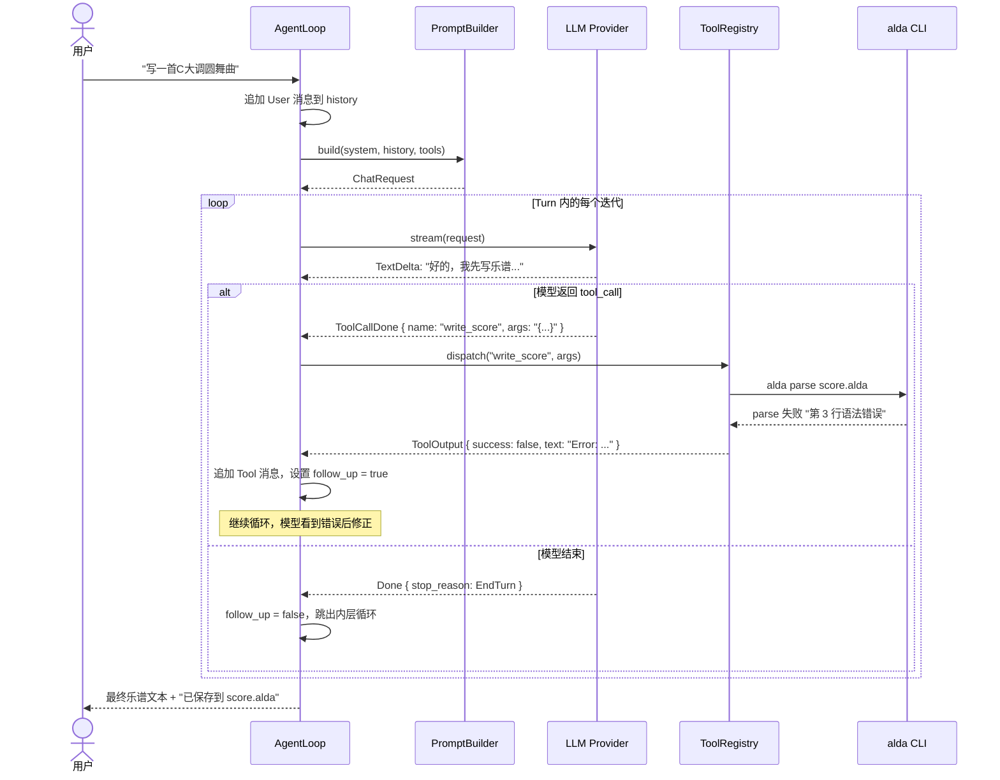
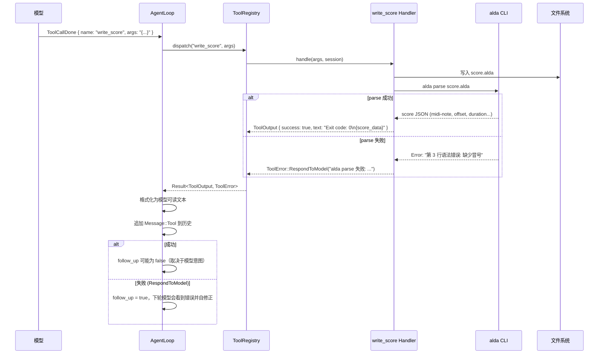
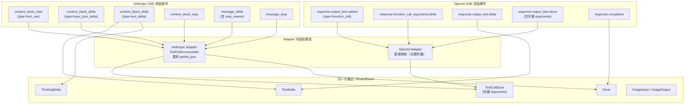
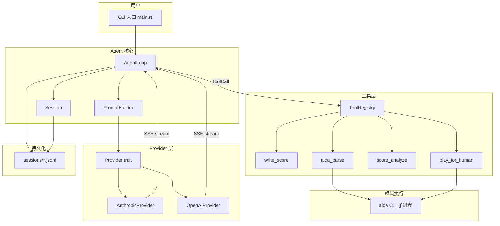

# Harness Engineering 零基础教程

> 面向：写过代码但没碰过 agent/harness 的程序员。你需要懂 HTTP/JSON/async，懂一门语言即可。
> 读前准备：建议先扫一眼目录，每个大标题就是一块拼图。全文有一条贯穿案例，请别跳着读。

## 目录

1. [什么是 Agent / Harness](#1-什么是-agent--harness)
2. [Agent Loop：心跳](#2-agent-loop心跳)
3. [Tool：智能体的手](#3-tool智能体的手)
4. [Streaming：用户为什么觉得它在"想"](#4-streaming用户为什么觉得它在想)
5. [Prompt：你在对模型说什么](#5-prompt你在对模型说什么)
6. [Session 与 Context：记忆与遗忘](#6-session-与-context记忆与遗忘)
7. [Evaluation：证明它真的变好了](#7-evaluation证明它真的变好了)
8. [全貌：把所有拼图拼在一起](#8-全貌把所有拼图拼在一起)

---

## 0. 贯穿案例：让 LLM 写一首 alda 乐谱

alda 是一门用文本描述音乐的 DSL。比如这样就是一段 C 大调旋律：

```alda
piano:
  c d e f g a b > c
```

你现在想对 LLM 说："帮我写一首 C 大调圆舞曲"。如果只是把这句话扔进 ChatGPT 网页，模型会给你一段 alda 代码——然后呢？你不知道它语法对不对，不知道能不能播放，不知道节奏是否合理。而且模型自己也**听不到**音频，它不可能自己验证。

于是你需要的不是一个模型，而是一个**系统**：

- 接收你的需求
- 调用模型生成乐谱
- 自动跑 `alda parse` 检查语法
- 如果语法错了，把错误信息喂给模型让它修正
- 修正后自动播放让你听
- 你说"太慢/太难听/换个调"，模型继续改
- 整个过程中记住你说过的每一句话

这个系统就是 **agent**，包裹在模型外面的工程层就是 **harness**。本文就用这个"alda 作曲助手"的场景，从零到一把 harness 的每块拼图讲清楚。

---

## 1. 什么是 Agent / Harness

### 1.1 模型本身能做什么、不能做什么

大语言模型（LLM）原生的能力边界非常明确：

- **能**：接收文本（以及图片/音频），输出文本
- **不能**：记住上次对话、读写文件、执行代码、获取当前时间、搜索互联网

每次调用模型时，它看到的是你给它的所有文本（"上下文"），但调用结束后，这个上下文就消失了。它不会"记住"你三分钟前说过什么——除非你在下一次调用时把历史消息重新塞给它。

### 1.2 Agent = Model + Harness

这句话来自 LangChain 博客，是最核心的定义：

> **如果你不是模型，那你就是 harness。**

- **Model**：只负责"接收文本，输出文本"这一件事
- **Harness**：包裹在模型外面的全部工程基础设施——系统提示词、工具定义、工具执行、上下文管理、会话持久化、流式输出、评测框架

类比：模型像是**大脑**——能思考，但没有手、没有记忆、不会主动做事。Harness 给了它**手**（工具）、**记忆**（会话历史）、**眼睛**（注入的场景信息）、**循环驱动**（while loop——反复调用直到任务完成）。

### 1.3 为什么强模型还不够

你可能想：Claude Sonnet 4.5 已经很强了，我直接聊天窗口里用不行吗？

不行，因为"强"和"能做成一件事"之间差了三样东西：

1. **验证闭环**：模型不知道自己的输出是对是错，需要外部反馈（parse 报错、人工说"难听"）
2. **迭代驱动**：模型一次回复不能完成复杂任务，需要"输出去做事 -> 结果回来 -> 调整输出"的循环
3. **环境连接**：模型不能碰文件系统，不能执行程序，需要有人帮它跑命令

这就是 harness 要做的事。

### 1.4 Codex 120 万行代码的启示

OpenAI 的 Codex（codex-rs）是 Rust 写的完整编码 agent，约 120 万行代码。但对于我们的 alda 作曲助手，其中 **95%+ 可以砍掉**：

| 砍掉的 | 理由 |
|--------|------|
| TUI 图形界面 (~4 万行) | CLI 就够了 |
| 多 client 并发通信 (~3 万行) | 单进程，没有远程连接 |
| OS 级沙箱 (~3 万行) | 不执行任意命令，只调 alda CLI |
| 多 agent / 子 agent (~5 万行) | 一个 agent 够用 |
| Plugin / MCP 扩展系统 (~3 万行) | 只有 4 个工具，不需要扩展框架 |

**剩下的精华约 1200 行 Rust：一个 `while loop` + tool dispatch。** 这也是本教程带你走完的路径。

> 本节对应设计文档 §1.1-§1.2

### 检查点 1

你现在应该理解：

- 模型只是个"文本到文本"的函数，无状态、无副作用
- Harness 是让模型能干活的工程骨架
- 复杂性取决于场景——单用户 alda 助手远不需要 codex 那 120 万行

如果不理解，回看 §1.1-§1.2。下一步我们看 harness 的心脏：agent loop。

---

## 2. Agent Loop：心跳

### 2.1 这是什么

想象你在和一个不会主动做事的助手一起工作：

- 你给任务
- 助手思考，可能说"我需要先查一下文件 X"——这是 tool call
- 你去查了文件 X，把内容给助手
- 助手继续思考，可能需要再查文件 Y
- 重复直到助手说"好了，这是最终结果"

这个"发给模型 -> 拿到回复 -> 如果需要执行工具就执行 -> 结果喂回去 -> 再问模型"的循环，就是 agent loop。每一次完整的外层交互叫一个 **Turn**（轮次）。

这是 harness 的核心——说白了，就是一个双层 while 循环。

### 2.2 怎么设计

agent loop 的关键结构：

```rust
// 这段对应设计文档 §3.1

/// 外层循环：接收用户输入，管理 Turn 生命周期
impl AgentLoop {
    pub async fn run(&mut self) -> Result<()> {
        loop {
            // 1. 读用户输入（CLI 或 REPL）
            let user_input = self.read_user_input().await?;
            if user_input.is_empty() { break; } // EOF 退出

            // 2. 把用户消息追加到历史
            self.session.history.push(Message::User {
                content: vec![ContentBlock::Text { text: user_input }],
            });

            // 3. 跑一个完整的 Turn
            self.run_turn().await?;

            // 4. 保存会话
            self.session.persist()?;
        }
        Ok(())
    }

    /// 内层循环：模型调用 -> 工具执行 -> 模型再调用，直到 Turn 结束
    async fn run_turn(&mut self) -> Result<()> {
        let mut follow_up = true;
        let mut iteration = 0;
        const MAX_ITERATIONS: u32 = 20; // 安全上限，防止死循环

        while follow_up && iteration < MAX_ITERATIONS {
            iteration += 1;

            // 构建请求：系统提示词 + 历史消息 + 工具定义 + 模型参数
            let request = ChatRequest {
                system_prompt: self.build_system_prompt(),
                messages: self.session.active_messages(),
                tools: self.tools.model_visible_specs(),
                model: self.config.model.clone(),
                max_tokens: self.config.max_tokens,
                temperature: self.config.temperature,
            };

            // 流式调用模型
            let mut stream = self.provider.stream(request).await?;
            let mut pending_tool_calls = vec![];
            let mut assistant_text = vec![];

            // 处理流式事件
            while let Some(event) = stream.next().await {
                match event? {
                    StreamEvent::TextDelta { text } => {
                        print!("{text}"); // 实时输出
                        assistant_text.push(ContentBlock::Text { text });
                    }
                    StreamEvent::ToolCallDone { id, name, arguments } => {
                        // 记录到历史，同时加入 pending 队列
                        assistant_text.push(ContentBlock::ToolCall {
                            id: id.clone(), name: name.clone(), arguments: arguments.clone(),
                        });
                        pending_tool_calls.push(ToolCall { id, name, arguments });
                    }
                    StreamEvent::Done { stop_reason } => {
                        match stop_reason {
                            StopReason::EndTurn => follow_up = false,
                            StopReason::ToolUse => follow_up = !pending_tool_calls.is_empty(),
                            _ => follow_up = false,
                        }
                    }
                    _ => {}
                }
            }

            // 如果模型说要调用工具但 pending 为空——异常，报错退出
            if follow_up && pending_tool_calls.is_empty() {
                return Err(AgentError::Provider(
                    "stream ended without completion event".into()
                ));
            }

            // 把助手消息追加到历史
            if !assistant_text.is_empty() {
                self.session.history.push(Message::Assistant {
                    content: assistant_text,
                });
            }

            // 执行工具调用（顺序执行）
            for tc in &pending_tool_calls {
                let result = self.tools.dispatch(&tc.name, &tc.arguments, &mut self.session).await;
                let output = match &result {
                    Ok(o) => o.model_visible_text(),
                    Err(e) => format!("Error: {e}"),
                };
                self.session.history.push(Message::Tool {
                    tool_call_id: tc.id.clone(),
                    content: vec![ContentBlock::Text { text: output }],
                });
                // 工具失败 -> 让模型看到错误后继续修正
                if result.is_err() { follow_up = true; }
            }

            pending_tool_calls.clear();
        }

        if iteration >= MAX_ITERATIONS {
            eprintln!("[warn] 达到最大迭代次数上限");
        }
        Ok(())
    }
}
```

你可能已经注意到了几个关键决策：

- **双层循环**：外层管 Turn（用户消息），内层管 Turn 内的"模型调用 -> 工具执行"迭代。这是抄 codex 的 `submission_loop` + `run_turn` 结构。
- **安全上限**：`MAX_ITERATIONS = 20`，防止模型在 tool_call 上死循环（一直调用工具修正，从没满意）
- **工具失败继续**：alda parse 失败了？错误文本回给模型，让它自己修正。这叫 `RespondToModel` 语义

### 2.3 Codex 怎么做的

Codex 的主循环位于 `turn.rs:252`，包含：
- 预检查是否需要 compact（压缩上下文）
- `build_prompt` 组装上下文片段
- 内部循环 `loop { stream -> tool dispatch -> continue or break }`
- 返回 `SamplingRequestResult { needs_follow_up, last_agent_message }`

此外 codex 有两队列模式（SQ/EQ）——这是因为它要支持多个 client 同时操作同一个 session。我们的 alda harness 是单进程单用户，直接砍掉这层。

### 2.4 Agent Loop 时序图



> 本节对应设计文档 §3, 调研 codex-agent-loop.md §2-§3

### 检查点 2

你现在应该理解：

- agent loop 本质上是一个双层 while 循环
- 外层管 Turn，内层管"模型调用 -> 工具执行 -> 再调用"
- 安全上限和工具失败的处理是 loop 中的关键设计
- codex 的 loop 复杂性来自多 client 并发，单用户场景可以极简化

如果不理解，重点回看 §2.2 的 Rust 代码。下一步我们看模型怎么"动手"——Tool 系统。

---

## 3. Tool：智能体的手

### 3.1 这是什么

Tool 是模型与外部世界交互的接口。模型不能执行代码，但它可以输出结构化的 JSON，说"请帮我执行 X 操作"。Harness 负责解析 JSON、执行对应代码、把结果打包回给模型。

一句话：**Schema -> Handler -> Output -> 注入回模型上下**。

### 3.2 贯穿案例：alda 作曲助手需要哪些 Tool

对于"让 LLM 写 alda 乐谱"这个任务，模型需要四只手：

| Tool | 做什么 | 模型为什么需要它 |
|------|--------|-----------------|
| `write_score` | 把 alda 代码写入文件 | 模型不能直接写文件 |
| `alda_parse` | 解析乐谱，返回 JSON（含音符的 midi-note/offset/duration） | 这是模型"看"音乐的唯一窗口——它听不到音频 |
| `score_analyze` | 分析乐谱的乐理特征（音域、和弦、协和度等） | 自动化的乐理检查，给模型符号化的反馈 |
| `play_for_human` | 为用户播放乐谱 | 但模型**听不到**——它只能看到"播放成功" |

注意 `play_for_human` 的微妙之处：模型调用这个工具后，收到的输出只有"播放成功，3.2 秒"。然后它**必须等用户口头反馈**。用户说"高潮部分太慢了"之后，这个文本会作为下一条 user message 进入对话历史。这是人机协作的完整闭环。

### 3.3 怎么设计 Tool

每个 tool 由三部分构成：

```rust
// 这段对应设计文档 §5.1

/// Tool trait：所有工具的抽象
#[async_trait]
pub trait Tool: Send + Sync {
    /// 工具名（模型看到的调用名）
    fn name(&self) -> &str;

    /// JSON Schema 定义（决定模型如何描述和调用这个工具）
    fn spec(&self) -> ToolSpec;

    /// 执行工具
    async fn handle(&self, args: &str, session: &mut Session) -> Result<ToolOutput, ToolError>;

    /// 是否支持并行（初期不实现）
    fn supports_parallel(&self) -> bool { false }
}

/// 工具输出：包装成模型可读文本
pub struct ToolOutput {
    pub tool_call_id: String,
    pub text: String,       // 模型可见的输出文本
    pub data: Option<serde_json::Value>, // 结构化数据（程序消费）
    pub success: bool,
}

impl ToolOutput {
    pub fn model_visible_text(&self) -> String {
        let status = if self.success { "Exit code: 0" } else { "Exit code: 1" };
        truncate_with_notice(&self.text, MAX_TOOL_OUTPUT_TOKENS);
        format!("{status}\n{self.text}")
    }
}

/// 关键设计：两态错误
pub enum ToolError {
    /// 模型可以自己修正的错误：参数错了、alda parse 失败了
    RespondToModel(String),
    /// 模型帮不上忙的错误：alda CLI 找不到、磁盘满了
    Fatal(String),
}
```

**两态错误**是直接从 codex 抄来的设计精华：

- `RespondToModel`：alda parse 失败？文本原样回给模型，模型自己会修正。这是 agent 的自愈能力来源。
- `Fatal`：alda 二进制文件不见了？终止 Turn，报告用户。模型改不了这个。

以 `write_score` 为例：

```rust
// 这段对应设计文档 §5.2

fn spec_write_score() -> ToolSpec {
    ToolSpec {
        name: "write_score".into(),
        description: "将 alda 乐谱写入文件。写入后自动运行 alda parse。\
            你**听不到音频**，只能通过 alda_parse 和 score_analyze 获取反馈。".into(),
        input_schema: json!({
            "type": "object",
            "properties": {
                "path": {"type": "string", "description": "乐谱文件路径"},
                "content": {"type": "string", "description": "alda 源代码全文"}
            },
            "required": ["path", "content"]
        }),
    }
}
```

### 3.4 Tool 生命周期图



### 3.5 Codex 怎么做的

Codex 的 `ToolRouter::build_tool_call` (`router.rs:128`) 负责解析模型返回的 `ResponseItem` 变体（可以是 `FunctionCall`、`CustomToolCall` 或 `ToolSearchCall`），然后分发给对应的 handler（shell、apply_patch、MCP 等 8+ 个 handler）。

Codex 的 ToolSpec 比我们复杂得多——它有一个专门的 JSON Schema builder，因为 codex 的工具描述本身就是 prompt engineering 的一部分。Anthropic 在《Building Effective Agents》中强调：**工具的 description 和参数名需要花和系统提示词同样多的精力打磨**——因为模型就是读这些文本来决定何时使用工具的。

我们只有 4 个工具，直接手写 JSON Schema 即可。

> 本节对应设计文档 §5, 调研 harness-engineering.md §3

### 检查点 3

你现在应该理解：

- Tool = Schema（模型看到） + Handler（harness 执行） + Output（回注给模型）
- 两态错误（RespondToModel vs Fatal）是 agent 自愈能力的关键
- alda 场景中，模型**听不到音频**，`alda_parse` 和用户口头反馈是它唯一的感知窗口

如果不理解，重点看 §3.3 的 `ToolError` 枚举和 §3.4 的时序图。下一步我们看为什么用户觉得模型在"想"——流式输出。

---

## 4. Streaming：用户为什么觉得它在"想"

### 4.1 这是什么

LLM 推理的完整响应可能需要 10-60 秒。如果等整个响应好了才一次性输出，用户会觉得程序卡死了。

**流式输出（Streaming）**：模型每生成几个 token 就立刻推送过来，不等到完整响应结束。用户在第 0.5 秒就能看到第一个词——这对体验来说是天壤之别。

### 4.2 SSE 协议

主流 LLM API（Anthropic 和 OpenAI）都用 **SSE (Server-Sent Events)** 做流式传输：

```
event: content_block_delta
data: {"type":"text_delta","text":"好的"}

event: content_block_delta
data: {"type":"text_delta","text":"，我来"}

event: content_block_delta
data: {"type":"text_delta","text":"写乐谱"}
```

每一行 `data:` 是一个 JSON chunk，包含了这次增量。但问题来了：Anthropic 和 OpenAI 的 SSE 事件**结构不同**。

### 4.3 核心设计：Provider 事件归一化

我们要支持两个模型提供商（Anthropic Messages API 和 OpenAI Responses API），但 **AgentLoop 只应该看到一套统一的事件类型**。否则每次换 provider 都要改核心逻辑。

```rust
// 这段对应设计文档 §2.3 和 §6

/// Provider 无关的统一流事件
/// 各 adapter 内部把 SSE chunk 翻译成这些变体
pub enum StreamEvent {
    /// 文本增量（用户看到的内容）
    TextDelta { text: String },
    /// 工具调用完成（provider adapter 保证携带完整 arguments）
    ToolCallDone { id: String, name: String, arguments: String },
    /// 思维链（可选展示给用户）
    ThinkingDelta { text: String },
    /// 输入 token 用量
    UsageInput { input_tokens: u32, cached_input_tokens: u32 },
    /// 输出 token 用量
    UsageOutput { output_tokens: u32 },
    /// 请求完成
    Done { stop_reason: StopReason },
}

pub enum StopReason {
    EndTurn,       // 模型正常结束
    MaxTokens,     // 达到 max_tokens 上限
    ToolUse,       // 模型请求使用工具
    Error(String), // 错误
}
```

### 4.4 关键差异处理：Anthropic vs OpenAI

以下是两种 API 的 SSE 事件到 `StreamEvent` 的映射：

| StreamEvent | Anthropic SSE | OpenAI SSE |
|-------------|--------------|------------|
| `TextDelta` | `content_block_delta` (type=`text_delta`) | `response.output_text.delta` |
| `ToolCallDone` | 由 adapter 内部累积 `input_json_delta` 后在 `message_stop` 时合成 | `response.output_item.done` |
| `ThinkingDelta` | `content_block_delta` (type=`thinking_delta`) | `response.reasoning_text.delta` |
| `Done` | `message_delta` + `message_stop` | `response.completed` |

最关键的差异：**Anthropic 的 `content_block_stop` 不携带完整 arguments**。Anthropic 把工具调用的参数以 `input_json_delta` 逐片推送，所以 adapter 内部要维护一个累积器：

```rust
// 这段对应设计文档 §6.2

/// 仅 Anthropic adapter 内部使用（不暴露给 AgentLoop）
struct ToolCallAccumulator {
    pending: HashMap<String, ToolCallPending>,
}

struct ToolCallPending {
    name: String,
    id: String,
    arguments_buf: String,  // 累积 partial_json
}

impl ToolCallAccumulator {
    fn on_start(&mut self, id: String, name: String) { /* ... */ }
    fn on_delta(&mut self, id: &str, delta: &str) { /* 拼接 arguments_buf */ }
    // 在收到 message_stop(stop_reason=tool_use) 时调用
    fn finalize_all(&mut self) -> Vec<StreamEvent> { /* 合成 ToolCallDone */ }
}
```

设计决策：**AgentLoop 永远只看到 `ToolCallDone`，看不到 `ToolCallStart`/`ToolCallDelta`**。累积拼接是 provider adapter 内部的事。这避免了核心循环需要知道 Anthropic SSE 的细节。

### 4.5 Provider 流式事件归一化图



AgentLoop 的 `match event` 只处理右侧的归一化事件——简洁、干净、provider 无关。

> 本节对应设计文档 §4 和 §6, 调研 codex-agent-loop.md §3

### 检查点 4

你现在应该理解：

- SSE 逐 token 推送，让用户感觉"它在想"而非"卡死了"
- 双 provider 支持的关键是 **adapter 内部归一化**，AgentLoop 不感知 provider 差异
- Anthropic 的工具调用参数是增量推送的，需要用累积器拼接——这个复杂度应完全内化在 adapter 中

如果不理解，重点回看 §4.3 的 `StreamEvent` 枚举和 §4.5 的 mermaid 图。下一步我们看 harness 怎么"教"模型做事——Prompts。

---

## 5. Prompt：你在对模型说什么

### 5.1 这是什么

Prompt 是你发给模型的全部文本。在 agent 系统中，prompt 不止是用户输入——它包括：

- **系统提示词 (System Prompt)**：角色的设定，在所有用户消息之前注入
- **对话历史 (History)**：之前的所有消息
- **工具定义 (Tool Specs)**：每个工具的 name + description + JSON Schema
- **领域知识片段**：项目规范、语法速查、当前状态

系统提示词是其中最关键的——它影响了模型的整个行为倾向（虽然不保证约束）。

### 5.2 贯穿案例：alda 作曲助手的 System Prompt

```markdown
你是一个 Alda 音乐编程助手。你的任务是帮用户创作 alda 乐谱。

## 工作流程
1. 理解用户的音乐需求（风格、情绪、乐器、结构）
2. 用 write_score 工具写出乐谱
3. 用 alda_parse 校验语法和结构
4. 用 score_analyze 获得乐理度量反馈
5. 必要时用人耳播放工具，让用户听后给你反馈
6. 根据反馈迭代改进

## 核心约束
- 你**听不到音频**。你对音乐的"理解"只能来自 alda_parse 和 score_analyze
  返回的符号信息。
- 所有乐谱必须通过 `alda parse` 无错误校验。
- 用户对播放效果的评价是你最重要的反馈信号——认真对待每一次用户反馈。

## 输出格式
- 最终乐谱用 write_score 工具输出，不要直接在对话中粘贴完整乐谱。
- 简短评价你的创作思路（1-3 句），不要长篇大论。
```

注意到几个关键设计：

- **明确说"你听不到音频"**：模型默认可能"觉得"自己能听——必须打破这个幻觉
- **给出工作流程**：不是让它自由发挥，而是给它一个步骤清单（Anthropic 推荐的做法）
- **输出格式约束**：防止模型在对话里贴几百行 alda 代码

> 这段对应设计文档 §3.2

### 5.3 动态 Prompt 构建

不是所有 prompt 内容都是静态的。当前乐谱状态需要动态注入：

```rust
// 这段对应设计文档 §3.2

fn build_system_prompt(&self) -> String {
    let mut prompt = String::new();

    // 1. 静态指令（角色设定 + 工作流程 + 核心约束）
    prompt.push_str(include_str!("prompts/base_instructions.md"));

    // 2. 动态注入：当前乐谱状态
    if let Some(score) = &self.session.current_score {
        prompt.push_str(&format!(
            "\n\n## 当前乐谱\n```alda\n{score}\n```\n"
        ));
    }

    // 3. 静态知识注入：alda 语法速查
    prompt.push_str(include_str!("prompts/alda_cheatsheet.md"));

    prompt
}
```

三个片段各司其职：
- `base_instructions.md`：角色设定 + 工作流程（约 100 行，永久不变）
- 动态乐谱状态：当前 session 中的乐谱内容（每次 turn 可能不同）
- `alda_cheatsheet.md`：alda 语法速查（约 200 行，从 alda 官方文档提炼）

### 5.4 Codex 的做法与简化

Codex 有约 **40+** 个不同的上下文片段（`core/src/context/`），包括 token 预算、权限说明、当前时间、git 状态、AGENTS.md、skills 等。每个片段实现 `ContextualUserFragment` trait，统一控制注入时机。

Codex 的关键约束："Everything injected in the model context must have a bounded size and a hard cap. No items larger than 10K tokens."

我们的 alda harness 只有 3-5 个片段，但遵循同一原则：每个片段有明确的大小上限，避免蚕食珍贵上下文。

> 本节对应设计文档 §3.2 和 §8, 调研 harness-engineering.md §5

### 检查点 5

你现在应该理解：

- System prompt 不是一句"你是 XX 助手"就完了——它包含工作流程、核心约束、输出格式
- Prompt 由静态指令 + 动态状态 + 领域知识三段组成
- "你听不到音频"这种硬约束必须明确写进 prompt，否则模型会"幻觉"自己有听觉

如果不理解，重点回看 §5.2 的系统提示词。下一步我们看记忆——Session 与 Context。

---

## 6. Session 与 Context：记忆与遗忘

### 6.1 这两者分别是什么

**Context（上下文）**：模型在当前请求中能看到的所有 token。包括 system prompt + 对话历史 + 工具输出。每次调 API 时你把这些全部塞进去——模型在这个范围内"记得"。

**Session（会话）**：一次完整对话的持久化记录。包括所有消息、当前乐谱状态、token 用量统计。Session 是"硬盘上的记忆"，Context 是"此时喂给模型的记忆子集"。

### 6.2 为什么持久化重要

假设你花 20 分钟让模型反复迭代乐谱，调到第 15 轮时程序崩了。如果没有持久化，全部白费。

alda harness 的持久化方案：**单文件 JSONL**（每行一个 JSON 事件）。

```rust
// 这段对应设计文档 §7.1

/// 会话管理器
pub struct Session {
    pub id: String,
    pub history: Vec<Message>,         // 完整对话历史
    pub current_score: Option<String>, // 当前乐谱内容
    pub token_info: TokenUsageInfo,    // token 用量统计
    log_path: PathBuf,                 // JSONL 文件路径
}

impl Session {
    /// 创建新会话
    pub fn new(sessions_dir: &Path) -> Result<Self> {
        let id = Uuid::new_v4().to_string();
        let filename = format!("{}.jsonl", id);
        let log_path = sessions_dir.join(&filename);

        let mut session = Self {
            id, history: vec![], current_score: None,
            token_info: TokenUsageInfo::default(), log_path,
        };

        // 写首行 session_meta
        session.append_line(&json!({
            "type": "session_meta",
            "payload": { "id": id, "created_at": Utc::now().to_rfc3339() }
        }))?;

        Ok(session)
    }

    /// 从 JSONL 恢复会话（resume）
    pub fn resume(log_path: &Path) -> Result<Self> {
        let content = std::fs::read_to_string(log_path)?;
        let lines: Vec<&str> = content.lines().collect();

        // 1. 逆序找最新 compacted 检查点
        // 2. 正序重放检查点之后的 response_item
        // 3. 重建 history + current_score

        // 详见设计文档 §7.1
        todo!()
    }

    /// 追加一行 JSON 到 JSONL
    fn append_line(&self, value: &Value) -> Result<()> {
        let mut file = OpenOptions::new().create(true).append(true).open(&self.log_path)?;
        writeln!(file, "{}", serde_json::to_string(value)?)?;
        file.flush()?;
        Ok(())
    }
}
```

为什么权威会话记录用 JSONL，而不直接存 SQLite？Codex 同样以每会话一个 JSONL rollout 作为权威记录，只把线程元数据镜像到 SQLite 以便列表和搜索。我们的学习项目不需要这层索引，直接扫描 JSONL 即可恢复，代码量可控制在约 60 行。

### 6.3 Token 预算与上下文压缩

每个模型有上下文窗口上限（比如 200K tokens）。虽然很大，但如果对话跑了 30 轮，每轮都有工具输出，就会超过。

```rust
// 这段对应设计文档 §7.2

pub struct TokenUsageInfo {
    pub total_input: u32,
    pub total_output: u32,
    pub last_input: u32,       // 最近一次请求的 input tokens
    pub context_window: u32,
}

impl TokenUsageInfo {
    /// 当前上下文是否快满了（超过窗口的 80%）
    pub fn needs_compaction(&self) -> bool {
        self.last_input as f64 >= 0.8 * self.context_window as f64
    }
}
```

当快满时，需要**上下文压缩 (Compaction)**：
1. 让模型把旧对话浓缩成摘要
2. 保留所有用户消息（含"难听/太慢"等关键反馈）
3. 保留当前乐谱状态，替换旧历史
4. 写 `compacted` 检查点到 JSONL

alda 场景对话通常很短（2-10 轮），M1 阶段不需要实现压缩——这是设计文档 M5 的内容。

### 6.4 贯穿案例：resume 后的体验

```
$ cargo run
> 写一首 C 大调圆舞曲
[agent 生成乐谱，迭代 5 轮，通过 parse]
> 高潮部分太慢了，改成 16 分音符
[agent 修改，再迭代 3 轮]
> :quit

# 半小时后...
$ cargo run -- :resume sessions/2026-07-27T14-30-05-abc123.jsonl
[resumed] 当前乐谱: 圆舞曲 (5 轮迭代)
> 换成 d 小调
[agent 在之前乐谱基础上继续修改]
```

这背后是 JSONL 的逆序扫描重建算法。

> 本节对应设计文档 §7, 调研 harness-engineering.md §6-§7

### 检查点 6

你现在应该理解：

- Context 是模型"当前能看到的"，Session 是"硬盘上的持久化记录"
- JSONL 单文件持久化——简单的方案有时就是最好的方案
- 上下文窗口有上限，长对话需要压缩——但 alda 短期用不上

如果不理解，重点看 §6.2 的 `Session` struct 和 resume 算法描述。下一步我们看怎么度量 agent 到底好不好——Evaluation。

---

## 7. Evaluation：证明它真的变好了

### 7.1 这是什么

你改了 system prompt、换了模型、加了工具——agent 是变好了还是变差了？Evaluation 就是回答这个问题的体系。

不需要等到做完才测试。从第一天起就用 eval 驱动开发。

### 7.2 四层评测阶梯

从最机械到最接近人类判断：

```
客观校验 -> 结构断言 -> LLM Judge -> 人工评审
  (机械)                           (主观)
```

**第 1 层：客观校验 (H0)**

确定性检查。跑一个命令，看输出是否包含某串文本。

对于 alda harness：
- `alda parse` 通过率：agent 生成的乐谱能否被解析器无错误通过？
- 语法错误率：100 次生成有多少次解析失败？

这是 eval 的**主力**——可以全自动跑，可以 CI 里跑，每次提交都跑。

```rust
// 示例：客观校验 —— 乐谱必须能通过 alda parse
fn test_score_must_parse() {
    let score = agent.run("写一段 4 小节 C 大调旋律").score_content;
    let parse_result = run_alda_parse(&score);
    assert!(parse_result.is_ok(), "乐谱解析失败: {:?}", parse_result.err());
}
```

**第 2 层：结构断言 (H1)**

检查输出格式和数量。

对于 alda harness：
- 音符数量范围合理（比如 16-128 个，不是 3 个也不是 3000 个）
- 音域在乐器可演奏范围内
- 声部数不超过用户指定的乐器数

```rust
// 示例：结构断言 —— 圆舞曲应该有合理的音符密度
fn test_waltz_note_density() {
    let score_json = parse_score_to_json("score.alda");
    let note_count = score_json["events"].as_array().unwrap().len();
    assert!(note_count >= 16, "音符太少");
    assert!(note_count <= 512, "音符太多");
}
```

**第 3 层：LLM Judge (H2)**

用一个更强的模型来评判 agent 的输出。用于真正主观的维度：
- 旋律的"音乐性"如何？
- 是否符合圆舞曲的风格特征？

注意：论文和 Anthropic 都**没有**推荐 LLM Judge 作为首选。它应作为客观校验和结构断言的**补充**，仅覆盖两者都做不到的维度。LLM Judge 的结果应视为信号而非事实。

**第 4 层：人工评审 (H3)**

人直接听/看 agent 的输出并评价。用于最终验收和评估 Judge 本身的准确性。

### 7.3 贯穿案例：评测 alda 作曲助手

设计文档 M4 给出了一套测试场景：

| 场景 | 做法 | 评测层 |
|------|------|--------|
| 转写任务 | 给已有的 alda 乐谱，要求 agent 生成近似版本 | H0: parse 通过率 + H1: note count 匹配度 + H3: 人工抽查 |
| 补全任务 | 给前半段，让 agent 写后半段 | H0 + H1 + H2: LLM Judge 双盲评风格一致性 |
| 风格迁移 | "把这段改成小调" | H0 + H1: 检查调性是否真的变了 + H2: LLM Judge |

最终产出：对 2-3 个模型/配置各跑一套 eval，生成对比报告。H0 通过率 >95%，H1 结构断言 >80%。

### 7.4 Harness Ladder：四层运行时支持

arxiv 论文 (2605.13357) 定义了 H0-H3 四层，不仅用于评测，也描述了 agent 获得了什么武器：

| 层级 | 给 Agent 的运行时支持 | 能评测什么 |
|------|---------------------|-----------|
| H0 | 任务描述 + 代码仓库 | 模型纯编码能力基线 |
| H1 | + 工具注册表 + 测试命令注册 | 工具使用能力 |
| H2 | + 项目记忆（架构文档、规范、已知缺陷） | 上下文利用能力 |
| H3 | + 验证流程（自动校验 + bug 复现协议） | 自验证闭环能力 |

每一层给 agent 更多能力，但也引入更多失败模式。分层测试帮你精确定位问题。

> 本节对应设计文档 M4 (§11), 调研 harness-engineering.md §9

### 检查点 7

你现在应该理解：

- Eval 分四层——越偏客观的越该做主力，越主观的越该少用
- H0(客观校验) 是 CI 能跑的东西，应该最频繁用
- LLM Judge 只应覆盖真正主观的维度，绝不替代可自动化验证

如果不理解，重点回看 §7.2 的四个层级定义和各自适用场景。下一步我们把所有拼图拼在一起。

---

## 8. 全貌：把所有拼图拼在一起

### 8.1 整体架构



每块拼图回到本教程的对应位置：

| 拼图 | 教程小节 | 关键概念 |
|------|---------|---------|
| AgentLoop | §2 | 双层 while loop, Turn 生命周期, follow_up |
| ToolRegistry + 4 个 Tool | §3 | Tool trait, 两态错误, 模型听不到音频 |
| Provider trait + 双 adapter | §4 | SSE 归一化, ToolCallAccumulator, StreamEvent |
| PromptBuilder | §5 | 系统提示词三段式, 动态注入 |
| Session + JSONL | §6 | 持久化, resume, token 预算 |

### 8.2 你学到的东西总结

从"什么都不懂"到"能看懂设计文档"，你走了这几步：

1. **Agent = Model + Harness**。模型像大脑，harness 给了它手+记忆+眼睛+循环驱动。
2. **Agent Loop** 是心跳。双层 while 循环，每轮"问模型 -> 执行工具 -> 再问"直到完成。
3. **Tool** 是手。Schema 描述接口，Handler 执行，Output 回注给模型。两态错误让模型能自愈。
4. **Streaming** 让用户不觉得卡。SSE 逐 token 推送，provider adapter 内部归一化屏蔽差异。
5. **Prompt** 在教模型做事。分三段：角色设定 + 动态状态 + 领域知识。
6. **Session + Context** 管记忆。JSONL 持久化，低成本的 resume，满时压缩。
7. **Evaluation** 证明变好。四层阶梯，H0 客观校验做主力，LLM Judge 仅做补充。

### 8.3 下一步

现在你可以：

- 直接读 `docs/design/harness-design.md`（本教程的基本"教材"）——你会发现每个 § 都对应你已经理解的一个概念
- 读 `docs/research/` 下其他调研文档，了解 codex 更多细节
- 打开 `alda-agent/` 代码仓库开始阅读实际实现

从 120 万行 codex 到 1200 行 alda harness——你现在知道这 1200 行里每一行在做什么，以及为什么不需要那剩下的 1198800 行。

---

## 附录：关键术语速查

| 术语 | 一句话 |
|------|--------|
| Agent | 模型 + 工具 + 记忆的复合系统 |
| Harness | 包裹在模型外的全部工程基础设施 |
| Turn | 一次"用户请求 -> 模型可能多次调工具 -> 最终回复" |
| Agent Loop | 驱动 Turn 内多次模型调用的 while 循环 |
| Tool | 模型调用外部能力的接口 (Schema + Handler + Output) |
| Tool Call | 模型输出的结构化 JSON，请求 harness 执行工具 |
| SSE | Server-Sent Events，HTTP 流式传输协议 |
| System Prompt | 在所有用户消息之前注入的角色设定文本 |
| Context Window | 模型一次能处理的最大 token 数 |
| Compaction | 上下文快满时将旧历史替换为摘要 |
| Resume | 从持久化的检查点恢复继续 |
| LLM Judge | 用另一个模型评判 agent 输出质量 |
| H0-H3 | 四层评测/运行时支持阶梯 |
